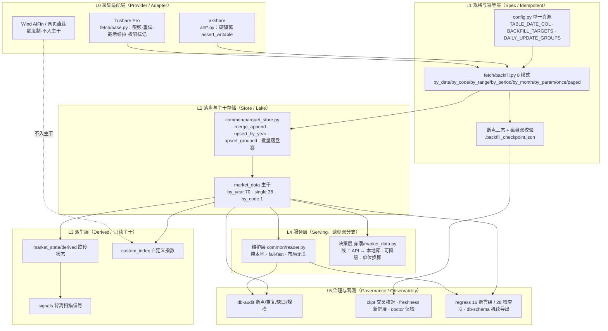
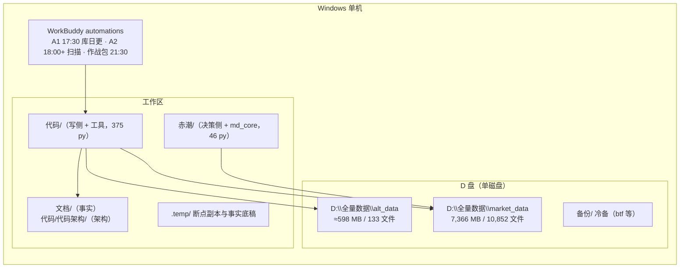

# 03 · 总体架构方案对比与推荐（章 6-7）

---

## 章 6 · 候选总体架构方案对比

### 6.1 四个候选

| 代号 | 方案 | 一句话 |
|---|---|---|
| **A** | **单机 Parquet 目录湖 + 机制增强**（现状延续） | 保持 `by_year/single/by_code` 布局与现有工具链，补齐契约化/快照/观测四项增量 |
| B | 本地湖仓表格式（Iceberg/Delta on local FS） | 以表格式替换裸 Parquet 目录，获得 ACID/时间旅行/schema 演进 |
| C | 关系型或列存数据库（PostgreSQL+Timescale / ClickHouse / DuckDB 服务化） | 数据导入数据库，用 SQL 服务读侧 |
| D | 混合：Parquet 主干 + DuckDB 读侧 + 快照层 | A 的形态 + 两个外挂能力（分析加速、版本回溯），不改主干写路径 |

### 6.2 评估维度与权重

| 维度 | 权重 | 理由 |
|---|---:|---|
| 消费侧兼容（改动量） | 5 | 现有 btf / 赤潮 / 看板 / 研究脚本已按 `reader` 与目录约定写死，断裂成本最高 |
| 迁移与回滚成本 | 5 | 113 目录 / 10,852 文件 / 7.4 GB 需一次迁移；误迁不可逆 |
| 版本回溯能力 | 4 | 现状**最大缺口**（误覆盖不可逆） |
| 并发写安全 | 3 | 单进程纪律可满足日更；但需防"双跑"事故 |
| 读侧性能 | 3 | 现状按年大表 + 列裁剪已足够；仅体检/全市场回放想更快 |
| 运维复杂度 | 4 | 单人维护，运维面越小越好 |
| 生态成熟与可替换性 | 3 | 避免被单一引擎锁定 |
| 授权与合规 | 2 | 不变（同数据、同授权） |

### 6.3 对比矩阵（5=优 / 1=差）

| 维度 | 权重 | A 现状增强 | B 湖仓格式 | C 数据库 | D 混合 |
|---|---:|---:|---:|---:|---:|
| 消费侧兼容 | 5 | **5** | 3 | 2 | **5** |
| 迁移成本（越低越高分） | 5 | **5** | 2 | 1 | 4 |
| 版本回溯 | 4 | 3（快照近似） | **5** | 3 | **5** |
| 并发写安全 | 3 | 3（纪律 + 写锁文件） | **5** | **5** | 3 |
| 读侧性能 | 3 | 4 | 4 | **5** | **5** |
| 运维复杂度（越低越高分） | 4 | **5** | 3 | 2 | 4 |
| 生态/可替换 | 3 | **5** | 3 | 3 | **5** |
| 授权合规 | 2 | 5 | 5 | 5 | 5 |
| **加权总分（满分 145）** | | **128** | 92 | 76 | **131** |

> 结论：**D（= A + 快照层 + DuckDB 只读加速）为推荐方案**，其中 A 的部分**已服役、无需改造**，D 相对 A 的增量即三项外挂能力（PoC-1/2/3）。

### 6.4 方案 B 与 C 的否决要点

| 方案 | 否决要点（不可回避） |
|---|---|
| B | ① 表格式元数据服务/事务日志把"只需一个目录就能读"的极简形态打破，`reader` 全部重写；② Windows 本地 FS 上 Iceberg/Delta 的成熟度与异常恢复经验远不如裸 Parquet [待验证]；③ 现有 36 个子命令、断言、体检全部需重写；④ 收益（ACID/时间旅行）已可由"快照层 + 写锁 + 摘要"以 5% 成本近似 |
| C | ① 需常驻服务（端口/进程/备份/升级），与"单机单人、17:30 跑完即退"的形态冲突；② 导入导出双写引入一致性风险；③ 7.4 GB 规模下 SQL 优势不足以抵消运维成本；④ `reader` 双分支与 `market_data.py` 降级能力全废 |

---

## 章 7 · 推荐架构与逻辑分层

### 7.1 逻辑分层（L0-L5）



### 7.2 主干-派生-服务三层边界（硬约定）

| 边界 | 允许 | 禁止 | 守卫手段 |
|---|---|---|---|
| 主干（`market_data` 除派生目录外） | 采集引擎写入（backfill 引擎唯一通道） | 消费侧写入、派生任务写入、手工改文件 | 写通道唯一化 + 代码白名单；`market_data` 只读纪律 |
| 派生（`market_state`/`custom_index`/`signals`） | 只读主干后**全量重建**；幂等可重跑 | 反向写主干；跨派生目录相互覆盖 | 派生目录独立写、独立断点；输入表清单显式声明 |
| 服务（reader / market_data.py） | 读（含缓存）、单位换算、降级 | 写任何数据文件；缓存污染主干 | `reader` 无写 API；决策层缓存写入 `.cache/` 独立目录 |
| 并列库（`alt_data`） | 独立采集、独立断点、独立体检 | 写主库（`assert_writable` 硬拦） | `config_alt.assert_writable()` |

### 7.3 端到端数据流（一句话链路）

```
定时 A1 17:30 → gap-update --group all
  → 读断点 + 磁盘双校验算缺口 → 复核窗口重拉最近 3 交易日（无参快照表排除）
  → 按 8 模式取数（限频 250-300/分、4 线程、截断即续拉）
  → parquet_store 按年大表落盘（先落盘 → 后记断点）
  → 汇总告警（命中漏网接口 / 失败表）
  → fund-nav（场外净值 20:00 后）→ redtide-supply（adj_factor/stk_limit/market_state）
  → alt-update（akshare 备库）
  → 派生与信号 → 日报/看板 → PushPlus
```

### 7.4 部署拓扑（单机）



> 单机单盘的含义：**无副本、无集群、无在线服务**；因此"可靠性"必须由**断点 + 可重拉 + 冷备 + 断言**提供，而不是由硬件冗余提供（14 §22.4）。

### 7.5 扩展点清单（预留，不在 MVP 实施）

| 扩展点 | 预留形态 | 触发条件 |
|---|---|---|
| 新数据源（券商/付费源/网页） | 实现 L0 适配器协议（连接/限频/重试/断点/权限标记） | 现源失效或新数据域上马 |
| 新布局（如 `by_month` 大表） | 在 `table_storage_layout()` 增加分支 + `reader` 适配 + 迁移函数 | 单年文件超限（> 2 GB）[假设] |
| 快照与回滚 | L2 旁挂 `_snapshots/`（不侵入主干路径） | PoC-2 通过后 |
| 读侧加速 | DuckDB 只读视图（零落盘） | 体检/全市场回放成为瓶颈时 |
| 并发写保护 | 库级 `.write.lock`（PID + 时间戳 + 心跳） | 出现"双跑"事故或新增第二个写进程 |
| 多市场日历 | `common/calendar.py` 扩展（已有美股） | 新增非中/美市场 |
