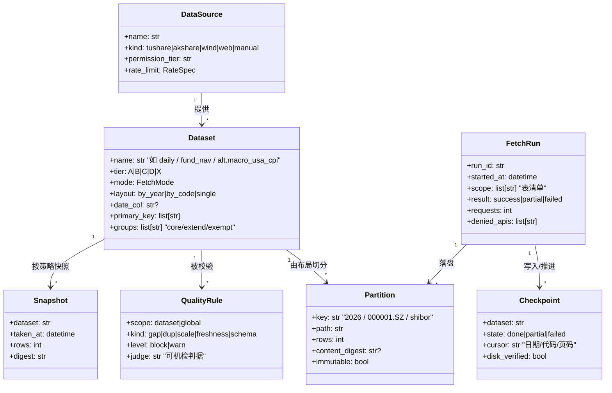

# 04 · 领域模型与核心接口（章 8）

> 目标：把"库"从**目录约定**提升为**显式领域模型**——表有身份、写有通道、读有契约、断点有状态、质量有规则。
> 纪律：本章只给**领域对象 + 接口签名（`typing.Protocol`）+ 不变式**，不给实现代码。签名与现役 API 同名部分即为**现状契约**（改动需走 12 号 ADR）。

---

## 8.1 领域对象全景



## 8.2 表（Dataset）规格模型

**现状**：规格以 `config.py` 中的多张注册表表达（结构分散但**单一真源**）：

| 注册表 | 含义 | 现状规模（2026-09-30 探针实测） |
|---|---|---|
| `TABLE_DATE_COL` | 表 → 日期列（**布局判定的第一输入**，也决定新鲜度口径） | 79 表 |
| `BACKFILL_TARGETS` | 表 → {tier, mode, enabled…}（**建库/补数规格**） | 101 表（A25/B51/C16/D3/X6；enabled 95 / disabled 6） |
| `DAILY_UPDATE_GROUPS` | 日更分组：`core` 7 + `extend` 34 | 41 表 |
| `DAILY_UPDATE_EXEMPT` | 日更豁免 + 理由 | 5 表 |
| `DB_AUDIT_PKEYS` | 每表主键/去重子集（**重复体检与 upsert 去重的判据**） | 114 项 |
| `DB_AUDIT_DATE_APIS` | 走"按日期接口"的表（体检口径区分） | 12 表 |
| `BACKFILL_PAGE_CONF` | 需 offset 分页的表与页参数（**截断防护**） | 18 表 |
| `LEAKY_PERMISSIONS` | 漏网接口清单（**授权风险登记**） | 7 项 |

**目标（to-be，PoC-1）**：上述注册表**机读导出**为统一"表规格文档"，文档与校验由真源生成：

```yaml
# 表规格（示意；真源仍为 config.py，导出物用于文档与校验）
dataset: daily
tier: A                      # 建库优先级
mode: by_date                # 取数模式（8 种之一）
layout: by_year              # 由 table_storage_layout() 判定，禁止手工指定
date_col: trade_date
primary_key: [ts_code, trade_date]
groups: [core]               # core 失败阻断；extend 失败告警
freshness_slo: {max_lag_trade_days: 0, level: block}
columns:
  - {name: ts_code, dtype: string, unit: null, nullable: false, desc: "证券代码"}
  - {name: amount,  dtype: float64, unit: 千元, nullable: true,  desc: "成交额"}
page_conf: null              # 非分页表
lineage: {sources: [tushare.daily], derived_from: []}
```

## 8.3 数据源适配器接口（L0）

```python
class RateSpec(TypedDict):
    per_minute: int | None      # 例：daily 300/分（配置 250）
    per_hour: int | None        # 例：4 个接口 1 次/小时
    per_day: int | None         # 例：index_global 100 次/天
    concurrency: int            # 例：4 线程（主线程落盘）

class SourceAdapter(Protocol):
    """数据源适配器：一个源一份生命周期（连接 → 限频 → 取数 → 权限标记）。"""
    name: str                                  # tushare / akshare / wind / web
    def probe(self) -> dict[str, Any]: ...      # 连通性与额度探测（doctor）
    def rate_limit(self, api: str) -> RateSpec: ...
    def fetch_by_date(self, api: str, date: str, **kw) -> FetchResult: ...     # 截面
    def fetch_by_code(self, api: str, code: str, **kw) -> FetchResult: ...     # 单标的
    def fetch_paged(self, api: str, **kw) -> ExportResult: ...                 # 分页/导出型
    def denied_apis(self) -> list[str]: ...     # 本次运行命中的无权限接口（漏网监控）
    def is_leaky(self, api: str) -> bool: ...   # 是否在 LEAKY_PERMISSIONS 清单
```

**现状实现锚点**（签名即契约）：

| 能力 | 现役函数（`代码/fetch/base.py`） |
|---|---|
| 连接 | `get_pro()`（全局唯一 Tushare 连接） |
| 限频 | `RateLimiter`（**预约式**，每接口独立时间槽） |
| 重试 | `ts_call_with_retry()`（限频与普通错误两套退避；`TS_MAX_RETRIES=5`，延迟 `[1,2,5,10,20]`） |
| 取数 | `ts_fetch()`（按标的，**含截断续拉**）、`ts_fetch_by_date()`（按日截面） |
| 并发 | `fetch_codes_parallel()`（4 线程，主线程落盘） |
| 权限 | `permission_denied_apis()`（漏网监控，回归 R 系断言消费） |
| 安全取数 | `safe_fetch()`（异常返回空表，不炸流水线——仅用于**非 core** 场景） |
| 交易日 | `get_latest_trade_date(target_date_str)`（**日历口径**，与决策层语义不同，禁止合并） |

## 8.4 读取接口（L4）

```python
class DatasetReader(Protocol):
    """布局无关读取契约：调用方不知道 by_year/single/by_code。"""
    def read_code(self, table: str, code: str, *,
                  columns: list[str] | None = None,
                  start_date: str | None = None,
                  end_date: str | None = None) -> pd.DataFrame: ...
    def read_range(self, table: str, *, columns: list[str] | None = None,
                   start_date: str | None = None,
                   end_date: str | None = None) -> pd.DataFrame: ...
    # 四类行情快捷读取（现役：read_stock_daily / read_fund_daily /
    #                  read_index_daily / read_cb_daily）
    def read_quick(self, kind: Literal["stock", "fund", "index", "cb"],
                   code: str) -> pd.DataFrame: ...
    def list_codes(self, table: str, listed_only: bool = False) -> list[str]: ...
    def latest_date(self, table: str, date_col: str = "trade_date") -> str | None: ...
    def detect_layout(self, table: str) -> Layout: ...
    def inspect_layout(self, table: str) -> LayoutReport: ...   # 含混合布局告警
    def iter_year_files(self, table: str) -> Iterator[tuple[int, Path]]: ...  # 仅 by_year

class DecisionReader(DatasetReader, Protocol):
    """决策侧扩展：线上/本地双分支 + 降级 + 单位换算（有意与维护层不同）。"""
    def set_online(self, enabled: bool) -> None: ...     # USE_ONLINE_API 单一真源
    def latest_with_data(self) -> str: ...               # 以"数据已入库"为准的最近交易日
    def unit_policy(self) -> dict[str, str]: ...         # vol=手 / mv=万元 / amount=千元
```

**双分支口径（硬约定，14 §23 展开）**：维护层 fail-fast（异常必须冒泡，因为静默会让断点记错）；决策层允许降级（线上失败落本地，且必须显式提示数据来源与新鲜度）。

## 8.5 写入接口（L2）

```python
class DatasetWriter(Protocol):
    """主干唯一写通道：所有落盘都经此，禁止业务代码直接 df.to_parquet。"""
    def merge_append(self, df, table: str, *, dedup_subset: list[str] | None = None) -> WriteReport: ...
    def upsert_by_year(self, df, table: str, *, year_col: str, dedup_subset: list[str] | None = None) -> WriteReport: ...
    def upsert_grouped(self, df, table: str, *, group_col: str, dedup_subset=None) -> WriteReport: ...
    def batch_writer(self, table: str, layout: Layout) -> YearBatchWriter | ByCodeBatchWriter: ...
    def migrate(self, table: str, *, target_layout: Layout, dry_run: bool = False) -> MigrateReport: ...

class PriorityWriter(Protocol):
    """非主干写通道（并列库/派生层），必须显式声明目标根目录。"""
    def target_root(self) -> Path: ...                 # alt_data / market_state / signals / custom_index
    def assert_writable(self, path: Path) -> None: ...  # config_alt.assert_writable 同语义

class WriteReport(TypedDict):
    table: str; rows_in: int; rows_written: int; rows_deduped: int
    files_touched: list[str]; layout: str; ok: bool
```

**落盘不变式（必须恒成立）**：

| # | 不变式 | 违反后果 | 守卫 |
|---|---|---|---|
| I1 | 落盘成功**先于**断点推进 | 断点虚记 → 静默缺数据 | 落盘器返回 `WriteReport.ok` 才允许 `mark_done` |
| I2 | 单表单一布局（无混合） | 读取漏数据/读错年份 | `LayoutGuardError` + `inspect_layout()` 告警 |
| I3 | 同一 `dedup_subset` 下无重复行 | 聚合指标翻倍 | `DB_AUDIT_PKEYS` + `db-audit` 重复体检 |
| I4 | 写入原子（临时文件 + 替换） | 半写文件损坏 | 落盘器原子替换 + `.bak` 保留策略 |
| I5 | 主干只能由 backfill 引擎写 | 业务脚本污染 | 写通道唯一化；派生目录单独通道 |
| I6 | 分区键不可变（年份与内容一致） | 跨年错位 | 按年分区 + 迁移函数保证；新增年份即新分区 |

## 8.6 断点接口（L1）

```python
class CheckpointStore(Protocol):
    """断点三态：done / partial / failed；断点必须与磁盘双校验。"""
    def load(self, dataset: str) -> Checkpoint | None: ...
    def mark_done(self, dataset: str, cursor: str, *, written: WriteReport) -> None: ...
    def mark_partial(self, dataset: str, cursor: str, *, reason: str) -> None: ...
    def mark_failed(self, dataset: str, *, reason: str) -> None: ...
    def verify_against_disk(self, dataset: str) -> CheckpointDiff: ...   # ckpt 交叉核对
    def clear_phantom(self, dataset: str) -> None: ...                   # 清"虚记"（磁盘无数据但断点已前移）

class RunLedger(Protocol):
    """运行台账（to-be，PoC-4）：回答'该行来自哪次运行'。"""
    def open_run(self, scope: list[str], trigger: str) -> str: ...
    def close_run(self, run_id: str, result: Literal["success", "partial", "failed"]) -> None: ...
    def record(self, run_id: str, dataset: str, report: WriteReport, denied: list[str]) -> None: ...
```

**现状锚点**：库根三份断点（`.backfill_checkpoint.json` 4.32 MB 为主启，`.checkpoint.json`、`.cb_checkpoint.json`）＋ `.bak_20260925_220428` 备份；`main.py ckpt` 提供交叉核对/回填/清虚记。**目标**：断点结构升级为"断点 + 运行台账"双记录（PoC-4），使 G4（可追溯）可机检。

## 8.7 质量规则模型（L5）

```python
class QualityRule(TypedDict):
    scope: str                    # dataset 名 或 "global"
    kind: Literal["gap", "dup", "scale", "freshness", "schema", "lineage"]
    level: Literal["block", "warn"]   # core → block；extend → warn
    judge: str                    # 可机检判据（表达式/断言名）
    evidence: str                 # 命令与口径：如 "main.py db-audit --table daily"

class QualityReport(TypedDict):
    run_at: str; rules_total: int; passed: int; failed: int
    blocked: list[str]; warned: list[str]; details: list[dict]
```

**现状判据（可复用，不必新造）**：`db-audit` 四类（断点 / 重复 / 缺口 / 规模）、`ckpt --verify`（断点-磁盘）、`freshness`（新鲜度）、`check-coverage`（可转债与 ETF/LOF 覆盖率）、`alt-audit`（alt 规格一致性）、`regress` 16 断言组 / 28 检查项、`doctor` / `config-check`（环境与配置体检）。

## 8.8 领域不变式汇总（全文可引用编号）

| 编号 | 不变式 | 章节引用 |
|---|---|---|
| INV-1 | 规格单一真源：表规格只来自 `config.py`，文档为导出物 | 14 §26.2 |
| INV-2 | 布局唯一且由 `table_storage_layout()` 判定 | 05 §9.3 |
| INV-3 | 落盘先于断点（I1） | 08 §13.3 |
| INV-4 | 主干只读（消费侧）/ 写通道唯一 | 14 §23.4 |
| INV-5 | 并列库隔离（alt 不写主库） | 14 §25.2 |
| INV-6 | 显式豁免（不日更/不建库必须登记理由） | 14 §26.3 |
| INV-7 | 派生只读主干且可全量重建（幂等） | 15 §27.3 |
| INV-8 | 消费侧不依赖目录/文件名（P2） | 15 §31.2 |
| INV-9 | 漏网接口不得作为方案依赖（须有替代或降级） | 10 §15.3 |
| INV-10 | 结论可复核：带 `文件:行号` 或实测命令与日期 | 16 §32.1 |
