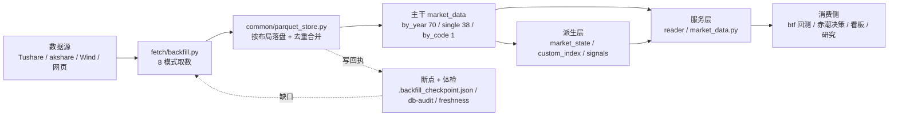

# 05 · 数据架构与数据集体系（章 9、20）

> 本章是全库的**结构真源说明**：分层模型 → 布局与分区 → 命名与口径 → 全表字典 → 黄金数据集 → 血缘 → 机读化路径。
> 事实口径：2026-09-30 只读编目（`.temp/_db_catalog_20260930.tsv`，113 目录 / 10,852 文件 / 7,366 MB / 291,396,574 行）。

---

## 章 9 · 数据架构与数据流

### 9.1 四层数据模型（现状映射）

| 层 | 语义 | 现状承载 | 纪律 |
|---|---|---|---|
| **L-Raw** 原始观测层 | 接口返回的观测值，**不做换算、不做策略语义** | 主干 113 目录中的全部业务表（`daily`/`index_daily`/…） | 单位保持源口径（`vol`=手、`amount`=千元、`mv`=万元）；不做复权、不做指标合成 |
| **L-Norm** 规范化层 | 统一主键、排序、去重、类型 | 由落盘器在写入时完成（`DB_AUDIT_PKEYS` 去重 + 日期字符串统一 `YYYYMMDD`） | 幂等：同键重复写不产生重复行（INV-3/INV-4） |
| **L-Derived** 派生层 | 由主干计算的状态/信号/指数 | `market_state/derived`（跌停状态，19 文件/21.43 MB/15,067,360 行）、`custom_index`、`signals` | **只读主干、可全量重建、幂等**（INV-7）；不得反向写主干 |
| **L-Serving** 服务层 | 面向消费的读取契约与缓存 | 维护层 `common/reader.py`；决策层 `赤潮/market_data.py`（含 `.cache/` ROE 缓存） | 只读；缓存不落主干目录；单位换算在服务层显式完成 |

> **注**：本库**没有独立的 Raw 落地区**（不存接口原始 JSON/CSV），现有主干即"Raw+Norm 合一"。这是有意取舍（省一半存储、避免双写不一致），代价是**无法回溯"接口当时返回了什么"**——列为目标态增量（PoC-2 的快照层覆盖该需求）。

### 9.2 主干数据流



### 9.3 存储布局与分区策略（现状已冻结）

| 布局 | 路径形态 | 目录数 | 判定条件（`fetch/backfill_io.py::table_storage_layout`） | 典型表 |
|---|---|---:|---|---|
| `by_year` | `dir/{YYYY}.parquet` | **70** | 有日期列 + 按日/区间/标的/期/月/分页取数（绝大多数日频表） | `daily`(37 文件)、`index_daily`(34)、`moneyflow`(19) |
| `single` | `dir/{key}.parquet` | **38** | 一次性/低频/汇总/月频（`once`/`by_range`/`by_month`/`by_param`/`paged` 中不按日切片者） | `shibor`、`margin`、`index_weight`、`us_tycr` |
| `by_code` | `dir/{ts_code}.parquet` | **1** | 仅静态元数据表（唯一保留者） | `stock_company`（5,851 文件） |
| `mixed` | 目录内混合（含子目录/多键） | **4** | 容器目录（非单一表） | `metadata`(8 文件)、`market_state`(19)、`custom_index`(2)、`wind_index`(3,182) |

**分区策略要点**：

1. **按年分区是性能决策的产物**：改为年度大表后 `moneyflow` 从"1 天/分钟"提升到"41 天/分钟"（**提速 40 倍**），因为消除数千小文件的读-改-写。
2. **分区键不可变**：年份即分区键，新增年份 = 新文件；跨年写入只重写"当日所在年份"文件（批量落盘器保证不逐行读改写）。
3. **文件数语义**：`by_year` 文件数 = **年份数**（不是标的数）；`single` 恒为 1；`stock_company` = 标的数。
4. **混合布局是告警项**：`inspect_layout()` 发现同表两种布局即告警（现状 4 个 `mixed` 目录均为**容器目录**，非违规）。

### 9.4 命名与路径契约

| 对象 | 约定 | 真源 |
|---|---|---|
| 目录名 | = 逻辑表名（与 `config.py` 注册名一致），**禁止别名** | `config.py` / `common/paths.py` |
| 文件名（by_year） | `{YYYY}.parquet`（四位年份，无前导/后缀） | `table_storage_layout()` |
| 文件名（single） | `{key}.parquet`（key 为单一键值，如 `shibor`） | 同上 |
| 文件名（by_code） | `{ts_code}.parquet`（如 `000001.SZ.parquet`） | 同上 |
| 断点 | 库根 `.backfill_checkpoint.json` / `.checkpoint.json` / `.cb_checkpoint.json` | `fetch/base.py::Checkpoint` |
| 派生 | 目录内含 `derived/` 子路径或在库根白名单目录（`market_state`/`custom_index`/`signals`） | 03 §7.2 边界表 |
| 并列库 | `D:\全量数据\alt_data\<表名>\...`（独立根） | `config_alt.py` |
| **禁止** | 手工建目录/文件、脚本直接 `to_parquet`、用 `glob(dir/*.parquet)` 反推标的 | INV-2 / INV-8 |

### 9.5 时间与单位口径（消费侧最易踩坑处）

| 项 | 口径 | 备注 |
|---|---|---|
| 日期字段 | **字符串 `YYYYMMDD`**（`trade_date`/`cal_date`/`end_date`/`ann_date`/`nav_date`） | 月频为 `YYYYMM`（如 `broker_recommend`） |
| 默认排序 | 源接口返回**倒序**，入库前统一正序 | 消费侧仍建议显式 `sort_values` |
| 成交量 `vol` | **手**（1 手 = 100 股） | 全库统一 |
| 成交额 `amount` | **千元**（`daily`/`fund_daily`/`cb_daily` 一致） | 曾为高危差异点，现统一 |
| 市值 `total_mv`/`circ_mv` | **万元**；股本 `total_share`/`float_share`/`free_share` | **万股** |
| 复权 | 库内**只存不复权价 + `adj_factor`**；复权在消费侧计算 | 前复权 = `close × adj_factor / 最新 adj_factor` |
| 财务空值 | 非适用行业字段为空（`NaN`），`pe` 亏损为空 | 使用前必须过滤 |
| 停牌/无数据 | 指数与个别品种当日无数据属正常（`check-coverage` 分类判定） | 见 15 §27.4 |

### 9.6 十一个数据域概览（明细见 §20.2）

| 域 | 目录数 | 代表表 |
|---|---:|---|
| D1 基础与元数据 | 17 | `metadata`(8 文件) · `stock_company`(5,851 文件) · 各类 `*_basic` · 三地交易日历 |
| D2 股票行情与交易约束 | 16 | `daily` · `daily_basic` · `adj_factor` · `stk_limit` · 周/月线 |
| D3 基金与 ETF/LOF | 5 | `fund_nav`(2,117 万行) · `fund_daily` · `fund_adj` · `fund_share` · `fund_div` |
| D4 债券与可转债 | 6 | `cb_daily` · `cb_issue`/`cb_rating`/`cb_share` · `repo_daily` · `bc_otcqt` |
| D5 指数 | 6 | `index_daily`(3,562 万行/1,207 MB) · `index_global`(131 文件) · `index_weight` |
| D6 期货、期权与商品 | 10 | `opt_daily`(2,398 万行) · `fut_holding`(2,507 万行) · `fut_daily` · `sge_daily` |
| D7 财务与披露 | 11 | `income`/`balancesheet`/`cashflow`/`fina_indicator` · `forecast` · `dividend` |
| D8 股东与治理 | 10 | `top10_holders`/`top10_floatholders` · `stk_managers` · `pledge_*` · `share_float` |
| D9 资金、两融与沪港通 | 10 | `moneyflow`(1,448 万行/1,155 MB) · `margin_detail` · `hk_hold` · `top_list`/`top_inst` |
| D10 利率、外汇与宏观 | 19 | `shibor` · `us_tycr` 族 · `cn_*` 宏观 · `fx_daily` · `eco_cal` |
| D11 派生与并列线 | 3 | `market_state` · `custom_index` · `wind_index`（停更 09-21）；并列库 `alt_data` |

> 11 域合计 **113 目录**，与 §20.2 逐目录字典一致；行数合计 **291,396,574**。

---

## 章 20 · 数据集架构与全表字典

### 20.1 字典口径

- **编目时间**：2026-09-30，只读 Parquet Footer 扫描（可复算脚本 `.temp/_arch_catalog.py`）。
- **行数** = 各文件 `num_rows` 求和；**覆盖** = 行组统计 `min~max`（日期以字符串存储，字典序可比）。
- **`-`** = 无可用日期统计（静态元数据表或该表未写入统计列），**不代表数据缺失**；日历类表出现的"未来日期"（如 `20271231`）为交易所日历预测，属正常。
- 布局图例：`Y`=`by_year` ｜ `S`=`single` ｜ `C`=`by_code` ｜ `M`=`mixed`（容器目录）。
- 域划分为**架构分类**（非源方定义）；跨域表按"主力用途"归一次。

### 20.2 全表字典（11 域 / 113 目录）

**D1 基础与元数据（17）**

| 目录 | 文件 | MB | 布局 | 行数 | 覆盖 |
|---|---:|---:|:--:|---:|---|
| `metadata` | 8 | 2.34 | M | 71,285 | 19901219~20271231 |
| `stock_company` | 5,851 | 121.72 | C | 5,851 | - |
| `bse_mapping` | 1 | 0.01 | S | 248 | - |
| `hk_basic` / `us_basic` | 1 / 1 | 0.22 / 1.04 | S | 2,785 / 24,255 | - |
| `fut_basic` / `opt_basic` | 1 / 1 | 0.29 / 0.75 | S | 11,275 / 30,730 | - |
| `fund_company` / `fund_manager` | 1 / 1 | 0.05 / 6.66 | S | 207 / 85,636 | 20091229 / ~20261016 |
| `index_classify` / `index_member_all` | 1 / 1 | 0.01 / 0.17 | S | 359 / 5,913 | - |
| `hs_const` / `new_share` | 1 / 1 | 0.01 / 0.17 | S | 823 / 3,030 | - |
| `namechange` | 37 | 0.49 | Y | 14,187 | 19920308~20260911 |
| `fut_trade_cal` / `hk_tradecal` / `us_tradecal` | 1 / 1 / 1 | 0.36 / 0.04 / 0.04 | S | 79,020 / 3,915 / 3,915 | 19901012~20271231 / 20160101~20260919 |

**D2 股票行情与交易约束（16）**

| 目录 | 文件 | MB | 布局 | 行数 | 覆盖 |
|---|---:|---:|:--:|---:|---|
| `daily` | 37 | 464.96 | Y | 17,441,777 | 19901219~20260929 |
| `daily_basic` | 37 | 919.28 | Y | 18,577,805 | 19901219~20260929 |
| `adj_factor` | 36 | 6.44 | Y | 16,936,111 | 19910703~20260929 |
| `stk_limit` | 19 | 68.31 | Y | 17,823,792 | 20080102~20260929 |
| `etf_limit` | 8 | 10.16 | Y | 2,243,957 | 20190626~20260929 |
| `suspend_d` | 27 | 0.89 | Y | 640,435 | 20000104~20260929 |
| `stk_seasoned` | 1 | 2.31 | S | 13,180 | 19910817~20260919 |
| `daily_info` / `sz_daily_info` | 27 / 19 | 3.89 / 2.86 | Y | 113,382 / 69,337 | 20000104~ / 20080102~20260929 |
| `stk_account` | 1 | 0.01 | S | 192 | 20150508~20190222 |
| `weekly` / `monthly` | 11 / 11 | 72.62 / 19.87 | Y | 2,370,501 / 556,962 | 20160108~20260918 / 20160129~20260831 |
| `stk_weekly_monthly` / `stk_week_month_adj` | 11 / 11 | 69.32 / 112.17 | Y | 2,310,533 / 2,367,646 | 20160108~20260918 |
| `block_trade` | 22 | 9.95 | Y | 627,293 | 20050104~20260929 |
| `broker_recommend` | 1 | 0.10 | S | 18,169 | 202003~202609 |

**D3 基金与 ETF/LOF（5）**

| 目录 | 文件 | MB | 布局 | 行数 | 覆盖 |
|---|---:|---:|:--:|---:|---|
| `fund_nav` | 28 | 194.26 | Y | 21,173,046 | 19991029~20260928 |
| `fund_daily` | 29 | 83.28 | Y | 3,078,647 | 19980407~20260929 |
| `fund_adj` | 28 | 0.95 | Y | 3,117,585 | 19991022~**20260918**（漏网接口） |
| `fund_share` | 29 | 9.26 | Y | 2,154,365 | 19980327~20260929 |
| `fund_div` | 19 | 2.04 | Y | 59,657 | 20080102~20260929 |

**D4 债券与可转债（6）**

| 目录 | 文件 | MB | 布局 | 行数 | 覆盖 |
|---|---:|---:|:--:|---:|---|
| `cb_daily` | 32 | 31.74 | Y | 831,841 | 19930210~20260929 |
| `cb_issue` / `cb_rating` / `cb_share` | 28 / 26 / 27 | 0.51 / 0.20 / 6.42 | Y | 1,138 / 5,194 / 109,582 | 19980730~20260915 |
| `repo_daily` | 27 | 5.84 | Y | 206,048 | 20000104~20260929 |
| `bc_otcqt` | 3 | 67.82 | Y | 3,707,281 | -（无日期统计） |

**D5 指数（6）**

| 目录 | 文件 | MB | 布局 | 行数 | 覆盖 |
|---|---:|---:|:--:|---:|---|
| `index_daily` | 34 | 1,207.74 | Y | 35,623,496 | 19931014~20260929 |
| `index_dailybasic` | 23 | 2.71 | Y | 52,359 | 20040102~20260929（漏网接口） |
| `index_global` | 131 | 13.16 | Y | 251,765 | 18960526~20260929（**单分页表 131 文件**） |
| `index_weight` | 1 | 1.91 | S | 708,659 | 20160129~20260831 |
| `index_weekly` / `index_monthly` | 36 / 36 | 1.11 / 0.46 | Y | 12,498 / 2,943 | 19910705~20260918 / 19910731~20260831 |

**D6 期货、期权与商品（10）**

| 目录 | 文件 | MB | 布局 | 行数 | 覆盖 |
|---|---:|---:|:--:|---:|---|
| `fut_daily` | 27 | 90.91 | Y | 2,964,191 | 20000104~20260929 |
| `fut_holding` | 22 | 261.84 | Y | 25,074,365 | 20050104~20260928（**持仓榜第一大表**） |
| `fut_mapping` | 27 | 0.59 | Y | 563,439 | 20000104~20260929 |
| `fut_settle` | 15 | 5.95 | Y | 1,626,734 | 20120104~20260929 |
| `fut_wsr` | 17 | 6.85 | Y | 2,458,892 | 20100104~20260928 |
| `fut_index_daily` | 21 | 1.69 | Y | 25,165 | 20060104~20260918 |
| `fut_weekly_monthly` | 11 | 19.64 | Y | 437,693 | 20160108~20260918 |
| `fut_weekly_detail` | 1 | 1.81 | S | 20,653 | - |
| `opt_daily` | 11 | 423.03 | Y | 23,984,562 | 20160104~20260929（漏网接口） |
| `sge_daily` | 22 | 2.76 | Y | 79,061 | 20050104~20260929 |

**D7 财务与披露（11）**

| 目录 | 文件 | MB | 布局 | 行数 | 覆盖 |
|---|---:|---:|:--:|---:|---|
| `income` / `balancesheet` / `cashflow` | 37 / 37 / 26 | 83.12 / 128.89 / 107.90 | Y | 412,165 / 401,927 / 387,454 | 19901231~20260630 |
| `fina_indicator` | 37 | 191.31 | Y | 260,486 | 19901231~20260630 |
| `fina_audit` / `fina_mainbz` | 30 / 27 | 2.22 / 21.15 | Y | 96,037 / 872,827 | 19971231~20260630 / 20001231~20260630 |
| `express` / `forecast` | 22 / 30 | 2.34 / 22.27 | Y | 28,669 / 127,423 | 20041231~ / 19981231~20271231 |
| `disclosure_date` | 11 | 0.64 | Y | 184,365 | 20160331~20260630 |
| `dividend` | 37 | 2.49 | Y | 267,341 | 19901231~20260826 |
| `cn_schedule` | 1 | 0.00 | S | 176 | 202601~202612（披露计划） |

**D8 股东与治理（10）**

| 目录 | 文件 | MB | 布局 | 行数 | 覆盖 |
|---|---:|---:|:--:|---:|---|
| `top10_holders` / `top10_floatholders` | 11 / 11 | 60.55 / 55.67 | Y | 2,063,059 / 1,956,807 | 20160331~20260630 |
| `stk_holdernumber` | 37 | 4.97 | Y | 569,428 | 19000908~20270630 |
| `stk_holdertrade` | 32 | 7.68 | Y | 181,611 | 19940810~20260916 |
| `stk_managers` / `stk_rewards` | 37 / 35 | 7.59 / 21.70 | Y | 571,783 / 1,643,012 | 19940315~20290916 / 19911231~20260811 |
| `pledge_detail` / `pledge_stat` | 24 / 13 | 5.94 / 9.46 | Y | 242,251 / 1,737,987 | 20010925~20560727 / 20140307~20260911 |
| `share_float` | 22 | 95.01 | Y | 4,521,447 | 20050809~**20260919**（漏网接口） |
| `repurchase` | 22 | 1.42 | Y | 62,503 | 20051228~20260918 |

**D9 资金、两融与沪港通（10）**

| 目录 | 文件 | MB | 布局 | 行数 | 覆盖 |
|---|---:|---:|:--:|---:|---|
| `moneyflow` | 19 | 1,155.01 | Y | 14,483,084 | 20080102~20260929（**主干第一大表**） |
| `margin` / `margin_detail` / `margin_secs` | 15 / 15 / 15 | 0.53 / 285.94 / 19.29 | Y | 8,040 / 6,829,029 / 8,036,021 | 20120104~20260928/29 |
| `hk_hold` | 10 | 55.12 | Y | 5,660,281 | 20170103~20260928 |
| `hsgt_top10` / `ggt_top10` | 10 / 10 | 1.94 / 2.42 | Y | 45,270 / 44,640 | 20170103~20260928 |
| `top_list` / `top_inst` | 19 / 15 | 18.44 / 59.08 | Y | 252,371 / 2,688,211 | 20080102~ / 20120104~20260928 |
| `slb_len_mm` | 1 | 0.47 | S | 55,180 | 20221114~20250725（转融通） |

**D10 利率、外汇与宏观（19）**

| 目录 | 文件 | MB | 布局 | 行数 | 覆盖 |
|---|---:|---:|:--:|---:|---|
| `shibor` | 1 | 0.11 | S | 2,659 | 20160104~20260929 |
| `shibor_lpr` / `shibor_quote` / `hibor` | 1 / 1 / 1 | 0.00 / 0.07 / 0.02 | S | 250 / 4,000 / 247 | **均止于 20161230**（日更豁免，见 14 §26.3） |
| `us_tbr`/`us_tltr`/`us_trycr`/`us_tycr`/`us_trltr` | 各 1 | 0.02~0.08 | S | 各 2,682~2,684 | 20160104~20260928 |
| `cn_cpi` / `cn_ppi` / `cn_m` / `cn_gdp` / `cn_pmi` | 各 1 | 0.01~0.07 | S | 512 / 419 / 583 / 178 / 260 | 月频至 202608 |
| `fx_daily` | 47 | 33.17 | Y | 556,696 | **19381229**~20260928 |
| `eco_cal` | 17 | 3.55 | Y | 167,314 | 20100104~20260929 |
| `sf_month` | 1 | 0.01 | S | 295 | 200201~202607（社融） |
| `wz_index` / `gz_index` | 1 / 1 | 0.10 / 0.03 | S | 3,160 / 1,181 | 20130104~20260917 / **止于 20190304** |

**D11 派生与并列线（3）**

| 目录 | 文件 | MB | 布局 | 行数 | 覆盖 | 性质 |
|---|---:|---:|:--:|---:|---|---|
| `market_state` | 19 | 21.43 | M | 15,067,360 | 20080102~20260929 | 派生：跌停状态（只读主干） |
| `custom_index` | 2 | 0.13 | M | 5,082 | 20160105~20260922 | 派生：自定义指数 |
| `wind_index` | 3,182 | 534.75 | M | 10,096,713 | 19901219~**20260921** | 并列线：Wind 自编指数（**停更**，研究暂停） |
| `alt_data`（并列库） | 133 | ≈598 | S 为主 | 约 3,044 万 | 视表而定（688981.SH 起） | 并列：akshare 66 表（`us_daily_qfq` 593.9 MB） |

### 20.3 体量与热点（容量治理的输入）

| 视角 | 事实（2026-09-30） |
|---|---|
| Top5 体积 | `index_daily` 1,207.74 MB · `moneyflow` 1,155.01 MB · `daily_basic` 919.28 MB · `wind_index` 534.75 MB · `daily` 464.96 MB（合计约占全库 **58%**） |
| Top5 行数 | `index_daily` 3,562 万 · `fut_holding` 2,507 万 · `opt_daily` 2,398 万 · `fund_nav` 2,117 万 · `daily_basic` 1,858 万 |
| Top5 文件数 | `stock_company` 5,851 · `wind_index` 3,182 · `index_global` 131 · `fx_daily` 47 · `daily*` 37 |
| 单文件均值 | 全库约 **0.68 MB/文件**；`by_year` 大表约 12~35 MB/年（`index_daily` 单年 35 MB 为最大） |
| 压缩比含义 | `daily_basic` 行数与 `daily` 同量级但体积为其 2 倍（列宽不同）→ 列裁剪收益显著（09 §14.7） |

### 20.4 列级契约（to-be，PoC-1）

现状 `db-schema` 已导出：表名 / 布局 / 文件数 / 行数 / 大小 / 列名 / 日期范围。目标增补**四类列级字段**（Pandera 思想，02 §R5）：

| 字段 | 含义 | 收益 |
|---|---|---|
| `dtype` | 规范类型（string/float64/int64/date-str） | 阻断"年份被读成 int 又当字符串比"类缺陷 |
| `unit` | 单位（手/千元/万元/万股/%/天） | 消除跨表单位误用（14 §23.3） |
| `nullable` | 是否允许空（含"行业不适用"语义） | 明确"空是正常还是异常"（15 §27.4） |
| `enum` | 枚举取值域（如 `exchange`/`list_status`） | 阻断脏枚举污染下游过滤 |

### 20.5 黄金数据集（Golden Set，回归与验收基准集）

| # | 名称 | 组成 | 用途 | 判据 |
|---|---|---|---|---|
| GS-1 | 核心 7 表最新切片 | `daily`/`daily_basic`/`adj_factor`/`stk_limit`/`index_daily`/`moneyflow`/`fund_daily` 最近 3 个交易日 | 日更验收（S1） | 非零行 + 主键无重复 + 行数较上一交易日偏差 ≤ 5% [假设] |
| GS-2 | 跨年边界切片 | 各 `by_year` 表 12 月末/1 月初相邻两日 | 分区切换正确性 | 无重复无缺口（R 系断言） |
| GS-3 | 复权一致性切片 | 单标的（000001.SZ）全历史 `daily` + `adj_factor` | 复权链可复算 | 前复权序列与官方行情一致 [待验证] |
| GS-4 | 涨跌停约束切片 | 同标的 `daily` + `stk_limit` | 约束类研究基线 | 触及涨跌停日 `high==low==涨跌停价` 一致性 |
| GS-5 | 财务报告期切片 | 4 张财务表 + `fina_indicator` 同一 `end_date` | 财务口径校验 | 勾稽冲突率 < 0.1% [假设] |
| GS-6 | 停更与豁免清单 | 5 张日更豁免 + 7 张漏网接口相关表 + `gz_index`/`slb_len_mm` | 防止"停更被误判为故障" | 停更清单与库内最大日期一致 |
| GS-7 | 并列库对照切片 | `alt_data.us_daily_qfq` vs 主库美股相关线 | 主备口径对照 | 差异可解释（复权/汇率/日历） |

### 20.6 数据血缘（轻量声明式）

```
源接口 ──(fetch/backfill.py 8 模式)──▶ 主干表 ──(派生任务, 只读主干)──▶ 派生表 ──(reader)──▶ 消费
```

| 派生物 | 输入（只读主干） | 生成通道 | 频率 |
|---|---|---|---|
| `market_state/derived`（跌停状态） | `daily` + `stk_limit` + `daily_basic` | `redtide-supply` | 交易日 |
| `custom_index` | `daily` / `daily_basic`（成分与权重） | `custom-index` | 按需 |
| `signals`（背离扫描信号） | `daily` + `adj_factor` | `scan`（18:00+） | 交易日 |
| 看板/日报产物 | 上述全部 | `report` / `push` | 交易日 21:30 |

**血缘纪律（INV-6/INV-7）**：每个派生物必须显式声明**输入表清单**（"输入表清单 = 契约"，14 §26.4）；主干**不得反向依赖**派生（依赖方向单向：主干 → 派生 → 消费）。

### 20.7 机读字典与生成路径（to-be）

```
config.py（唯一真源）
  ├─ main.py db-schema          → 结构快照（现役：表/布局/文件数/行数/大小/列/日期范围）
  ├─ main.py db-schema --json   → 文档生成输入（待建：PoC-1 增补列级契约字段）
  └─ main.py db-audit           → 体检结论（断点/重复/缺口/规模）
```

目标：**文档从真源生成**——本文件 §20.2 字典与 README 快照表均由 `db-schema --json` 渲染，杜绝"文档数字过期"。[风险] 现状偏差来源见 11 号 R-9。

### 20.8 示例数据集方案（最小可用切片）

给新消费方（新人/新策略/新工具）的"开箱即用"最小数据集，避免直接拉全库：

| 切片 | 内容 | 体积量级 | 用途 |
|---|---|---|---|
| S-MIN | `daily` + `adj_factor` + `daily_basic` 最近 3 年、沪深 A | 约 200 MB | 跑通读取链路与回测 |
| S-FUND | `fund_nav` + `fund_daily` 全量 | 约 280 MB | 基金策略与净值研究 |
| S-CB | `cb_daily` + `cb_issue` + `cb_share` | 约 40 MB | 转债策略 |
| S-MACRO | `shibor` + `us_tycr` 族 + `cn_*` + `fx_daily` | < 40 MB | 宏观择时 |
| S-ALT | `alt_data` P0 组表 | 按需 | 备源与交叉验证 |

**交付方式**：不复制数据，提供**读取脚本 + 表名清单 + 起止日期**（遵守 P2 布局不可知）；切片导出仅在明确对外交换时进行（合规，10 §15.4）。
