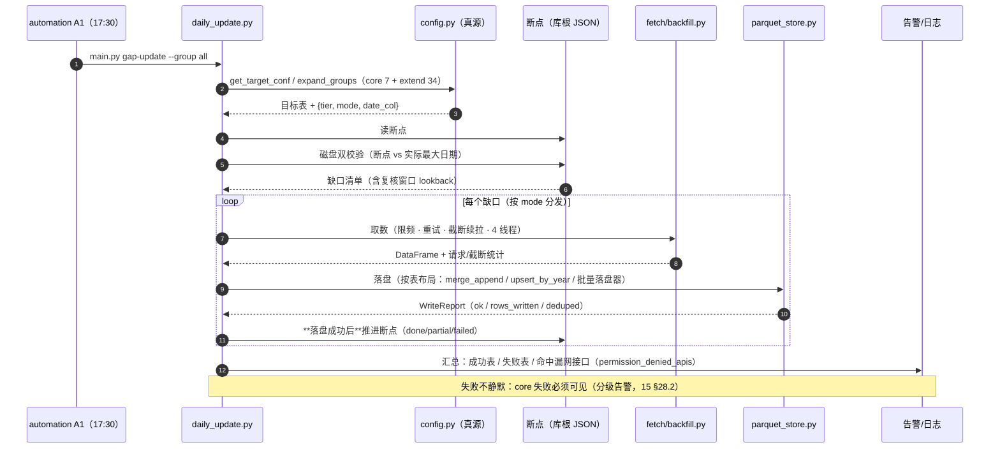
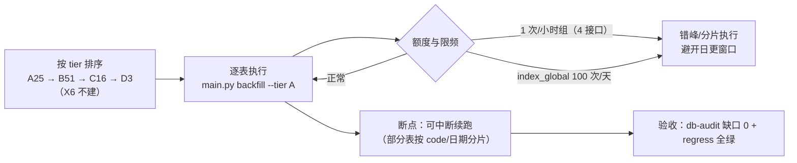
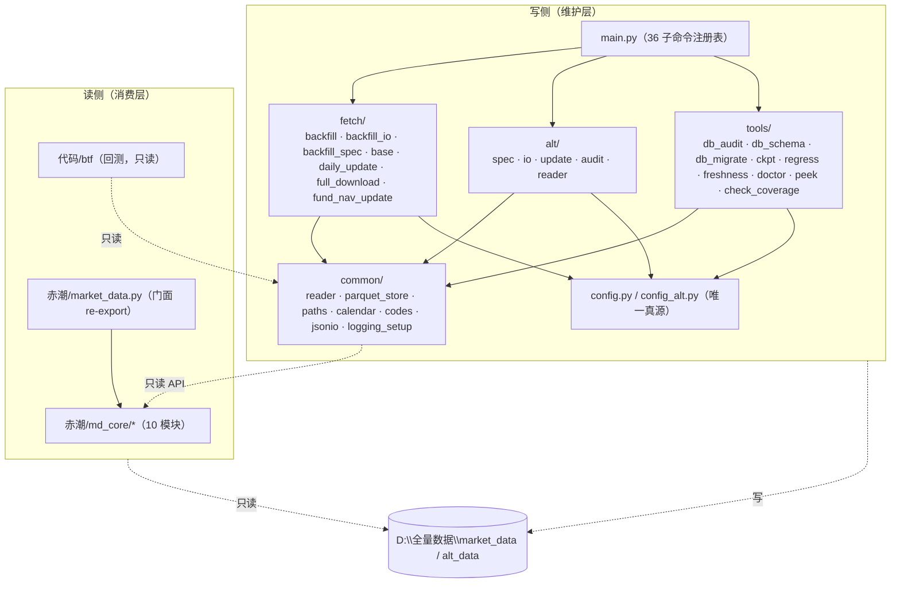
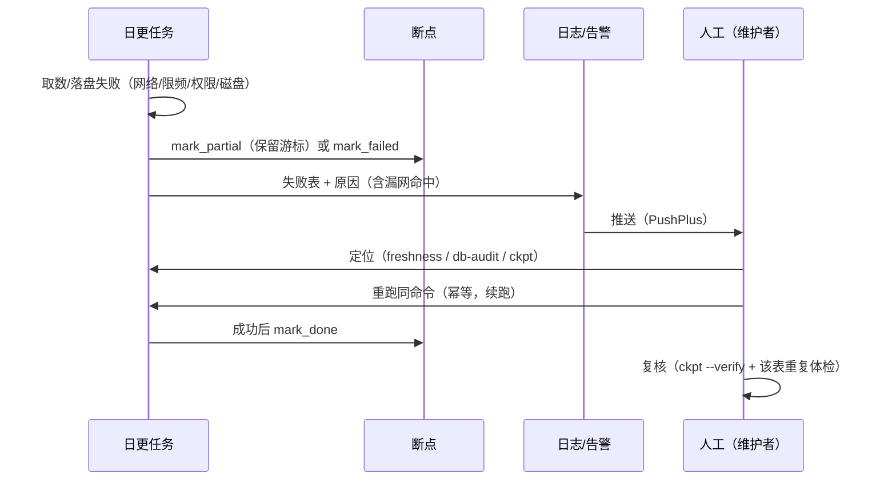

# 06 · 核心流程与关键时序（章 10-11）

> 本章回答"库每天/每次是怎么动起来的"：**七个端到端流程（F1-F7）** + 图集（时序/依赖/命令地图/调度时刻表）。

---

## 章 10 · 七大端到端流程

### 10.1 流程总览

| # | 流程 | 触发 | 入口命令 | 产出 |
|---|---|---|---|---|
| F1 | **每日增量（日更）** | automation A1（17:30） | `main.py gap-update --group all` | 主干表推进至 T 日 +（失败/漏网）告警 |
| F2 | **缺口补数** | 中断后发现 / 人工 | `main.py gap-update --table X` / `--group core` | 指定表缺口补齐；幂等 |
| F3 | **全量建库/重建** | 新库 / 迁移 / 灾备 | `main.py backfill --tier A`（逐 tier） | 101 目标表按 tier 重建 |
| F4 | **新表纳管** | 新增数据需求 | 手工改 `config.py` + 断言 | 新表进组/进豁免 + 断言覆盖 |
| F5 | **迁移与布局变更** | 分区策略调整 | `main.py db-migrate` | 布局统一 + 校验 + 回滚点 |
| F6 | **体检与审计** | 定期 / 异常 | `db-audit` · `ckpt` · `freshness` · `regress` | 体检报告 + 告警 |
| F7 | **派生重算** | 主干更新后 / 人工 | `redtide-supply` · `custom-index` · `scan` | 派生层重建（只读主干） |

### 10.2 F1 每日增量（核心流程）

**现状实现锚点**（`代码/fetch/daily_update.py`）：`get_target_conf()` → `expand_groups()` → `engine_supports_daily()` → `resolve_gaps()`（含 `_resolve_gaps_range()`）→ `run_daily_update(target_date, dry_run, groups)` → `_report_permission_denied()`。



**关键设计点**：

| 设计点 | 现状做法 | 为什么 |
|---|---|---|
| 缺口来源 | **断点 ∩ 磁盘**双校验（不是只看断点，也不只看磁盘） | 断点可能虚记（落盘失败但已记），磁盘是事实 |
| 复核窗口 | 重拉最近若干交易日（`lookback`） | 源方当日数据可能后修正（更新/补披露） |
| 无参快照表 | 复核窗口排除（`once` 类表日更不重拉） | 避免无意义请求与"参数缺失"错误 |
| 取数分发 | 按 `mode` 8 分支（引擎能力判定 `engine_supports_daily`） | `single`/`paged`/`by_param` 类表不进日更 |
| 落盘次序 | **先落盘 → 后记断点**（INV-3） | 断点表示"数据已在磁盘"，不是"请求已发出" |
| 漏网报告 | `_report_permission_denied()` 汇总本次命中 | 7 个漏网接口随时可能失效，必须显式可见 |

**日更之后的链式动作**（同一交易日晚间）：

| 时点 | 动作 | 说明 |
|---|---|---|
| 17:30 | `gap-update --group all` | 主干核心与扩展组 |
| 20:00 后 | `fund-nav` | 场外基金净值（当日晚间才发布） |
| 20:00 后 | `alt-update` | akshare 备库（独立断点、独立体检） |
| 20:10 后 | `redtide-supply` | 派生：`adj_factor`/`stk_limit`/`market_state` 供给 |
| 18:00+ | `scan` | 背离扫描信号（消费侧任务，读主干） |
| 21:30 | `report` / `push` | 日报与推送（含库体检摘要） |

### 10.3 F2 缺口补数

| 步骤 | 动作 | 判据/守卫 |
|---|---|---|
| 1 | 定位缺口（表 + 日期区间） | `main.py gap-update --table daily --start ... ` 或先 `db-audit`/`freshness` 定位 |
| 2 | 确认表规格与模式 | `config.py` 真源（`mode`/`date_col`/`page_conf`） |
| 3 | 断点态处理 | 若断点为 `partial` → 从游标续跑；若"虚记" → `ckpt` 清虚记后再补 |
| 4 | 执行与落盘 | 同 F1（同一引擎，幂等） |
| 5 | 复核 | `ckpt --verify` + 该表重复体检 |

**幂等性保证**：落盘器以 `DB_AUDIT_PKEYS` 为去重子集做"合并去重"，故**重复执行不产生重复行**（INV-4）；这也是"敢重跑"的前提。

### 10.4 F3 全量建库 / 重建



| 档位 | 表数 | 说明 |
|---|---:|---|
| Tier A | 25 | 核心高频，优先重建 |
| Tier B | 51 | 扩展数据域 |
| Tier C | 16 | 低频/批量（分页表集中于此） |
| Tier D | 3 | 极低频/长周期 |
| Tier X | 6 | **不建**（`enabled=False`，死结/无权限，显式登记） |

**请求规模参考**：期货线（`fut_*` 系列）曾实测 **5,276 个任务 → 31,656 次请求**（权限总账口径）；因此全量重建必须**分段 + 错峰 + 断点**，不可一次性拉起。**耗时基线：[待验证]**（PoC-3 目标：给出逐 tier 的实测 wall-clock）。

### 10.5 F4 新表纳管（纪律清单，S4）

| 步 | 动作 | 产物 | 机检 |
|---|---|---|---|
| 1 | 归域并定 tier/mode | `BACKFILL_TARGETS` 条目 | `config-check` |
| 2 | 定日期列与主键 | `TABLE_DATE_COL` / `DB_AUDIT_PKEYS` | `regress` R10 类断言 |
| 3 | 判布局 | `table_storage_layout()`（**不手工指定**） | `reader.inspect_layout()` |
| 4 | 进组或显式豁免 | `DAILY_UPDATE_GROUPS` / `DAILY_UPDATE_EXEMPT`（含理由） | INV-6 检查 |
| 5 | 分页/截断配置 | `BACKFILL_PAGE_CONF`（如需） | 截断检测 |
| 6 | 补质量断言 | 缺口/重复/规模判据 | `db-audit` 覆盖 |
| 7 | 更新字典与 README 快照 | 文档 generated 段落 | 一致性抽查 |

### 10.6 F5 迁移与布局变更

| 步 | 动作 | 守卫 |
|---|---|---|
| 1 | 迁移前判定 | `inspect_layout()` 是否存在混合布局 |
| 2 | **dry-run** | 仅打印计划（不写盘） |
| 3 | 备份 | 目标表 `copy` 到 `.bak`（迁移前置） |
| 4 | 执行迁移 | `migrate_to_year_partitions`（按年重写 + 原子替换） |
| 5 | 校验 | 迁移前后**行数与主键**一致（`ckpt --verify` + 重复体检） |
| 6 | 回滚点 | 保留 `.bak` 至下一次成功日更之后 |
| 7 | 断言 | `regress` 全绿方可销项 |

**历史先例**：2026-09 完成"按年大表"迁移，`moneyflow` 读取从 1 天/分钟提速至 **41 天/分钟**（40×），证明布局改造是本库最大的性能杠杆。

### 10.7 F6 体检与审计

| 检查 | 命令 | 覆盖 | 频率 |
|---|---|---|---|
| 断点一致性 | `main.py ckpt --verify` | 断点 vs 磁盘最大日期/行数 | 日更后 |
| 重复检查 | `main.py db-audit`（重复段） | 按 `DB_AUDIT_PKEYS` 主键 | 每日/每周 |
| 缺口检查 | `main.py db-audit`（缺口段） | 交易日连续性 | 每日 |
| 规模检查 | `main.py db-audit`（规模段） | 行数/文件数突变 | 每日 |
| 新鲜度 | `main.py freshness` | core 7 表是否达最近交易日 | 日更后 |
| 覆盖率 | `main.py check-coverage` | 可转债、ETF/LOF 覆盖 | 每周 |
| 规格一致性 | `main.py alt-audit` / `config-check` | 并列库与配置 | 每周 |
| 回归 | `main.py regress` | 16 断言组 / 28 检查项 | 变更后 + 每周 |

### 10.8 F7 派生重算

| 派生 | 输入 | 幂等性 | 失败处理 |
|---|---|---|---|
| `market_state/derived` | `daily` + `stk_limit` + `daily_basic` | 全量重建（覆盖写） | 重跑；不触碰主干 |
| `custom_index` | `daily`/`daily_basic` + 权重定义 | 全量重建 | 重跑 |
| `signals` | `daily` + `adj_factor` | 按日增量 + 覆盖 | 重跑 |
| 日报/推送 | 上述全部 + 体检摘要 | 幂等（按日覆盖） | 重跑 |

**纪律**：派生任务**只读主干**（INV-7），且不得写主干目录；派生目录独立（03 §7.2）。

---

## 章 11 · 图集：架构图 / 拓扑图 / 依赖图 / 命令地图

### 11.1 逻辑架构图

见 03 §7.1（L0 采集适配 → L1 规格与幂等 → L2 落盘与主干 → L3 派生 → L4 服务 → L5 治理观测）。**本图为准，其他文档引用不重绘**，避免多处维护导致漂移。

### 11.2 部署拓扑与调度时刻表

拓扑见 03 §7.4。**调度时刻表（现状，自动化侧口径）**：

| 时点 | 任务 | 归属 | 失败影响 |
|---|---|---|---|
| 17:30 | 库日更 `gap-update --group all` | automation A1 | core 失败 → 当日决策降级；extend 失败 → 次日补 |
| 18:00+ | 背离扫描 `scan` | automation A2 | 信号延迟，不影响主干 |
| 20:00 后 | `fund-nav`（场外净值） | automation | 净值滞后一日 |
| 20:00 后 | `alt-update`（akshare 备库） | automation | 备源滞后（主库不受影响） |
| 20:10 后 | `redtide-supply`（派生供给） | automation | 派生状态滞后 |
| 21:30 | 日报 / 推送（作战包） | automation | 仅通知缺失 |

> **窗口纪律**：任何全量/大批量作业（F3、F5）必须**避开 17:00-18:00 与 20:00-21:00**，否则与日更争用 API 额度（限频是全局的，不是按任务隔离）。

### 11.3 模块依赖图（现状，写侧与读侧分离）



**依赖纪律**：`common` 不依赖 `fetch`/`tools`/`alt`（底层不反向依赖）；`config.py` 不依赖任何业务模块（真源零依赖）；读侧不得依赖写侧内部函数（只经公开 API）。

### 11.4 命令地图（36 子命令按职责分类）

| 分类 | 职责 | 代表命令（完整清单以 `main.py --help` 为准） |
|---|---|---|
| 采集 | 增量与全量取数 | `gap-update` · `backfill` · `fund-nav` |
| 并列库 | akshare 备库 | `alt-update` · `alt-audit` |
| 治理 | 体检与核对 | `db-audit` · `ckpt` · `freshness` · `check-coverage` · `config-check` · `doctor` |
| 结构 | 结构与迁移 | `db-schema` · `db-migrate` |
| 质量 | 回归断言 | `regress` |
| 派生 | 状态/信号/指数 | `redtide-supply` · 自定义指数与信号生成命令 |
| 交付 | 报告与推送 | `report` · `push` |
| 探查 | 人工快速查看 | `peek` |

### 11.5 关键路径与阻塞点

**日更关键路径（最慢链）**：

```
读断点 + 磁盘校验 → 缺口计算 → 【限频取数 = 关键路径瓶颈】 → 落盘 → 记断点 → 告警
```

| 阻塞点 | 事实 | 缓解 |
|---|---|---|
| 全局限频 | `daily` 300/分（配 250）、高频组 200/分（配 170）、4 接口 1 次/小时、`index_global` 100 次/天 | 限速器预约式排队 + 分片错峰 + 断点续跑 |
| 单接口小时窗 | 4 个接口 1 次/小时 → 补数窗口极窄 | 该组表纳入日更正确性优先（宁可早跑不可晚跑） |
| 授权单点 | 7 个漏网接口无合同保障 | 降级 + 替代源（ADR-8、14 §25.3） |
| 并发写 | 无锁（单进程假设） | 写锁文件（11 §21 PoC-5） |
| 磁盘单点 | 单盘、无冗余 | 冷备 + 重拉能力（PoC-2、14 §22.4） |

### 11.6 故障时序（失败 → 可见 → 恢复）



**恢复原则**：① 先看断点态再看磁盘（避免重复拉）；② 重跑一律使用同一命令（幂等保证结果一致）；③ 恢复后必须做一次该表**重复 + 缺口**双检（防"补了重复"）。

