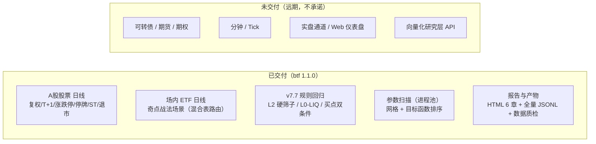

# 01 总览与定位

> **本文档描述 btf（BT-Foundation）当前的定位与范围**——对应实现版本 **btf 1.1.0（2026-09-29 定版；2026-09-30 CLI 收编）**。
> 关联：[README.md](README.md)（导航与门禁）、[03-总体架构方案对比与推荐.md](03-总体架构方案对比与推荐.md)（分层架构与依赖铁律）、[18-分步编码计划.md](18-分步编码计划.md)（编码过程与时间线）。

---

## 第 1 章 执行摘要

### 1.1 一句话定位

**btf 是 A 股日线量化策略的"个人级回测基础设施"**：以**正确性第一、可复现性第二**为原则，分层可插拔 + 事件驱动内核，直读现有 Tushare Parquet 主库（只读），
为两个在役策略提供**可复现的回归与验证能力**——① v7.7 规则引擎（`赤潮/rules/single-source.md`）；
② 奇点战法（`代码/strategies/qidian.py`，ETF 轮动）。

**定位边界（明确口径）**：btf 是**工具**（服务对象=本人单机单人），不是平台/SaaS，不对外提供在线服务；
「1.0」只对**工具**成立（可自证 / 自检 / 自退），**研究体系本身恒演进、无 1.0 概念**。

### 1.2 交付现状（**btf 1.1.0**，实测）

| 维度 | 现状 |
|---|---|
| **能力** | 任一策略 × 任一有数据基准，在数据覆盖区间内**可跑通 / 可复算 / 可复现 / 越界 fail-closed**；报告可读（6 章 HTML，含强制章节「假设与披露」「复现说明」） |
| **资产 × 频率** | A 股股票（含退市，防幸存者偏差）+ 场内 ETF，**日线**；周/月线由日线自聚合（W-FRI）；期货/期权/港美股仅领域模型预留 |
| **策略面** | 事件驱动 `StrategyBase`（`on_open`/`on_close` + 目标仓位）；v7.7 规则链经 RulesProvider 从规则源/镜像加载（**禁止 YAML 手抄**） |
| **质量门** | 全量 **890 测试**绿 · `bt check` **9/9** · import-linter **10 契约 KEPT** · 规则机检（数值四方 + 状态机语义）· 数据不变量机检（含负向对照）· IO 单一入口机检（含变异性自检）· ruff 全清 |
| **CLI** | **十一命令族**：`config-check` / `run` / `report` / `verify` / `test` / `dataset` / `optimize` + **`check`**（九项门禁收编 · 单一真源转发）/ `cold-backup` / `runs` / `show`；`bt --version` 版本单源 |
| **性能（实测基线，隔离单跑）** | 十年就绪 **8.86s**（软 10s）· 沪深300 轮动月调仓 10 年 **16.95s**（硬 20s）· 全市场 10 年 **43.3s**（硬 60s）· 千组参数扫描外推 **1670s**（预算 1800s，余量 1.08x）· LIQ 十年预计算 **4.90s**（软 8s）——明细与机器态归因见 [09 §14.5](09-测试验证与基准.md) / `tests/perf/BASELINE.md` |
| **可复现** | `manifest.json` 四版本快照（数据指纹 / 代码版本 / 配置哈希 + 生效配置 / 环境）· `metrics_digest` 重跑逐位一致 · `bt verify` 对账 |

### 1.3 已落地的架构结论（TL;DR）

| # | 结论 | 落地形态 |
|---|---|---|
| 1 | **分层可插拔 + 混合计算**：领域核心零第三方依赖；回测层事件驱动（结论只出自事件层）；研究层向量化（筛选用途，不作结论） | `btf.domain`（白名单标准库）→ 引擎四模块 → 分析/实验/数据 → app/cli/api |
| 2 | **数据底座复用而非重建**：直读 `market_data` 主库（只读契约），读取适配层统一布局与量纲 | `btf.data`（`tables_meta` 登记 18 表；`core.YearTableStore` 为唯一 IO 入口） |
| 3 | **A 股特化建模是增量价值点**：涨跌停/停牌/ST/退市/分红分散在 5+ 表 → 合成**交易日状态面板** | `btf.data.state.StateSynthesizer`（六源合成） |
| 4 | **"全字段齐备"回测区间从 2008-01-02 起**（stk_limit 起点）；更早区间须显式降级 | `data.coverage.check_coverage` 装配期硬门 + `allow_degraded_limit` 显式放行并披露 |
| 5 | **复权是消费侧职责**：库内只存不复权价 + `adj_factor` | `btf.data.adjust.AdjustService`（hfq/qfq；**不进引擎记账**） |
| 6 | **确定性优先**：单进程 + 进程池并行；事件流可重放、产物可对账 | `engine.events.jsonl`（可采样但**必披露**）· `bt verify` digest 对账 · 原子写 + fsync |
| 7 | **入口统一、核心稳定**：入口只编排不承载业务 | `btf.app`（应用服务层）← `btf.cli` / `btf.api`；契约新 10 机器守卫 |
| 8 | **规则单一真源**：赤潮 `rules/single-source.md` 为唯一源，YAML 手抄即违约 | RulesProvider（`static` / `mirror_json`）+ 四方机检（源 ↔ 镜像 ↔ 消费绑定 ↔ btf 缓存） |

### 1.4 探索期最重要的问题（及其当前答案）

| 问题 | 当前答案（可复核） |
|---|---|
| 结果**可信**吗（无前视/无幸存者/状态合成正确）？ | 事件时序随 bar 严格定义（10 步日循环）；退市股在库内可回测；状态面板六源合成 + **数据不变量校验**（CC-1..CC-5）+ **金标准用例**（成交约束/成本分段/分红复权/退市 ST） |
| 三个月后重跑一致吗？ | 四版本快照 + `metrics_digest`（重跑逐位相同）+ `bt verify`（recompute/stored 双对账）+ 数据指纹（`sha256:…` 实算值，非占位） |
| 策略代码从研究到实盘不改写？ | 事件内核 + 目标仓位协议；实盘通道为**非目标**（不承诺，仅保留领域接口） |
| A 股微观约束够用且不错吗？ | 涨跌停拒单（含板块/ST 幅度）、T+1 可卖数量、停牌/退市/ST 拒单、100 股整手、**卖先买后**顺序；参数经真实数据标定 |
| 何时停止探索进入下一阶段？ | 见 [11-演进路线风险与PoC.md](11-演进路线风险与PoC.md)（PoC 门槛）与 **btf 1.0 判据**（[16-架构评审与验收标准.md](16-架构评审与验收标准.md)） |

### 1.5 阅读指引

- 想看**架构与依赖纪律**：[03](03-总体架构方案对比与推荐.md)
- 想看**领域模型与接口契约**：[04](04-领域模型与核心接口.md)
- 想看**数据层与数据集体系**：[05](05-数据架构与数据集体系.md)
- 想看**核心流程与日循环时序**：[06](06-核心流程与关键时序.md)
- 想看**验收尺子与门禁**：[16](16-架构评审与验收标准.md)（+ [README.md](README.md) 门禁清单）
- 想看**编码过程与版本时间线**：[18](18-分步编码计划.md)；**历次架构审查与裁决**：[19](19-架构审查与重构方案-20260927.md)

---

## 第 2 章 目标、非目标与范围

### 2.1 目标（已交付口径）

**G1 正确性优先的回测内核** ✅ 已交付

- 事件驱动日循环：bar 内时序严格定义（**10 步**，见 [06](06-核心流程与关键时序.md)）；含退市股票（防幸存者偏差）；A 股约束完备（涨跌停、T+1、停牌、ST、100 股整手）。
- 成本模型可配置：佣金（含最低佣金）、印花税（**按日期分段**）、过户费（沪深双向，按日期分段）、滑点（`none`/`fixed`/`pct`）。

**G2 可复现的实验闭环** ✅ 已交付

- 一次回测 = 数据版本 + 代码版本 + 配置版本 + 环境版本 四元组唯一确定（`manifest.json` + 配置哈希 + 生效配置快照）；数据版本为**实算内容指纹**（`data/version.py`）。
- 实验产物落盘可查：`manifest.json` / `snapshots.jsonl` / `trades.jsonl` / `fills.jsonl` / `rejections.jsonl` / `events.jsonl` / `metrics.json` / `data_quality_report.json` / `report.html`。

**G3 可组合的策略工作台** ◐ 部分交付

- 事件驱动回测为**唯一结论来源**；参数扫描（网格 + 进程池）已交付（`bt optimize`）。
- 向量化研究层**当前不交付**：研究层结论不作依据，故不以双路径口径换取治理成本（研究需求由 Notebook 直用 `btf.data` 读取层满足）。

**G4 工程化的稳定复用底座** ✅ 已交付

- 领域层纯 Python、**零第三方依赖**（白名单：`typing/dataclasses/enum/datetime/collections/__future__`）。
- 扩展点插件化：**10 个注册点**（data_feed / cost_model / slippage_model / execution_handler / risk_rule / rebalancer / analyzer / rules_provider / optimizer / run_store），新增实现 = 新增文件 + 配置声明，**不改核心**（契约 6 + 机器守卫）。

**G5 增量交付** ✅ 已交付

- v0.2（MVP）→ v0.5 → 0.5.16 逐批交付 → **1.0.0（2026-09-29 定版）→ 1.1.0（2026-09-30 CLI 收编）**，每批带门禁与实测证据；完整时间线见 [18](18-分步编码计划.md)。

### 2.2 非目标（明确不做）

| # | 非目标 | 理由 |
|---|---|---|
| NG1 | Tick / Level-2 订单簿撮合、分钟级 | 数据底座无盘中数据；日线频率下收益远小于复杂度（**能力边界，不销案**） |
| NG2 | 实盘下单通道 | 非目标；仅保留领域模型接口一致性，不承诺时间表 |
| NG3 | 自建数据采集管道 | 采集侧流水线独立运行，btf **只读消费** |
| NG4 | 分布式/集群、数据库服务器 | 日线单策略单机秒-分钟级；参数扫描用进程池即可 |
| NG5 | 期权定价/希腊字母、期货保证金逐日盯市 | 多资产远期项，仅留 `Instrument.asset_class` 与账户模型接口 |
| NG6 | Web 在线协作平台、多租户 SaaS | 单人本机场景；**明确不对外提供服务** |
| NG7 | 高频做市/套利 | 与日线定位不符 |
| NG8 | 自研 DSL / 多语言内核 | 仅 Python 单语言，降低维护成本 |

### 2.3 范围（当前）

- **资产**：A 股股票（主板/创业板/科创板/北交所）+ 场内 ETF（含混合表 `mixed` feed，按代码段自动路由）。
- **频率**：日线（含周线信号 W-FRI 自聚合）。
- **数据**：只读主库 `market_data`（`BTF_DATA_DIR` 可覆盖）；回测可信区间按覆盖度守卫分级（[05](05-数据架构与数据集体系.md)）。
- **规则**：v7.7 类策略经 RulesProvider 加载（唯一真源约束）。
- **入口**：CLI（`bt`，7 命令）+ Python Facade（`btf.api`）+ Notebook 直用读取层。



---

## 第 3 章 利益相关者与典型场景

### 3.1 利益相关者

| 角色 | 关注点 | 对应质量属性 |
|---|---|---|
| **策略研究员**（主要用户，单人） | 快速验证、指标可信、结果可复现 | 正确性、可复现性、易用性 |
| **规则维护者**（同一人，赤潮侧） | 规则升级后行为未漂移（回归可信） | 一致性、可追溯 |
| **数据底座维护者** | btf 对主库的**只读契约**、不破坏采集流水线 | 互操作、隔离 |
| **架构评审者** | 决策有据、门禁可复核、演进可行 | 可评审性 |

### 3.2 典型用户旅程（当前实现口径）

**U1 单策略日线回测（最高频）**

```bash
bt config-check --config backtest.yaml --resolve-strategy   # 配置与策略可加载性
bt run --config backtest.yaml --verbose                     # 落盘 + 分步耗时/质检/指纹摘要
# 产物：runs/<run_id>/{manifest.json,metrics.json,...,data_quality_report.json}
# 报告：bt report --run <run_id>  →  report.html（6 章，含强制「假设与披露」「复现说明」）
# 对账：bt verify --run <run_id>  →  digest 双对账（recompute/stored）
# 门禁：bt check                  →  九项架构门禁（提交前必跑；= python tools/check.py）
```

**U2 参数扫描**

```bash
bt optimize --config backtest.yaml --grid "run.params.top_n=5,10;run.params.rebalance_day=1,2" \
            --objective sharpe_ratio --workers 8
```

**U3 Notebook 研究（直用读取层）**

```python
from btf.data.core import YearTableStore            # 唯一 IO 入口（线程安全、有界缓存）
from btf.data.tables_meta import daily_table_of      # 标的路由（股票/ETF 混合表）
store = YearTableStore()                             # 缺省主库
# 按区间/标的切片取数（谓词下推）→ numpy/pandas 自行研究
```

**U4 策略迭代回归（防"改了算法导致历史结论失效"）**

```bash
python tools/check.py                 # 9 项门禁（ruff/契约/冒烟/依赖预算/导入/domain 白名单/渲染/数据质检/IO 单一入口）
bt test --layer l5                    # 基准层（B1..B4 + perf）
bt test --layer l3                    # 集成层（含风控真实链 e2e、CLI 基准 e2e）
```

**U5 v7.7 规则回归 + 奇点复跑（第一验收旅程）**

```
规则源镜像加载（rules_version 进 manifest）→ L2 硬筛子（PIT）逐日选股
  → L0-LIQ 仓位闸门（状态序列 = CRISIS→RECOVERY×3→NORMAL）
  → 规则升级后重跑 → digest/指标 diff 证明行为变更范围受控
奇点：QIDIAN_POOL + 指数双重确认（周线 J/CCI，W-FRI）→ 信号复现 → 与既有名单对照
```

### 3.3 场景支持矩阵（当前）

| 场景 | 支持 | 说明 |
|---|---|---|
| 全市场日线截面策略（轮动/多因子选股） | ✅ | 截面读取 + 谓词下推（子集宇宙免扫全市场年表） |
| 单标的择时 | ✅ | 最简场景 |
| 组合再平衡（月度/阈值） | ✅ | `full` / `threshold` 两种 rebalancer |
| ETF 轮动（奇点类） | ✅ | `mixed` feed + `fund_daily`/`etf_limit` |
| v7.7 规则引擎回归 | ✅ | `daily_basic`/`fina_indicator`/`moneyflow`/`index_dailybasic` + 微盘派生 |
| 参数优化 | ✅ | 网格 + 进程池（跨组合共享数据源） |
| 可转债 / 期货 / 期权 | ❌ | 远期，仅领域预留 |
| 日内 / Tick / 高频 | ❌ | NG1 / NG7 |

---

## 第 4 章 质量属性与约束

### 4.1 质量属性优先级（实际执行顺序）

```
正确性 > 可复现性 > 可测试性 > 可扩展性 > 易用性 > 性能 > 可观测性 > 安全性
```

| 优先级 | 属性 | 当前可验收口径 |
|---|---|---|
| P0 | **正确性** | 890 测试全绿（含金标准用例：成交约束/成本分段/分红复权/退市 ST）；数据不变量校验（CC-1..CC-5）装配期可硬失败；事件时序 10 步显式化；[16](16-架构评审与验收标准.md) 验收尺子逐项有实测证据 |
| P0 | **可复现性** | `manifest` 四版本 + **实算数据指纹**（`sha256:…`）+ `metrics_digest` 重跑逐位相同 + `bt verify` 双对账；原子写 + fsync |
| P1 | **可测试性** | 领域对象可脱盘构造（`MemoryFeed`）；每撮合规则可单测；测试五层（l1..l5）+ 机检脚本 |
| P1 | **可扩展性** | 10 注册点「新增文件 + 声明」；契约 6 机器守卫（`check_plugin_boundary.py` 基线 + 留痕） |
| P2 | **易用性** | **十一命令族**（含 `bt check` 门禁收编、`bt --version` / `runs` / `show` / `cold-backup`）+ `bt config-check`（含 `--resolve-strategy`）+ `--dry-run` + `--verbose` 分步耗时 + 默认配置开箱可用 |
| P2 | **性能** | 四道基准门槛（磁盘实测）：B2 20s / B3 60s / B4 1800s / LIQ 硬 8s；均带软目标与负载余量纪律（`tests/perf/BASELINE.md`） |
| P3 | **可观测性** | `events.jsonl`（采样需披露）+ `step_timings` + 日志；断点续跑为远期项 |
| P3 | **安全性** | 凭据经环境变量（`BTF_*` 白名单过滤）；产物可审计；无外部服务暴露 |

### 4.2 约束（当前事实）

**C1 数据约束（硬边界）**

| 约束 | 影响 | 应对（已落地） |
|---|---|---|
| 主库仅日线及以上频率 | 撮合基于 bar 聚合假设 | bar 内撮合规则显式化（[06](06-核心流程与关键时序.md)） |
| `stk_limit` 起于 2008-01-02 | 更早区间无涨跌停约束 | `check_coverage` 装配期硬门；`allow_degraded_limit` 显式放行并**强制披露** |
| `etf_limit` 起于 2019-06-26、`adj_factor` 起于 1991-07-03 | 早期 ETF / 早期区间不可复权 | 同上（分级降级 + 披露） |
| vol=手、amount=千元、市值=万元 | 量纲错是高发 bug | `tables_meta` 声明 + `parquet_reader._apply_conversions` **单点换算** |
| 日期为 `YYYYMMDD` 字符串 | 解析陷阱 | 领域层统一 `TradingDate` 值对象 |
| 周月线锚点=周五 | 长假周口径分歧 | 由日线**自聚合**（W-FRI），不直读现成周月线表 |
| 部分 Tushare 接口停更 | 数据源可靠性分级 | 主库为一等源；alt 库为快照型（`BTF_ALT_DATA_DIR` 预留） |

**C2 环境约束**

- Windows 11 单机（PowerShell），路径含中文（`D:\量化策略`），全部 I/O 显式 UTF-8。
- Python 3.13 + venv（pandas / pyarrow / scipy / pyyaml / jinja2 / jsonschema / plotly）；**不引入编译型扩展**。
- 主库体量 GB 级；产物目录独立（`回测产物/runs`）。

**C3 工程约束**

- 单人开发、无 CI 服务器：**门禁本地常跑**（`python tools/check.py` 9 项 + pytest 五层）。
- 只读主库；派生产物写独立目录。
- 配置体系支持环境变量覆盖（`BTF_*`）与 CLI 覆盖（`--set`，L4 层，类型推断单源在 `btf.app`）。
- **规则单一真源**：规则参数经 RulesProvider 从规则源/镜像加载；四方机检保证源↔镜像↔消费↔缓存数值一致（含状态机语义锚点）。

### 4.3 成功判据（**btf 1.0.0 已达成**，2026-09-29 定版）

btf 1.0 = **可自证 / 可自检 / 可自退**（详细尺子见 [16](16-架构评审与验收标准.md)）：

1. **8 项判据全部满足**（对齐"数据库工具 1.0"同级标尺）：数据溯源（实算指纹）／结构不变量（CC-1..CC-5 + 机检）／
   门禁常跑（**9 项**）／契约机器守卫（**10 条**）／渲染级断言／**可回退**（**跨版本源码冷备已执行**：
   `备份/20260929-2146-btf-1.0.0-cold`，213 文件 sha256 自校验通过）／质量担保（私有托管**就绪**，push 属老大动作）／
   文档即真相（本文档集 01–17 已按 1.1.0 现状收口；2026-09-30 计数同步）。
2. **卡口清单**：**执行方可闭环的代码项已全部清零**（R4 四批 v0.5.10–0.5.13 + 批 9–11）；余 **1 项老大动作**
   （私有托管 push）+ 业务/数据侧议题（多区间稳健性、数据治理 OBS-7/8，**不卡工具 1.0**）。
3. **出口三条件**：一区清零 ✅ + 私有托管（就绪，待 push）◐ + **v1.0 定版冷备 ✅ 已执行**。

---

> **下一篇**：[02-参考系统对照与借鉴.md](02-参考系统对照与借鉴.md) —— 五类参考系统的对照与**已采纳**的借鉴结论。
