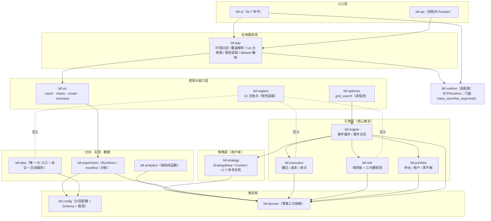

# 03 总体架构方案对比与推荐

> **本文档描述 btf 当前的总体架构**——对应实现版本 **btf 1.1.0（2026-09-29 定版；2026-09-30 CLI 收编）**。
> 关联：领域模型与接口见 [04](04-领域模型与核心接口.md)；依赖纪律的机器守卫见 [14](14-工程化专项设计-上.md) 与 [README.md](README.md)。
> **阅读要点**：§6 是方案取舍（为何最终是这一种），§7 是**已落地的分层与依赖铁律**（可直接对照代码）。

---

## 第 6 章 候选架构方案与取舍

### 6.1 三类候选

| 方案 | 形态 | 结局 |
|---|---|---|
| **A 纯事件驱动** | 全部计算（含指标）都在事件循环内，策略以回调消费逐 bar 事件 | 未采纳（指标预计算/参数扫描体验差） |
| **B 纯向量化 + 约束修正层** | 信号矩阵 → 撮合向量化 → 绩效向量化；A 股约束以事后掩码叠加 | **未采纳**：约束修正层是"事后补丁"，T+1 可卖数量、涨跌停排队、停牌在向量化里表达**极易出错且难单测**——正确性天花板结构性偏低 |
| **C 分层可插拔 + 事件驱动内核** ✅ | 领域核心零依赖；结论只出自事件层；外围（数据/成本/滑点/风控/指标/存储）全插件化 | **采纳并已实现**：见 §7；向量化"研究层"仅作筛选用途，**不作结论**（当前不交付 API，研究直用 `btf.data` 读取层） |

### 6.2 采纳理由（可复核）

1. **正确性结构性占优**：结论只出自事件驱动层（约束逐事件可查、可单测）；向量化只用于筛选，错了不致命。
2. **与项目形态匹配**：日线为主 → 事件层开销可接受；单人研究 → 快速筛选仍有价值（由读取层 + Notebook 承担）。
3. **口径单源**：同一 `DataFeed` 切片 + 同一指标实现 + 同一配置体系 → 不存在"两套口径"的治理税。
4. **演进平滑**：换内核不动领域层；扩资产 = 加规则包；分布式 = 换调度层（当前不做）。

**代价（已正视）**：初期多出契约与守卫成本 → 对策是**把纪律做成机器可执行的门禁**（10 条 import-linter 契约 + 9 项 `check.py` + 插件基线留痕）。

---

## 第 7 章 已落地的分层架构

### 7.1 分层总图（与 `pyproject.toml` 的 Layered architecture 契约一一对应）

> **注**：`btf.runtime` 是**装配根**（唯一把配置、插件、数据、引擎、风控、报告串起来的地方），
> 不参与分层序号但受同一契约约束；`btf.app` 位于入口层之下、能力层之上。

### 7.2 分层职责与稳定性（对照包名）

| 层 | 包 | 职责 | 稳定性 | 硬禁令（机器守卫） |
|---|---|---|---|---|
| **稳定核** | `btf.domain` | `Instrument`/`Order`/`Fill`/`Position`/`Portfolio`/事件类型/`TradingDate`/有界缓存工具；纯数据 + 纯行为 | ★★★ | **零第三方依赖**（白名单 `typing/dataclasses/enum/datetime/collections/__future__`）；禁止 I/O |
| **配置** | `btf.config` | 分层配置（默认 → 环境 `BTF_*` → 用户文件 → CLI 覆盖）、JSON Schema 校验、路径解析、脱敏 | Schema★★★ | 禁止代码内硬编码裸路径（环境变量可覆盖） |
| **数据** | `btf.data` | DataFeed 协议 + Tushare Parquet 适配器（含 `mixed` 混合表路由）+ 状态面板合成 + 复权服务 + 覆盖度守卫 + 数据不变量校验 + 内容指纹 + 指数宇宙/序列 | 协议★★★ / 适配器★ | 禁止反向依赖引擎（契约 4）；上层**不得直接 import `data.parquet_reader`**（契约 9）；`data.core` 不得依赖领域模块（契约 7） |
| **策略** | `btf.strategy` | `StrategyBase`（`on_open`/`on_close` + 目标仓位）、`Context`、示例与 v7.7 参考实现 | 基类★★★ / 用户代码★ | 不得直接触 IO（取数只经 Context/注入） |
| **引擎** | `btf.engine` `btf.execution` `btf.risk` `btf.portfolio` | 事件循环（10 步日循环）+ 事件日志；撮合/成本/滑点；风控规则链；组合与再平衡 | ★★☆ | **四模块只经 domain 事件与 Protocol 交互**（契约 3）；不得依赖具体数据源（全部 Protocol 注入） |
| **分析** | `btf.analytics` `btf.optimize` `btf.experiment` | 指标纯函数（15 项）；网格扫描（进程池）；Run 产物/manifest/对账 | 协议★★★ | 指标无副作用；optimizer 不内嵌回测逻辑（调引擎） |
| **注册表** | `btf.registry` | 10 注册点发现与装配、版本协商（`contract_version`）、按点惰性装载 | ★★★ | 不做业务校验；重名注册即报错 |
| **表现** | `btf.viz` `btf.cli` | HTML 报告（6 章，含强制章节）/ 图表插件 / 渲染降级；CLI 参数面 | 协议★★★ / 实现★ | **只认契约类型**（契约 5）；含渲染级断言守卫（`check_report_render.py`） |
| **应用** | `btf.app` | 入口层共享编排（环境过滤/覆盖解析/run 主链路/报告装配/dataset 编排） | ★★☆ | 入口层与内层之间的**唯一编排出口**（契约 10） |
| **入口** | `btf.api` | 进程内 Facade（`run`/`report`/`dataset`），与 CLI **同源实现** | ★★★ | 不得直连 data/engine/execution/risk/portfolio/analytics/experiment（契约 10） |

### 7.3 依赖铁律（**已全部机器化**：import-linter **10 契约**，`lint-imports` 退出码即门禁）

| # | 铁律 | 契约实现 |
|---|---|---|
| 1 | **依赖只指向更稳定方向**（外层 → 内层） | `Layered architecture`（`cli/api → app → viz/optimize/registry → engine 组 → strategy → analytics/experiment/data → config/domain`） |
| 2 | **domain 零第三方依赖** | `Domain zero-dependency` + `tools/check_domain_whitelist.py`（AST 白名单穷举，白名单 = `typing/dataclasses/enum/datetime/collections/__future__`） |
| 3 | **引擎四模块互不 import 实现** | `Engine modules decoupled via domain only` + `Engine-layer four modules mutually independent` |
| 4 | **数据层不认识引擎** | `Data layer never imports engine` |
| 5 | **表现层只认契约类型** | `Presentation depends only on contract types` |
| 6 | **插件只增不改** | `tools/check_plugin_boundary.py`（核心文件哈希基线 + 注册点唯一性 + **刷新留痕** `.plugin_baseline_history.jsonl`） |
| 7 | **`data.core` 纯度**（唯一 IO 入口，不反向依赖领域模块） | `New 7: data.core depends on no domain module` |
| 8 | **data 域模块互不依赖** | `New 8: data domain modules are independent`（**零豁免**：原唯一例外 `feed → state` 已于 2026-09-29 由"状态面板构造期注入"反转，见 [05 §9.1](05-数据架构与数据集体系.md)） |
| 9 | **上层不得直接触 IO** | `New 9: only data layer touches parquet IO`（engine/strategy/viz/analytics → `data.parquet_reader` 禁止） |
| 10 | **入口层不含编排** | `New 10: cli/api orchestrate only via facade`（cli/api → data/engine/execution/risk/portfolio/analytics/experiment 禁止） |

**契约现状（实测）**：`lint-imports` → `Contracts: 10 kept, 0 broken`。

### 7.4 模块稳定性分级与版本策略

| 分级 | 范围 | 版本策略 | 变更流程 |
|---|---|---|---|
| **S1 契约级** | domain 类型、DataFeed/ExecutionHandler 等 Protocol、`RunResult` 数据契约（`runresult.v1`）、`runmanifest`、配置 Schema（`backtest.v1`）、`btf.api` 签名、报告章节契约 | 语义化版本；破坏性变更 = major + 废弃期 | ADR（[12](12-ADR草案.md)）+ 全量回归 |
| **S2 核心级** | 事件循环、撮合核心、manifest/产物读写、装配根 `BTFRuntime` | minor 内兼容 | 回归 + CHANGELOG |
| **S3 实现级** | 指标实现、图表实现、适配器细节、CLI 交互、报告样式 | 无兼容承诺 | 自由迭代 |

**契约协商机制**：插件以 `contract_version` 声明所实现的契约版本；`registry.register` 在注册期协商，不匹配即 `ContractVersionError`（拒载而非降级）。

### 7.5 "核心稳定、外围可插拔"的三重保证

1. **契约先行**：S1 契约（Protocol + 数据契约 + Schema + 报告章节）已冻结并被渲染级/机检断言钉住。
2. **注入边界**：引擎/分析所需外部能力（数据、成本、滑点、风控、存储）全经构造函数 Protocol 注入；注册表只负责"发现与组装"，不是运行时枢纽。
3. **插件沙箱纪律**：新增实现 = 新增文件 + 配置声明；`check_plugin_boundary.py` 用**核心文件哈希基线**证明"扩展工作流未改核心"，且每次刷新必须带 `--reason` 并写入历史留痕。

### 7.6 能力边界（当前）

| 维度 | 已交付 | 未交付（远期，不承诺） |
|---|---|---|
| 资产 | A 股股票（含退市）+ 场内 ETF | 可转债、期货、期权、港美股 |
| 频率 | 日线（+ 周线信号自聚合 W-FRI） | 周/月直读表、分钟、Tick |
| 订单 | 市价（次日开盘/收盘基准） | 限价挂单排队、止损止盈、TWAP/VWAP |
| 撮合 | 涨跌停拒单、停牌/ST/退市拒单、T+1 可卖数量、100 股整手、**卖先买后** | 盘口排队、部分成交、流动性冲击 |
| 成本 | 佣金（含最低）+ 印花税（日期分段）+ 过户费（日期分段）+ 滑点（none/fixed/pct） | 冲击成本、融资利息 |
| 数据源 | Tushare Parquet 主库直读（18 表登记）+ `mixed` 混合表 + 内存 Feed（测试） | alt 库接入、外部 CSV |
| 规则参数 | RulesProvider（`static` / `mirror_json`）+ 四方机检 | — |
| 优化 | 网格扫描（进程池，跨组合共享数据源） | Walk-Forward、蒙特卡洛、贝叶斯 |
| 可视化 | 静态 HTML 报告（6 章 + 图表） | 交互式仪表盘、参数热力图 |
| 入口 | CLI（7 命令）+ `btf.api` | REST/gRPC、Web UI |

---

> **下一篇**：[04-领域模型与核心接口.md](04-领域模型与核心接口.md) —— 领域类型、Protocol 契约与 10 个扩展点的接口口径。
