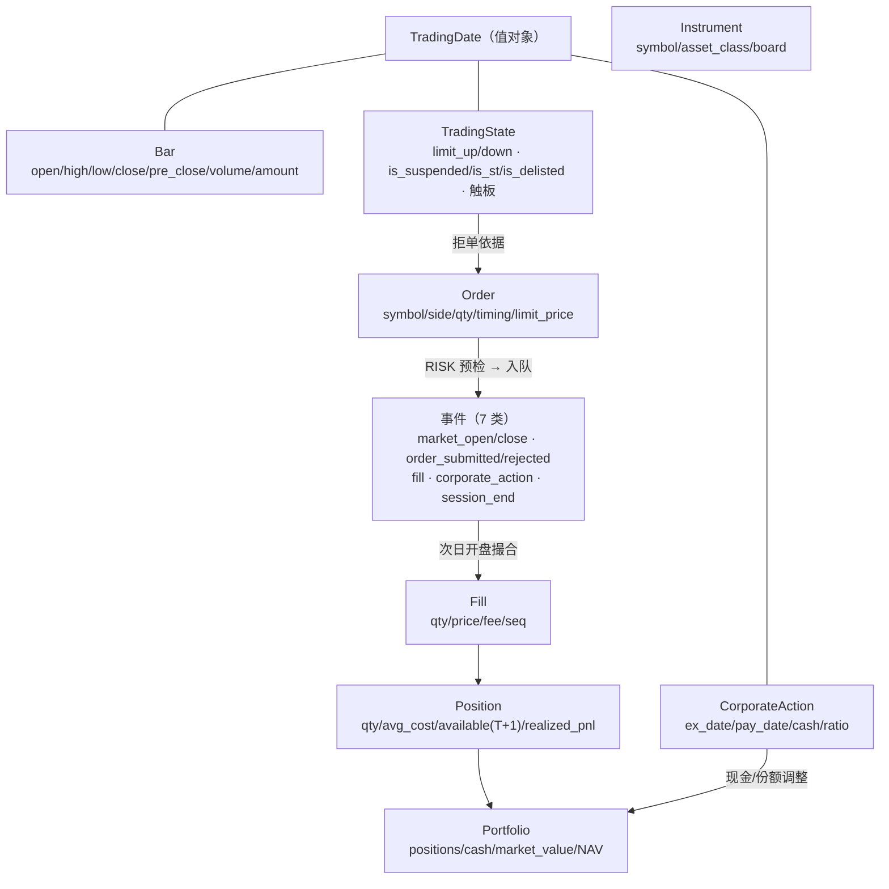

# 04 领域模型与核心接口

> **本文档是 btf 的领域模型与接口契约**——对应实现版本 **btf 1.1.0（2026-09-29 定版；2026-09-30 CLI 收编）**。
> 契约版本：`CONTRACT_VERSION = "1.0"`（`btf/domain/contracts.py`）；数据契约 `runresult.v1` / `runmanifest` / `backtest.v1` / `dataquality.v1`。
> 关联：分层与依赖铁律见 [03](03-总体架构方案对比与推荐.md)；数据表与布局见 [05](05-数据架构与数据集体系.md)；日循环时序见 [06](06-核心流程与关键时序.md)。
> **本文只描述当前实现**；接口签名以「`文件路径:符号`」给出，可直接对照代码。

---

## 8.1 领域对象关系总览



**领域层模块**（`btf/domain/`，零第三方依赖）：`types.py`（`TradingDate`/`Instrument` 等值对象）· `market.py`（`Bar`/`TradingState`）·
`orders.py`（`Order`/`Fill`/`RejectCode`/`Side`/`FillTiming`）· `action.py`（`CorporateAction`）· `events.py`（7 类事件）·
`contracts.py`（`CONTRACT_VERSION`）· `cache.py`（`BoundedDict`，有界缓存工具）。

---

## 8.2 核心领域对象

### 8.2.1 Instrument（金融工具）与 A 股特化

- 字段要点：`symbol`（`600519.SH` 形制）、`asset_class`（`stock`/`etf`/…）、`board`（主板/创业板/科创板/北交所）——**涨跌幅幅度由板块推导**。
- **标的路由**（`btf/data/tables_meta.py::daily_table_of`）：`399/93/H3/98` 前缀或 `CSI/CNI` 后缀、`000xxx.SH` → `index_daily`；
  `600/601/603/605/688/689/900` 或 `00/30/20/43/83/87/92` 前两位 → `daily`（股票）；其余 → `fund_daily`（ETF）。
- 混合表与集合竞价口径见 [05 §9.4](05-数据架构与数据集体系.md)；`mixed` feed 按上表自动路由，**要求显式标的清单**（禁全市场截面）。

### 8.2.2 交易日历与日期（Calendar / TradingDate）

- `TradingDate`：唯一日期值对象（内部为 `YYYYMMDD` 字符串语义），**禁止在业务代码里直接比较字符串日期**。
- 交易日历来自主库 `metadata/trade_cal.parquet`；BTC 之外的所有区间/快照/事件均以交易日为粒度。
- 周线口径：**自日线聚合为 W-FRI**（不直读现成周线表，避免长假周锚点分歧）。

### 8.2.3 MarketData / Bar 与交易日状态面板（🅰 核心增量价值）

- `Bar`：`open/high/low/close/pre_close/volume/amount`（**量纲已在读取层统一**：vol=股、amount=元；见 [05 §9.4](05-数据架构与数据集体系.md)）。
- **`TradingState`（状态面板，`btf.domain.market`）**：`limit_up_price`/`limit_down_price`/`is_suspended`/`is_st`/`is_delisted`/`is_limit_up`/`is_limit_down`；
  属性 `tradable = not (is_suspended or is_delisted)`；涨跌停触及判定容差 `LIMIT_PRICE_TOL = 1e-4`（相对比较）。
- **合成源（六表，`btf.data.state.StateSynthesizer`）**：`stk_limit`/`etf_limit`（限价）+ `suspend_d`（**在表即停牌**，区分全日停牌与盘中停牌）+ `namechange`（ST 区间）+ `stock_basic`（退市）+ `daily`（当日是否有行情）。
- 状态面板是**唯一拒单/可交易性依据**：风控 `tradability` 规则与撮合层共用（避免两套判定）。

### 8.2.4 复权与公司行动（CorporateAction / AdjustService）

- `CorporateAction`：`ex_date`（除权除息日）/`pay_date`（派息到账日）/`cash_per_share`/`ratio`；仅取 `div_proc='实施'`。
- **复权是消费侧职责**：库内只存不复权价 + `adj_factor`；`btf.data.adjust.AdjustService`（Protocol + `TushareAdjustService`）提供 hfq/qfq 序列，**不进引擎记账**。
- 引擎侧公司行动按**两时点**分发：`ex_date`（开盘前，份额/成本调整）与 `pay_date`（现金到账，仅派息）；两日重合时等效单日但**各留一条事件**（见 [06 §10.4](06-核心流程与关键时序.md)）。
- 除权事件与因子一致性由**数据不变量校验 CC-4** 保证（[05 §20.4](05-数据架构与数据集体系.md)）。

### 8.2.5 Order / Fill / Trade

- `Side`：`buy`/`sell`；`FillTiming`：`market`（次日开盘或当日收盘，由配置决定）/`limit`（触价即成简化）。
- `Order`：`symbol`/`side`/`qty`（**100 股整手**，引擎强制取整）/`limit_price`/`order_id`（确定性赋号 `O00000001…`）。
- `Fill`：`qty`/`price`/`fee`/`seq`（撮合序号，用于对账与回放）。
- **`RejectCode`（拒单码，`btf.domain.orders`）**：`suspended`（停牌/退市/无行情）· `limit_up`（涨停买不进）· `limit_down`（跌停卖不出）·
  `lot_size`（非整手）· `volume_cap`（VPP 上限不足一手）· `insufficient_cash`（现金不足，含费用预估）· `risk_rejected`（**预交易风控否决，message 含规则名**，见 [06 §10.6](06-核心流程与关键时序.md)）。
- **卖先买后**：同交易日先执行卖单再执行买单（现金约束下的确定性顺序）。

### 8.2.6 Position / Portfolio / Account

- `Position`：`qty`/`avg_cost`/**`available`（T+1 可卖数量）**/`realized_pnl`；买入当日不可卖（`available` 次日释放）。
- `Portfolio`：持仓字典 + `cash` + `market_value` + `NAV`；`mark_all(closes)` 收盘重估；`snapshot()` 产出 `SessionEnd` 快照记录。
- 交易成本在成交时点计入（费用不进持仓成本摊薄的歧义项一律以 `fills.jsonl` 为真）。

### 8.2.7 Signal / TargetPortfolio（信号-执行分离）

- 策略**只表达目标**（目标权重/目标数量），不直接下单：`StrategyBase.on_close(ctx)` → `ctx.set_target(...)`（或返回目标映射）。
- 再平衡器（`rebalancer`）负责把「当前 vs 目标」转成订单：`full`（全额差额）与 `threshold`（阈值带内不动）。
- 该分离保证：同一策略在回测/未来实盘通道下**订单生成逻辑一致**（时间表与通道为远期项）。

### 8.2.8 BacktestRun / Experiment / DataVersion（实验域）

- `RunManifest` 全字段（`btf/experiment/manifest.py`）：`run_id, status, contract_version, btf_contract_version, data_version, code_version, config_hash, config_effective, env_version, rules_version, rules_overrides, seed, metrics_digest, error, assembly_notes`；
  状态 `RUNNING`/`COMPLETED`/`FAILED`；`run_id = %Y%m%d_%H%M%S_<config_hash 前 6 位>`。
- `data_version`：**实算内容指纹**（`sha256:…` + 逐表 `row_count/date_min/date_max/sample_hash` + `mode` + `anchor_date`），三档 `meta`（缺省，Parquet 元数据）/`fast`（键列）`/full`（全列）——见 [05 §20.3](05-数据架构与数据集体系.md)。
- 产物（RunStore `local_jsonl`）：`manifest.json` / `snapshots.jsonl` / `trades.jsonl` / `fills.jsonl` / `rejections.jsonl` / `events.jsonl` / `metrics.json` / `data_quality_report.json` / `report.html`。
- `bt verify --run <id>`：`digest` 双对账（按产物重算 vs 落盘）——可复现性的常跑证据。

---

## 8.3 核心接口（Protocol 契约）

> 全部外部能力经**构造函数注入**（依赖倒置）；协议实现以 `contract_version` 声明兼容性，注册期协商，不匹配即拒载。

### 8.3.1 DataFeed（数据层协议）

`btf/data/feed.py::DataFeed`（Protocol）：

| 方法 | 语义 |
|---|---|
| `universe(date) -> list[Instrument]` | 当日可交易宇宙（PIT）；`universe_span(start, end)` 为区间并集 |
| `bars_of(symbol, start, end, *, daily_table="daily")` / `bars(symbols, start, end, *, daily_table=…)` | 逐日截面（**惰性** `_LazyCrossSection`：不物化的 bar 只构造必要字段） |
| `history(symbol, end, fields=None, n_bars=1)` | 回看窗口（策略 warmup 用） |
| `trading_states(date, symbols=None, *, with_touch_flags=True)` | 状态面板（见 §8.2.3） |
| `corporate_actions(start, end)` | 区间内公司行动（去重后） |

实现：`TushareParquetFeed`（主库直读；`root` 可覆盖）、`MixedDailyFeed`（**股票/ETF 混合表自动路由**，要求显式标的）、`MemoryFeed`（测试专用，脱盘）。

### 8.3.2 Strategy（策略接口）

- `btf.strategy.base.StrategyBase`：生命周期 `on_start / on_open / on_close / on_finish`；**只表达目标**（§8.2.7），不得直接 I/O。
- 上下文 `Context` 提供：`universe()`（宇宙）、`history()`（回看）、`set_target()`（目标）、状态面板只读视图。
- 参考实现：`btf.strategy.v77`（v7.7 规则链：L2 硬筛子 + L0-LIQ 闸门 + 买点双条件）、`btf.strategy.monthly:MonthlyEqualWeight`（等权月调仓，基准用例）。
- 策略类在配置中以 `module:Class` 声明；`bt config-check --resolve-strategy` 可**预检可加载性**（拼错类名在 run 前暴露）。

### 8.3.3 ExecutionHandler / MatchingEngine（撮合与执行）

- `ExecutionHandler`（`next_open`）：判定可成交性（停牌/涨跌停/整手）→ 生成 `Fill` 或 `RejectCode`；**费用在成交时计算**。
- 成本模型（`cost_model`）：`flat_rate`（费率常数）/`tiered_v1`（**日期分段**：佣金含最低、印花税 2023-08-28 分段、过户费沪深双向）/`zero`。
- 滑点（`slippage_model`）：`none`/`fixed`/`pct`。
- 撮合层**不感知数据源**：只消费 bar + 状态面板 + 订单。

### 8.3.4 RiskManager（预交易风控规则链）

- 三态裁决 `VerdictKind = ALLOW | REDUCE | REJECT`，`RiskVerdict(kind, qty=None, reason_code=None, message="")`（`btf/risk/manager.py`）。
- 链式语义：按配置顺序逐条 `check(order, portfolio, states)`；`REDUCE` 缩量后继续链，`REJECT` 立即否决（**归因到首个否决规则**）。
- 三内置规则（`btf/risk/rules.py`，**`strict` 缺省 `True`** = 缺数据即拒单）：

| 规则 | 参数（缺省） | 语义 |
|---|---|---|
| `max_weight` | `max_weight=0.10, lot_size=100, strict=True` | 单标的目标权重上限；超限 `REDUCE`；缺盯市价 `strict` 下 `REJECT`（`risk:max_weight`） |
| `cash_check` | `fee_buffer=0.001, lot_size=100, strict=True` | 现金（含费用缓冲）不足即缩量/拒单（`risk:cash`） |
| `tradability` | `reject_st=False, strict=True` | 停牌/退市拒单；`reject_st=True` 时 ST 拒单（`risk:suspended` / `risk:delisted` / `risk:st`） |

- **空风控链**：`risk.allow_empty_chain=true` 显式声明「裸奔调试」才放行（并强制披露）；缺省**拒绝运行**（fail-closed）。

### 8.3.5 PortfolioManager / Rebalancer（组合层）

- `Rebalancer.generate_orders(portfolio, targets, ...)`：目标 → 订单；实现 `full` / `threshold`。
- 组合层持有账户与持仓，**T+1 可卖数量**是卖出下单的硬约束（与撮合层共同保障）。

### 8.3.6 Analyzer / Optimizer（分析与优化）

- **指标（15 项，`btf.analytics.metrics.METRICS`）**：`final_nav, total_return, annualized_return, annualized_volatility, sharpe_ratio, max_drawdown, calmar_ratio, win_rate, profit_loss_ratio, n_fills, total_fees, total_turnover, turnover_annualized, fee_ratio, n_trading_days`。
  指标为**纯函数**（无副作用）；不可算项落盘为 `null`（终端同形，见 [06 §10.7](06-核心流程与关键时序.md)）。
- 基准相对指标（`information_ratio`/`excess_*`）在配置 `report.benchmark` 时计算；样本不足（n<3）时给出明确业务异常而非除零。
- `Optimizer`（`btf.optimize.grid`，注册名 `grid_search`）：笛卡尔积网格 × **进程池**（跨组合共享数据源预热）→ 按 objective 排序；结果顺序 = 网格顺序。

### 8.3.7 RulesProvider / rules_loader（规则参数单一真源）

- **唯一真源**：赤潮 `rules/single-source.md`（v7.7）；镜像 `rules_mirror_v77.json`；btf 侧经 RulesProvider（`static` / `mirror_json`）加载，**禁止 YAML 手抄规则数值**。

```yaml
# 策略配置中的声明式引用（YAML 不允许出现规则数值字面量）：
strategy:
  rules: {source: "mirror_json", path: "…/rules_mirror_v77.json"}
  params: {pe_max: {override: true, value: 20}}    # 仅显式声明 override 的研究变量可覆盖
# 未声明 override 而试图覆盖规则参数 → Schema 校验拒绝（启动失败）
```

- `rules_version` 与 `rules_overrides` 记入 `manifest.json`（可追溯"这次结论用的是哪版规则"）。
- **四方机检**（`tools/check_rules_four_way.py`）：源 ↔ 镜像 ↔ 消费绑定 ↔ btf 缓存数值一致 + **状态机语义锚点**（RECOVERY「3 日恢复」）+ 自我维持回归守卫。

### 8.3.8 Runtime / Facade（统一入口）

- `BTFRuntime`（`btf/runtime.py`，**装配根**）：`load_config → build → run`；门面函数 `make_store()` / `fee_segments()`。

| 方法 | 语义 |
|---|---|
| `load_config(source=None, *, environ=None, overrides=None)` | 四层合并（默认 → `BTF_*` 环境 → 文件 → `--set` 覆盖）+ Schema 校验 + 脱敏 |
| `build()` | 装配（含**硬门**，见 §8.6）；产出 `instruments`/`coverage`/`data_quality`/`assembly_notes`/`step_timings` |
| `run(*, store=None, persist=True)` | 执行并落盘（`persist=False` = 内存回测/网格组合）；落盘路径实算数据指纹 |
| `load_run(run_id)` / `verify_run(run_id)` | 读回产物 / digest 双对账 |

- **入口层**：`btf.api`（进程内 Facade：`run`/`report`/`dataset`）与 `btf.cli`（7 命令）**共用 `btf.app` 实现**（契约 10 保证入口层不含编排）。

---

## 8.4 事件类型体系（引擎内核语义）

| 事件（`kind`） | 载荷要点 | 触发时点（日循环步骤） |
|---|---|---|
| `corporate_action` | `action` + 时点（`ex_date`/`pay_date`） | ① 开盘前 |
| `market_open` | `date` | ④ `on_open` 之前 |
| `fill` | `qty/price/fee/seq` | ② 撮合（T-1 队列，次日开盘） |
| `order_rejected` | `order` + `RejectCode` | ②/⑧ |
| `market_close` | `date` | ⑥ `on_close` 之前 |
| `order_submitted` | `order`（含确定性 `order_id`） | ⑨ 风控通过后入队 |
| `session_end` | 快照（持仓/NAV） | ⑩ 收盘后 |

- 事件日志：`events.jsonl`，行形制 `{"kind": …, "payload": …}`；超预算时**采样**（尾部 ring 保留，落盘哨兵行 `kind="_sampled"`），采样状态在 manifest 与报告中**强制披露**。
- 事件流是**回放/对账**的基础（`bt verify` 与未来模拟盘 diff 的前提）。

---

## 8.5 扩展点清单（10 个注册点）

`btf.registry` 名字表（`catalog.py`）：`points()` 返回静态清单（**不触发装载**），`create(point, name, config)` 才按点**惰性装载**。

| 点 | 内置实现 | 用途 |
|---|---|---|
| `data_feed` | `tushare_parquet` / `mixed` / `memory` | 数据源 |
| `cost_model` | `tiered_v1` / `flat_rate` / `zero` | 费用 |
| `slippage_model` | `none` / `fixed` / `pct` | 滑点 |
| `execution_handler` | `next_open` | 撮合执行 |
| `risk_rule` | `max_weight` / `cash_check` / `tradability` | 风控规则 |
| `rebalancer` | `full` / `threshold` | 目标 → 订单 |
| `analyzer` | `METRICS` 全量（15 项） | 指标 |
| `rules_provider` | `static` / `mirror_json` | 规则参数源 |
| `optimizer` | `grid_search` | 参数优化 |
| `run_store` | `local_jsonl` | 产物存储 |

- **新增实现 = 新增文件 + 注册**（契约 6）；`tools/check_plugin_boundary.py` 用核心文件哈希基线 + 注册点唯一性证明"扩展未改核心"，每次基线刷新**必须留痕**（`--reason` + `.plugin_baseline_history.jsonl`）。
- 注册 API：`register(point, name, factory)`（重名即错，注册期协商 `contract_version`）· `resolve(point, name)` · `create(point, name, config)` · `available(point)`。

---

## 8.6 数据缺失与装配期硬门（CompletenessPolicy）

**装配期硬门（`build()` 中，失败即拒运行）**：

| # | 门 | 触发条件 | 结果 |
|---|---|---|---|
| 1 | 区间覆盖度 | 区间早于必需表起点（`stk_limit ≥ 2008-01-02`） | `ConfigError`；显式 `data.allow_degraded_limit=true` 可放行并**强制披露** |
| 2 | 基准守卫 | `report.benchmark` 形制非法 或 指数序列**零行** | `ConfigError`（不允许"有基准配置但静默无量"） |
| 3 | 数据不变量校验 | `data.quality.enabled=true`（缺省）且发现异常；`strict=true` 时 | 缺省：告警 + 产物 + 报告披露；`strict`：`DataQualityError` |
| 4 | 风控链 | `risk.rules` 为空且未显式 `allow_empty_chain=true` | `ConfigError`（fail-closed） |
| 5 | 数据指纹档位 | `data.fingerprint_mode` ∉ {`meta`,`fast`,`full`} | `ConfigError` |
| 6 | 插件契约 | 插件 `contract_version` 不匹配 | `ContractVersionError`（拒载） |

**运行期降级语义（必须披露，不静默）**：事件日志采样、覆盖度降级、空风控链、零成本模型、内存 Feed 的指纹标注（`sha256:in-memory:Nsym`）——全部进入报告「假设与披露」章节（**强制章节，不可关闭**）。

---

## 8.7 接口版本与兼容策略（摘要）

| 契约 | 版本 | 兼容规则 |
|---|---|---|
| 领域/插件契约 | `CONTRACT_VERSION = "1.0"` | 插件注册期协商；不匹配拒载 |
| 运行结果数据契约 | `runresult.v1` | 报告/外部工具消费的唯一契约；破坏性变更 = major |
| RunManifest | `runmanifest`（**主版本校验**） | `from_dict` 遇不兼容主版本**拒绝解析**（不再静默错值） |
| 回测配置 Schema | `backtest.v1` | 未知键拒绝（`additionalProperties: false`）；死键即校验失败 |
| 数据质量报告 | `dataquality.v1` | 产物 + 报告章节共用 |

**废弃策略**：S1 契约破坏性变更需 ADR（[12](12-ADR草案.md)）+ 全量回归；S2/S3 走 CHANGELOG。

---

> **下一篇**：[05-数据架构与数据集体系.md](05-数据架构与数据集体系.md) —— 表登记、目录布局、读取层 API、数据质量与数据集体系。
