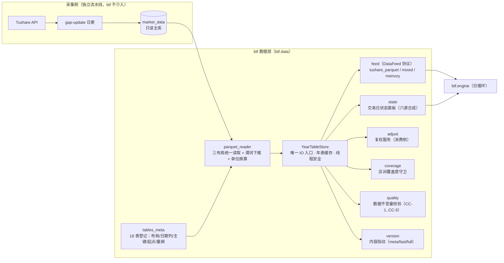
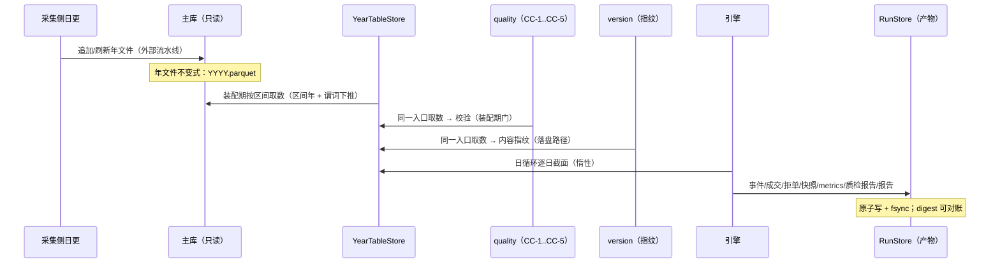
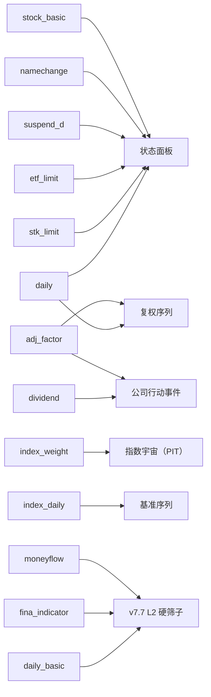

# 05 数据架构与数据集体系

> **本文档描述 btf 的数据层现状**——对应实现版本 **btf 1.1.0（2026-09-29 定版；2026-09-30 CLI 收编）**。
> 关联：接口口径见 [04 §8.3.1](04-领域模型与核心接口.md)；装配期硬门见 [04 §8.6](04-领域模型与核心接口.md)；可复现性见 [08](08-可复现性与实验管理.md)。
> **数据纪律**：主库**只读**；btf 不写任何数据文件，只写产物目录。

---

## 第 9 章 数据架构与数据流

### 9.1 数据架构总览（五段）



**五段式要点**：

1. **登记**（`tables_meta`）：表 → 布局（BY_YEAR / SINGLE / METADATA）、日期列、主键、起点、量纲换算系数，**单点声明**。
2. **布局归一**（`parquet_reader`）：三种布局统一读取；`memory_map=True` **仅主库**（Windows 下映射文件不可删，测试夹具走普通读）；量纲换算只在此处发生。
3. **资源管理**（`core.YearTableStore`）：**全系统唯一允许认识磁盘的公共模块**；年表缓存（FIFO 有界）+ 按日索引 + 线程安全（`threading.Lock` 保护缓存与计数，IO 在锁外）+ 装载双检（并发重复只计一次）。
4. **领域服务**（`feed`/`state`/`adjust`/`coverage`/`quality`/`version`/`index_*`）：全部经 `core` 取数，**互不依赖**（契约新 8，**零豁免**）。
   其中 `feed` 的**状态面板**经**构造期注入**获得（`attach_state_provider`，装配根 `BTFRuntime.build` 注入 `StateSynthesizer`）——`feed` 不 import `state`；直接构造 Feed 的场景须显式传 `state_provider=`，未注入而取状态即**显式报错**（不静默降级）。
5. **消费**：引擎只经 `DataFeed` 协议取数；策略只经 `Context` 取数；上层（engine/strategy/viz/analytics）**不得直接 import `parquet_reader`**（契约新 9）。

### 9.2 存储路径

| 用途 | 路径 | 读写 |
|---|---|---|
| **主库**（唯一数据源） | `BTF_DATA_DIR` → 缺省 `<项目>/全量数据/market_data` | **只读**（btf 不写） |
| alt 数据（预留） | `BTF_ALT_DATA_DIR` → 缺省 `<项目>/全量数据/alt_data` | 只读；当前未接入 |
| **产物** | `回测产物/runs/<run_id>/`（`BTF_OUTPUT_DIR` 可覆盖） | 读写（btf 独占） |
| 数据集（黄金集构建产物） | `btf/btf_datasets/` | 读写（`tools/build_golden.py`） |
| 配置/代码 | 仓库内 | 读 |

**目录布局约定**（由 `tables_meta.Layout` 决定）：

```
<主库>/
  daily/2015.parquet            # BY_YEAR：{表}/{YYYY}.parquet
  fund_daily/2020.parquet
  index_weight/index_weight.parquet   # SINGLE：{表}/{表名}.parquet
  metadata/stock_basic.parquet        # METADATA：metadata/{表名}.parquet
  metadata/trade_cal.parquet
```

### 9.3 数据生命周期（端到端）



- **装配期**：区间覆盖度守卫 → 状态面板可用性 → 数据不变量校验（可 `strict` 硬失败）→ 数据指纹（**仅在落盘路径**实算）。
- **运行期**：引擎逐日取截面（`_LazyCrossSection` 惰性，不物化不需要的字段）。
- **落盘期**：产物 + `data_quality_report.json` + `manifest.data_version`（指纹真值）+ `report.html`。

### 9.4 核心数据字典（登记 18 表）

| # | 表 | 布局 | 日期列 | 起点 | 用途 |
|---|---|---|---|---|---|
| 1 | `daily` | BY_YEAR | `trade_date` | 19901219 | 股票/指数行情（**混合表路由见下**） |
| 2 | `adj_factor` | BY_YEAR | `trade_date` | 19910703 | 复权因子（消费侧复权） |
| 3 | `stk_limit` | BY_YEAR | `trade_date` | **20080102** | 股票涨跌停价（**可信区间下界**） |
| 4 | `suspend_d` | BY_YEAR | `trade_date` | 20000104 | 停牌（**在表即停牌**） |
| 5 | `namechange` | BY_YEAR | `start_date` | 19901201 | 名称变更（ST 区间判定） |
| 6 | `dividend` | BY_YEAR | `ex_date` | 19901231 | 分红送转（仅 `div_proc='实施'` 消费） |
| 7 | `stock_basic` | METADATA | `list_date` | — | 证券主表（退市判定） |
| 8 | `trade_cal` | METADATA | `cal_date` | — | 交易日历 |
| 9 | `index_daily` | BY_YEAR | `trade_date` | 19931014 | 指数行情（基准/指数宇宙） |
| 10 | `daily_basic` | BY_YEAR | `trade_date` | 19901219 | 每日基本面（PE/PB/换手/市值） |
| 11 | `index_weight` | SINGLE | `trade_date` | — | 指数成分权重（月末快照 → PIT 宇宙） |
| 12 | `index_dailybasic` | BY_YEAR | `trade_date` | 20040102 | 指数每日指标 |
| 13 | `new_share` | SINGLE | `ipo_date` | 20160122 | 新股（**新股窗口豁免**依据） |
| 14 | `moneyflow` | BY_YEAR | `trade_date` | 20080102 | 资金流 |
| 15 | `fina_indicator` | BY_YEAR | `end_date` | 19901231 | 财务指标（PIT 匹配） |
| 16 | `fx_daily` | BY_YEAR | `trade_date` | 19380104 | 汇率 |
| 17 | `fund_daily` | BY_YEAR | `trade_date` | 19980407 | ETF/基金行情 |
| 18 | `etf_limit` | BY_YEAR | `trade_date` | **20190626** | ETF 涨跌停价 |

**声明式量纲换算（`tables_meta` 单点，读取层执行）**：`daily`/`index_daily`/`fund_daily` 的 `vol ×100`（手→股/份）、`amount ×1000`（千元→元）；`daily_basic.total_mv ×10000`；`moneyflow.net_mf_amount ×10000`。

**标的路由（`daily_table_of`）**：指数（`399/93/H3/98` 前缀、`CSI/CNI` 后缀、`000xxx.SH`）→ `index_daily`；股票代码段（`600/601/603/605/688/689/900`、`00/30/20/43/83/87/92` 前两位）→ `daily`；其余 → `fund_daily`。
**混合表 Feed**（`mixed`）按上述规则逐标的自动路由，跨表截面用懒切片合并（先命中者返回）；**要求显式标的清单**（禁全市场截面），避免"跨表全市场"的语义含糊。

**合成视图（非表）**：① 交易日状态面板（六源合成，[04 §8.2.3](04-领域模型与核心接口.md)）；② 复权序列（`close × adj_factor / 基准因子`）；③ 指数宇宙（`index_weight` 月末快照 + 复算 PIT 成分）。

### 9.5 数据血缘与依赖



- **忠实呈现 PIT**：`index_weight` 取月末快照并复算成分；`fina_indicator` 按 `ann_date`（公告日）匹配，避免未来函数。
- **状态面板是唯一可交易性依据**（撮合 + 风控共用）。

---

## 第 20 章 数据集、数据版本与数据质量

### 20.1 数据集体系（当前）

| 类型 | 位置 | 说明 |
|---|---|---|
| **主库** | `market_data` | 一等数据源（日更流水线维护）；btf 的全部回测默认取自此处 |
| **黄金数据集** | `btf_datasets/` | 由 `tools/build_golden.py` 构建/校验的最小可复现场景集（G1..G10），**测试地基** |
| **场景库** | `tests/fixtures/scenarios.py` | 进程内构造的小场景（T+1、停牌、除权等），用于单测/集成（脱盘，快） |
| **内存 Feed** | `btf.data.memory.MemoryFeed` | 测试专用数据源实现（协议子集） |

### 20.2 黄金数据集构成

- 覆盖：成交约束（涨跌停/停牌/整手）、成本分段（印花税/过户费日期边界）、分红送股除权、退市与 ST、T+1 可卖数量、组合再平衡、指标一致性。
- 构建与校验：`python tools/build_golden.py --cases all --verify`（`bt dataset` 命令为其子进程封装）；校验失败即拒绝写入（`--force` 才覆盖并留痕）。
- 黄金集与**数据不变量校验**、**渲染级断言**共同构成"结论可信"的三层证据。

### 20.3 数据版本管理与可复现

| 机制 | 实现 |
|---|---|
| **内容指纹** | `btf/data/version.py::compute(tables, root, *, mode="meta"|"fast"|"full", years=…)`；指纹 = `sha256:` + 逐表 `(row_count, date_min, date_max, sample_hash)` 排序合成 |
| **三档语义** | `meta`（缺省）：仅读 Parquet footer（行数/行组 min-max/文件大小/mtime）——**毫秒级**；`fast`：键列（日期+代码）抽样（大表 10 年 6 表 ≈7.2s）；`full`：全列抽样（可检出**数值级修订**，重） |
| **区间化** | `years=` 只指纹区间涉及年份；只对**本次实际使用的表集**（按宇宙 `daily_table_of` + 状态/身份表 + 基准表）计算 |
| **落盘时机** | **仅在落盘路径**（`run(persist=True)`）实算并写入 `manifest.data_version`；`persist=False`（网格/内存回测）**零成本**；进程内 memo 同输入只算一次 |
| **fail-closed** | 计算失败即抛，**绝不**静默回落 `sha256:unknown`（空洞披露比不披露更误导） |
| **内存 Feed** | 显式标注 `sha256:in-memory:Nsym`（非占位值） |
| **锚点** | `anchor_date` = 各表数据水位（最大日期）**裁剪到区间末**——避免非年分片表把水位写成未来 |
| **对账** | `manifest.metrics_digest` + `bt verify`（按产物重算 vs 落盘）双对账；`config_effective` 保存**生效配置**（脱敏） |

### 20.4 数据质量校验（回测侧，CC-1..CC-5）

实现：`btf/data/quality.py`（`run_checks`），全部 **Arrow 向量化 + 区间化 + 标的谓词下推**（经 `YearTableStore` 取数）。

| 规则 | 内容 | 关键口径 |
|---|---|---|
| **CC-1** | OHLC 内部一致性 | `high ≥ max(open,close)`、`low ≤ min(open,close)`、`high ≥ low`、`close > 0`、`vol/amount ≥ 0` |
| **CC-2** | 涨跌幅边界 | 板块幅度（主板 10% / 创业 `300·301·302` 20% / 科创 `688·689` 20% / 北交所 `4xx·8xx·920` 30%）+ **ST 5%**（ST 名单来自 `namechange`，经 `StateSynthesizer.st_pairs` **真实接线**；不可用时 `st_source="unavailable"` 并披露）；**新股上市 7 交易日**与**复牌首日**豁免；容差 `_PCT_TOL = 0.005` |
| **CC-3** | 日历一致性 | ① 行情日期 ⊆ `trade_cal`；② **全日停牌日不得有行情行**（口径：`suspend_d` 中 `S` 型且无 `timing`）——盘中停牌**允许**有行 |
| **CC-4** | 复权因子一致性 | 因子 > 0；除权事件 `(symbol, ex_date)` 存在因子行（事件源本模块直读 `dividend`，回看窗口 `_DIV_LOOKBACK_YEARS = 5`）；个股序列**单调不减**（容差 `max(1e-3, 1e-4×v)`，吸收 4 位小数发布的末位舍入） |
| **CC-5** | 量价互斥 | ① 有行情行 ⇒ `vol/amount > 0`；② 收盘价落在当日 `[limit_down, limit_up]` 内 |

**装配期门与产物**：`data.quality{enabled=true, strict=false, max_symbols=200}`（配置 Schema 声明）；缺省**告警 + 记录 + 强制披露**，`strict=true` 时 `DataQualityError` 硬失败；**校验自身失败（缺 `trade_cal` 等）永远硬失败**（不静默跳过）。
产物 `data_quality_report.json`（契约 `dataquality.v1`：`ok/period/symbols/tables/seconds/n_findings/rules/extra` + **`st_source`/`st_pairs_count`** + `sampled_symbols`/`checked_symbols`/`mode`）；宇宙超限按 `max_symbols` 字典序前缀抽样并**披露** `sampled_symbols`。

**常跑守卫**：`bt check` 第 8 项（`tools/check_data_quality.py`）——正样本 + **负向对照（5 类注入缺陷必须全部检出）**；独立单测/集成 **22 项**（逐条注入必红 + 豁免反向对照）。
**IO 单一入口守卫（EX-4 完全体）**：`bt check` 第 9 项（`tools/check_io_boundary.py`）——AST 扫描全 `btf/`：`import pyarrow.parquet` 与 `from btf.data.parquet_reader import …` **只允许** `data/parquet_reader.py`（实现）与 `data/core.py`（唯一消费者）；契约**新 9**（import-linter）同口径（豁免仅 `core → parquet_reader` 一条）。

**当前实测（主库，2026-09-28）**：20 标的 × 10 年 **PASS 2.0s**；全市场 × 1 年 10.4s，残余 22 行（**退市整理期**，人工复核类）+ 5 行（**退市股因子断层**，真实异常）——**保留为发现项并按发现项披露**，不屏蔽。

### 20.5 数据访问层 API（插件化数据源）

**唯一 IO 入口 `YearTableStore`（`btf/data/core.py`）**：

| 方法 | 语义 |
|---|---|
| `load(table, year, columns, *, sorted_rows=True)` | 年表装载（键 `(table, year, columns, sorted_rows)`；缺文件 = 负缓存，返回 `None`） |
| `read_year_where(table, year, columns, key_values)` | **谓词下推**（`filters=[("ts_code","in",…)]`）——子集宇宙免扫全市场年表 |
| `day_map(table, ymd, *, key, value, columns)` / `day_codes(table, ymd)` | 按日索引取数（`day_index` 预建，O(1)） |
| `days(table, year)` / `load_year(...)` | 年表日清单 / 带日索引的年表 |
| `values_by_symbol_day(table, year, symbols, value, *, date_col)` | 多标的逐日值（缺值跳过） |
| `symbol_range(table, symbol, start_ymd, end_ymd, columns)` | 单标的区间（逐年过滤 + 拼接） |
| `evict(*, year_below=None, table=None)` / `stats()` | 显式淘汰 / 统计（`entries`/`loads`/`hits`） |

缓存语义：容量 `max_entries`（缺省 4，年推进模式下与 LRU 等价）；**淘汰为插入序 FIFO**；`load_count` = 新建缓存条目数（并发重复只计一次）。

**插件化数据源**：新增源 = 实现 `DataFeed` 协议 + 注册 `data_feed` 点（示例：`mixed` 混合表、`memory` 测试源）。

```python
# 新数据源接入 = 实现 DataFeed + 注册（见 04 §8.5 扩展点 1）
registry.register("data_feed", "csv_dir", MyCsvFeed)      # 需声明 contract_version
```

### 20.6 数据完备等级（区间可信度声明）

实现：`btf/data/coverage.py`（装配期守卫，`REQUIRED_TABLES=("stk_limit",)`、`DEGRADED_TABLES=("etf_limit","adj_factor")`）。

| 等级 | 条件 | 行为 |
|---|---|---|
| **完整** | 区间 ⊇ 必需表起点（股票 ≥ 2008-01-02；ETF 场景另需 `etf_limit ≥ 2019-06-26`） | 正常回测 |
| **降级** | 区间早于必需表/降级表起点 | `ConfigError`；显式 `data.allow_degraded_limit=true` 可放行 → **报告强制披露**（涨跌停约束缺失等），并按降级口径解释结论 |
| **不可用** | 区间早于行情起点，或指定标的在区间内**零行** | 拒绝运行（不允许"跑了但无数据"的静默结论） |

- 反例防线：**基准零行**单独有硬门（[04 §8.6](04-领域模型与核心接口.md) 第 2 条）——历史上"有基准配置但静默无量"是真实缺陷。

---

> **下一篇**：[06-核心流程与关键时序.md](06-核心流程与关键时序.md) —— 日循环 10 步、事件序与关键时序。
