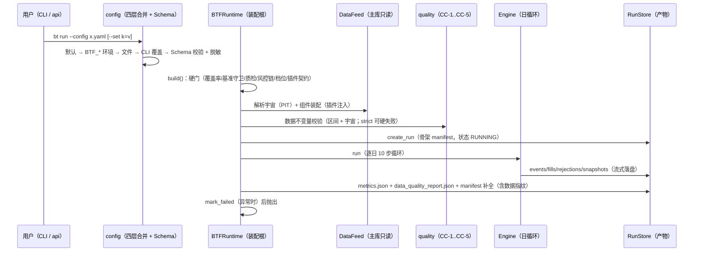
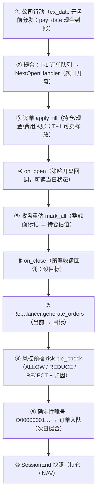
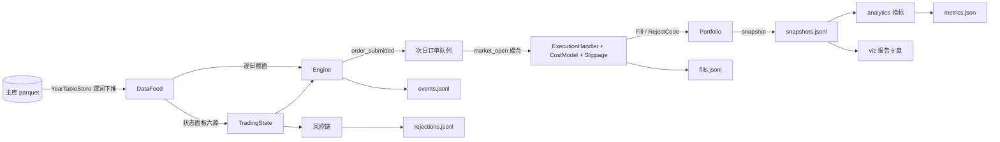
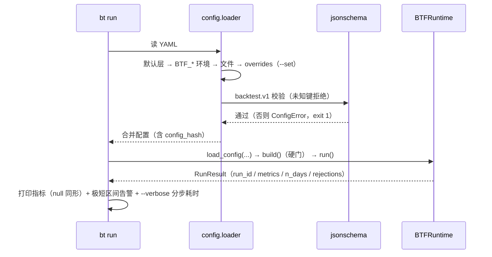

# 06 核心流程与关键时序

> **本文档描述 btf 的核心流程与日循环时序**——对应实现版本 **btf 1.1.0（2026-09-29 定版；2026-09-30 CLI 收编）**。
> 关联：领域对象与协议见 [04](04-领域模型与核心接口.md)；数据取数口径见 [05](05-数据架构与数据集体系.md)；验收门禁见 [16](16-架构评审与验收标准.md)。
> 实现位置：`btf/engine/loop.py`（日循环）、`btf/runtime.py`（装配与落盘编排）。

---

## 第 10 章 核心流程

### 10.1 流程一：历史回测（主旅程）



**关键纪律**：

- **落盘先建骨架**：`create_run` 在任何计算之前（失败也有可查的失败现场）。
- **异常即失败态**：引擎/写盘异常 → `mark_failed(reason)` 后抛出（不留下"看似成功"的目录）。
- **指纹在落盘路径实算**（`persist=False` 的内存回测/网格组合零成本）。
- **指标落盘与终端同形**：不可算项写 `null`（严格 JSON），终端同样显示 `null`。

### 10.2 日循环：10 步（引擎内核，`btf/engine/loop.py`）



**每日事件序（确定性）**：`corporate_action*` → `market_open` → `fill*` / `order_rejected*` → `market_close` → `order_submitted*` → `session_end`。

**关键语义（易错点显式化）**：

| 步骤 | 语义要点 |
|---|---|
| ① | 公司行动按**两时点**分发：`ex_date`（份额/成本调整，开盘前）与 `pay_date`（现金到账，仅派息）；两日重合等效单日但**各留一条事件** |
| ② | **卖先买后**（同批订单内的确定性顺序）；停牌/涨跌停/整手/无行情 → 拒单（`RejectCode`） |
| ③ | 成交即入账：持仓 `avg_cost`、现金、费用；**T+1**：当日买入的 `available=0`，次日释放 |
| ⑤ | `mark_all` 标记**整个当日截面**（不只持仓）——风控在决策时点需要**新建仓标的**的盯市价；未持有标的只进 `_last_close` 不入估值，**NAV 语义不受影响** |
| ⑦ | 再平衡器按配置（`full` / `threshold`）把「当前 vs 目标」转为订单；**策略不下单**（信号-执行分离） |
| ⑧ | 风控链逐条裁决；`REDUCE` 缩量后继续，`REJECT` 立即否决并记录**首个否决规则**（`risk_rejected`，message 含规则名） |
| ⑨ | 订单号确定性赋号（`O00000001…`），与网格/重跑逐位可复现 |
| ⑩ | 快照落 `snapshots.jsonl`（`SessionEnd` 记录），是净值曲线与对账的数据源 |

### 10.3 流程三：参数优化（已交付：网格 + 进程池）


- **同一代码路径**：每个组合走 `BTFRuntime` 标准装配与执行（与单跑**逐位一致**，有常跑一致性用例）。
- **不落盘**：组合回测 `persist=False` → 无指纹/无质检产物开销（性能纪律见 [14](14-工程化专项设计-上.md) §BASELINE）。
- 当前**未交付**：Walk-Forward（10.4）、蒙特卡洛（10.5）——见 §10.4/§10.5 说明。

### 10.4 流程四：Walk-Forward 验证（未交付）

- 现状：**未实现**（无 `bt walkforward` 命令、无滚动窗口切分器）。
- 若未来实现，须遵守的既有纪律：① 窗口切分只用交易日历（不按自然月）；② 训练/测试区间在 manifest 中可追溯；③ 结论仍只出自事件层（不引入第二套口径）。
- 归属：能力演进项（不卡 btf 1.0 门槛）。

### 10.5 流程五：蒙特卡洛稳健性（未交付）

- 现状：**未实现**（无 bootstrap / 交易顺序扰动工具）。
- 若未来实现，须遵守：① 随机种子进 manifest（`seed.master` 已有单源）；② 扰动只作用在"成交序列"层，不改变撮合规则本身；③ 结果以分布形式披露（不得只报最优）。
- 归属：能力演进项。

### 10.6 职责切分（撮合 / 组合 / 风控 / 分析 / 优化）

| 环节 | 负责模块 | 输入 | 输出 | 不做什么 |
|---|---|---|---|---|
| 取数与状态 | `data`（feed/state） | 主库 + 日期 | 逐日截面 + 状态面板 | 不做交易决策 |
| 撮合 | `execution`（handler/cost/slippage） | 订单 + bar + 状态 | `Fill` 或 `RejectCode` | 不修改目标、不做风控 |
| 组合 | `portfolio` | 成交 + 目标 | 持仓/现金/NAV/快照 | 不生成目标 |
| 目标生成 | `strategy` + `rebalancer` | 截面 + 持仓 | 订单 | 不直接成交、不绕过风控 |
| 风控 | `risk`（规则链） | 订单 + 组合 + 状态 | 三态裁决 | 不做撮合、不改价格 |
| 分析 | `analytics` | 快照 + 成交 | 指标（纯函数） | 无副作用、不读数据源 |
| 优化 | `optimize` | 配置 + 网格 | 组合结果排序 | **不内嵌回测逻辑**（调引擎） |

### 10.7 展示层一致性纪律（易错点）

- **终端 == 落盘**：不可算指标一律 `null`（终端不再出现 Python `nan`）。
- **极短区间告警**：区间 < 20 交易日（`SHORT_PERIOD_TRADING_DAYS`）时打印告警且 **exit 0**——极短区间部分指标"数学有定义、业务无意义"，禁止用于 `optimize --objective` 排序。
- **分步耗时可选披露**：`bt run --verbose` 输出 `step_timings`（装配·前置/质检/组件 ‖ 运行·指纹/引擎/落盘）+ 数据质检与指纹摘要。

---

## 第 11 章 关键图集

### 11.1 回测内部数据流（组件级）



### 11.2 模块依赖（稳定/易变示意）

见 [03 §7.1/§7.3](03-总体架构方案对比与推荐.md)：依赖只指向更稳定方向，**10 条 import-linter 契约**机器守卫（`lint-imports` 退出码即门禁）。

### 11.3 部署拓扑（单机单人）

```
Windows 11 本机
├── 采集侧流水线（独立进程，日更；btf 不介入）
├── 主库 market_data（只读）
└── btf 进程
    ├── CLI（bt run / report / verify / optimize / …）
    ├── 引擎单进程 + 事件循环
    ├── 优化：进程池（缺省 8 worker；跨组合共享数据源预热）
    └── 产物：回测产物/runs/<run_id>/（原子写 + fsync）
```

无服务端、无数据库、无消息队列（NG4）；进程池是唯一的并行手段。

### 11.4 配置加载与生命周期时序



### 11.5 配置分层与示例

**四层合并（后者覆盖前者）**：① 内置默认（`btf/config/loader.py::DEFAULTS`）→ ② 环境变量（**仅 `BTF_*`**，白名单过滤）→ ③ 用户 YAML → ④ CLI `--set`（`a__b=v` 嵌套，类型推断单源在 `btf.app`）。

```yaml
schema_version: backtest.v1
run:
  strategy: tests.fixtures.buyhold:ConfigBuyHold     # module:Class（--resolve-strategy 可预检）
  params: {symbol: "600519.SH", weight: 0.9}
  universe: {source: explicit, symbols: ["600519.SH"]}
  period: {start: 2016-01-01, end: 2025-12-31}
  initial_cash: 10000000
data:
  feed: tushare_parquet
  feed_params: {root: "D:/全量数据/market_data"}
  fingerprint_mode: meta          # meta（缺省）| fast | full
  quality: {enabled: true, strict: false, max_symbols: 200}
execution:
  handler: next_open
  cost_model: tiered_v1
  slippage_model: none
  rebalancer: full
risk:
  rules: [{name: max_weight, params: {max_weight: 0.10}},
          {name: cash_check}, {name: tradability}]
  # allow_empty_chain: true  ← 仅调试用；缺省不声明 = 空链即拒绝运行
report:
  benchmark: "000300.SH"           # 配基准才计算超额/信息比率指标
  sections: [summary, equity, drawdown, monthly_heat, trades, assumptions, reproduce, appendix]
  # 「假设与披露」「复现说明」为强制章节，收窄 sections 也不会被移除
seed: {master: 20260926}
```

- **规则参数不得写数值**：经 `rules: {source: mirror_json, path: …}` 声明（[04 §8.3.7](04-领域模型与核心接口.md)）。
- **默认层现状**：`report.sections` 默认**全章**；`risk` 默认**不声明** `allow_empty_chain`（空链即 fail-closed）。

---

> **下一篇**：[07-技术选型建议与权衡.md](07-技术选型建议与权衡.md) —— 当前实际技术栈与选型理由。
