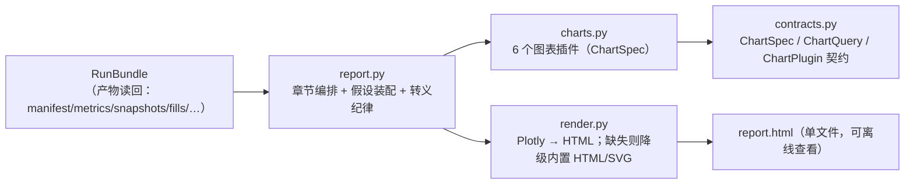

# 13 可视化架构与设计

> **本文档描述 btf 的报告与可视化现状**——对应实现版本 **btf 1.1.0（2026-09-29 定版；2026-09-30 CLI 收编）**。
> 实现：`btf/viz/{contracts,charts,render,report}.py`；产物 `report.html`（自包含）。
> 关联：门禁第 7 项（渲染级结构）见 [09 §14.9](09-测试验证与基准.md)；产物契约见 [08 §13.3](08-可复现性与实验管理.md)。

---

## 19.1 架构（三层解耦）

| 模块 | 职责 | 关键点 |
|---|---|---|
| `contracts.py` | 图表数据契约 | `ChartSpec(chart_type,title,subtitle,series,axes,annotations,export_hint)`、`ChartPlugin` Protocol；`CHART_CONTRACT_VERSION="runresult.v1"` |
| `charts.py` | 图表插件集 | 6 个：`equity`（净值曲线）/`drawdown`（回撤）/`monthly_heatmap`（月度热力图）/`trades_table`（交易明细）/`metrics_table`（指标表）/`weights_area`（权重面积）；`CASH_KEY="@CASH"`、`TOP_HOLDINGS=8` |
| `render.py` | 渲染与降级 | `render_html(spec, *, include_plotlyjs=False)`；Plotly 缺失/失败 → 内置 HTML/SVG，**不抛错** |
| `report.py` | 编排 | `ReportBuilder(bundle, assumptions=None, charts=DEFAULT_CHARTS, title=None).build()`；Jinja2 `autoescape=True` |

## 19.2 数据契约（图表层只认契约）

- 图表**只消费** `RunBundle`（产物读回）与 `ChartSpec`；**不得**自行取数（禁止 import 数据层）。
- 契约保证：同一 `RunBundle` → 同图表结构（渲染级断言的基础）。
- 图表插件注册：新增图表 = 新增 `ChartPlugin` 实现 + 加入 `CHART_PLUGINS`（**不改核心渲染逻辑**）。

## 19.3 图表清单（当前）

| 图 | 数据源 | 说明 |
|---|---|---|
| `equity` | `snapshots.jsonl` | 净值曲线（含基准对比，若配置基准） |
| `drawdown` | 净值序列推导 | 回撤曲线 |
| `monthly_heatmap` | 净值序列 → 月度收益矩阵 | 月度收益热力图 |
| `trades_table` | `trades.jsonl`/`fills.jsonl` | 交易明细（含费用） |
| `metrics_table` | `metrics.json` | 15 项指标表（不可算项显示 `null`） |
| `weights_area` | `snapshots.jsonl` 持仓权重 | 权重演进（现金键 `@CASH`，Top-8 持仓） |

## 19.4 报告结构（HTML 单文件）

**章节（6 章）**：`summary`（摘要 + 指标卡）→ `performance`（净值/回撤/月度热力）→ `trading`（交易明细/权重）→ **`assumptions`（假设与披露）** → **`reproduce`（复现说明）** → `appendix`（生效配置等）。

| 规则 | 说明 |
|---|---|
| **强制章节** | 「假设与披露」「复现说明」**不可关闭**（`_MANDATORY_SECTIONS`）——即使 `report.sections` 只写 `[summary]`，这两章仍会渲染 |
| 默认章节 | 默认全章（含 `reproduce`/`appendix`）——报告是"证据载体"，不是"展示选配" |
| 章节别名 | `report.sections` 支持 11 个别名键（图表名与章节名映射） |
| 披露内容 | 零成本模型 / 空风控链 / 降级涨跌停 / 事件采样 / 数据质检摘要 / 数据指纹 / 代码与规则版本 / 装配说明 |

**转义纪律**：Jinja2 `autoescape=True`；**HTML 片段必须显式 `| safe`**（否则标签被转义 → 正文出现 `&lt;div class=`，报告不可读）。
该纪律由 `tools/check_report_render.py`（`bt check` 第 7 项）**渲染级断言**守卫，含**负向对照**（还原错误模板即变红）与
**双向探针**（HTML 片段正常渲染 ∧ 纯文本字段被转义且裸串不存在）。

## 19.5 入口行为契约

| 入口 | 行为 |
|---|---|
| `bt run` | 落盘产物（报告不自动生成；可用 `bt report` 生成） |
| `bt report --run <id> [--out X.html]` | **幂等**再生成（同产物 → 同 HTML）；缺产物 → 报错退出 |
| `btf.api.report(run_id, ...)` | 与 CLI **同源实现**（`btf.app.build_report_file`） |
| Notebook | 直接读 `ReportBuilder` 或读取层自绘（不承诺兼容） |

## 19.6 插件化与降级

- **插件化**：新增图表 = 新增文件 + 注册进 `CHART_PLUGINS`；不改 `report.py`/`render.py`（契约 6 精神）。
- **降级链**：Plotly 可用 → 内联图表；不可用/渲染失败 → 内置 HTML/SVG 静态图（**报告仍可读**）。
- **不依赖网络**：`include_plotlyjs=False` 时不引用 CDN 资源（离线可看；如需 CDN 版本显式开启）。

---

> **下一篇**：[14-工程化专项设计-上.md](14-工程化专项设计-上.md) —— 性能容量、微观结构建模、数据治理与契约。
