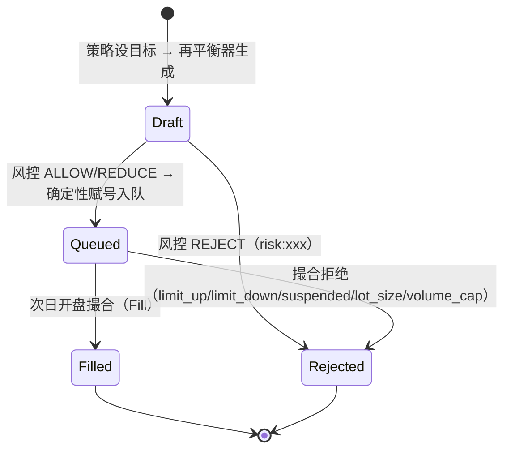
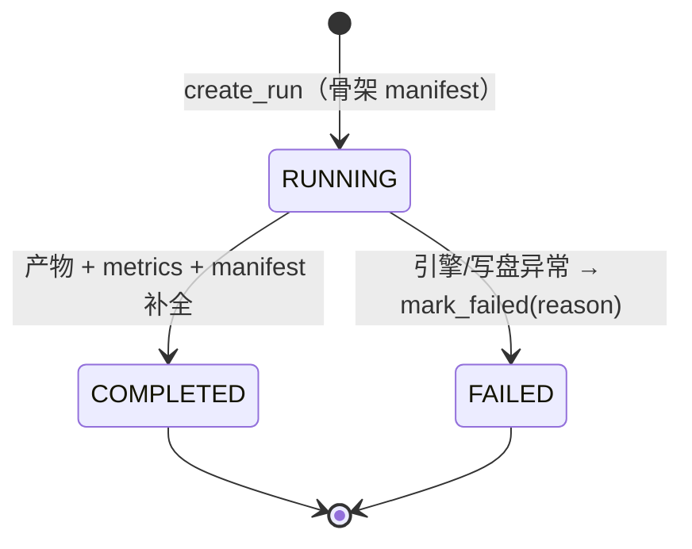
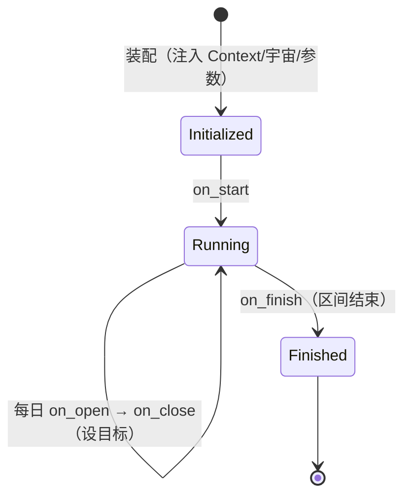
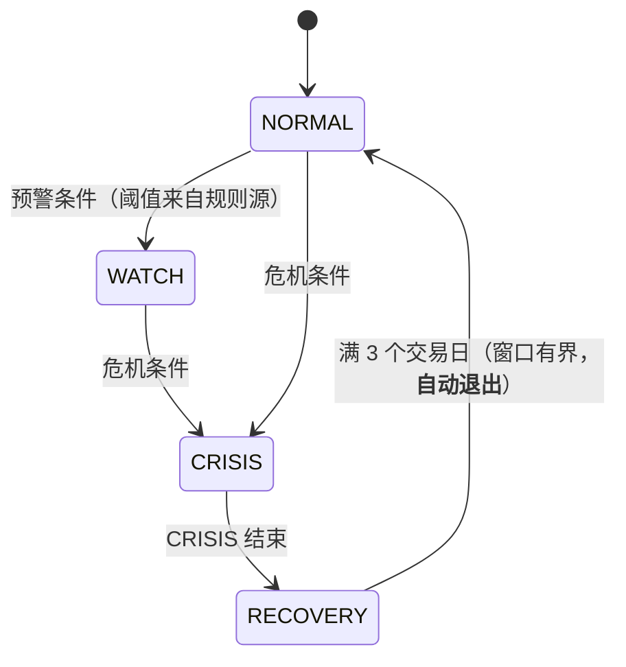

# 17 术语表与关键状态机

> **本文档是 btf 的术语与状态机权威表**——对应实现版本 **btf 1.1.0（2026-09-29 定版；2026-09-30 CLI 收编）**。
> 用法：文档与代码注释中的术语以本文为准；状态机语义变更须同步本文与 [19 §6.3](19-架构审查与重构方案-20260927.md) 的机器守卫。

---

## 33.1 术语表

### 交易与市场

| 术语 | 定义（btf 口径） |
|---|---|
| **标的（Instrument）** | 可交易/可回测对象；`symbol` 形如 `600519.SH`；含 `asset_class`（stock/etf/index）与 `board` |
| **交易日（TradingDate）** | 唯一日期值对象（`YYYYMMDD` 语义）；一切区间/快照/事件以交易日为粒度 |
| **状态面板（TradingState）** | 每 (标的, 交易日) 的可交易性事实：限价、停牌、ST、退市、触板；**唯一拒单依据** |
| **全日停牌 / 盘中停牌** | `suspend_d` 中 `S` 型且无 `timing` = 全日停牌（当日**不产出行**）；否则为盘中停牌（当日有行） |
| **涨跌停触及** | 收盘价与限价比较，容差 `1e-4`（相对） |
| **T+1** | 买入当日不可卖（`available=0`），次日释放；卖出受 `available` 硬约束 |
| **整手** | 100 股；不足一手 → 拒单（`lot_size`） |
| **名义价记账** | 引擎以**不复权价**记账；除权通过事前/事后事件调整（ADR-6） |
| **复权（hfq/qfq）** | 消费侧序列变换（`close × adj_factor / 基准因子`）；**不进引擎记账** |
| **公司行动（CorporateAction）** | 除权除息事件；按 `ex_date`（份额/成本）与 `pay_date`（现金）两时点处理 |
| **PIT（Point-in-Time）** | 只用决策时点**已知**的信息：指数成分用月末快照复算、财务按公告日匹配、宇宙按当日取 |

### 回测与引擎

| 术语 | 定义 |
|---|---|
| **事件循环 / 日循环** | 引擎逐交易日执行的 **10 步**（[06 §10.2](06-核心流程与关键时序.md)） |
| **目标仓位（Target）** | 策略表达的目标权重/数量；**策略不下单**（信号-执行分离） |
| **再平衡器（Rebalancer）** | 把「当前 vs 目标」转为订单；`full` / `threshold` |
| **撮合（Execution）** | 判定可成交性并生成成交或拒单；成本/滑点在此时计算 |
| **撮合序号（seq）** | 成交的确定性序号（对账/回放用） |
| **确定性订单号** | `O%08d`（按日循环顺序赋号）——重跑可逐位对照 |
| **风控链（Risk Chain）** | 预交易规则链；三态裁决 `ALLOW`/`REDUCE`/`REJECT`，归因到**首个**否决规则 |
| **允许空链（allow_empty_chain）** | 显式声明"裸奔调试"；缺省**不声明** → 空链即拒绝运行（fail-closed） |
| **快照（Snapshot / SessionEnd）** | 每日收盘后的持仓/现金/NAV 记录（净值曲线来源） |
| **事件流（events.jsonl）** | 7 类事件的 JSONL 日志；可采样但**必须披露** |
| **基准守卫** | `report.benchmark` 形制非法或指数序列零行 → 装配期硬失败 |
| **极短区间告警** | 区间 < 20 交易日（`SHORT_PERIOD_TRADING_DAYS`）→ 告警（不阻断），禁用于 optimize 排序 |
| **step_timings** | 分步耗时（`--verbose` 输出）：装配·前置/质检/组件 ‖ 运行·指纹/引擎/落盘 |

### 数据与工程

| 术语 | 定义 |
|---|---|
| **主库 / 市场数据目录** | 只读 Parquet 数据源（`BTF_DATA_DIR`）；**btf 不写** |
| **布局（Layout）** | `BY_YEAR`（`表/YYYY.parquet`）/ `SINGLE`（`表/表.parquet`）/ `METADATA`（`metadata/表.parquet`） |
| **登记表（tables_meta）** | **18 表**的元数据（布局、日期列、主键、起点、量纲）；未登记即读取失败 |
| **YearTableStore** | **唯一 IO 入口**：年表缓存（有界 FIFO）+ 按日索引 + 线程安全 |
| **谓词下推** | `filters=[("ts_code","in",…)]` 让子集宇宙免扫全市场年表 |
| **惰性截面** | 逐日截面只构造必要字段（不物化全部 Bar） |
| **内存 Feed（MemoryFeed）** | 测试专用数据源（脱盘）；其数据指纹标注 `sha256:in-memory:Nsym` |
| **混合表 Feed（mixed）** | 按代码段在股票/ETF/指数字典间自动路由；**要求显式标的** |
| **覆盖度（coverage）** | 区间与表起点的匹配判定；不满足 → 硬门或显式降级并披露 |
| **数据不变量（CC-1..CC-5）** | OHLC 一致性 / 涨跌幅边界 / 日历一致性 / 复权因子一致性 / 量价互斥 |
| **数据指纹（data_version）** | 内容寻址 `sha256`（逐表行数/日期范围/抽样哈希）；三档 `meta`（缺省）/`fast`/`full` |
| **锚点（anchor_date）** | 数据水位（各表最大日期）**裁剪到区间末** |
| **产物（Run 产物）** | `manifest/metrics/snapshots/trades/fills/rejections/events/data_quality_report/report.html` |
| **摘要（digest）** | `metrics_digest`（对账基准）；`bt verify` 校验"重算 vs 落盘 vs 记录" |
| **门禁（check.py）** | 9 项常跑检查（lint/契约/冒烟/依赖预算/导入/domain 白名单/渲染/数据质检/IO 单一入口） |
| **契约（Contract）** | ① 插件/领域契约 `CONTRACT_VERSION="1.0"`；② 数据契约 `runresult.v1` 等；③ 架构契约（import-linter 10 条） |
| **插件边界基线** | 核心文件哈希快照 + 注册点唯一性；刷新**必须留痕**（`--reason` + 历史文件） |

### 规则（赤潮侧）

| 术语 | 定义 |
|---|---|
| **规则源（single-source）** | 赤潮 `rules/single-source.md`（v7.7）——规则的唯一真源 |
| **规则镜像（mirror_json）** | 由规则源导出的 JSON；btf 经 RulesProvider 加载，**禁止手抄数值** |
| **四方机检** | 源 ↔ 镜像 ↔ 消费绑定 ↔ btf 缓存 数值一致 + 状态机语义锚点 |
| **L0-LIQ 状态机** | 流动性闸门：`NORMAL`/`WATCH`/`CRISIS`/`RECOVERY` + `POSITION_CAPS`（仓位上限） |
| **L2 硬筛子** | v7.7 基本面筛选（PE/PB/ROE/股息率等，PIT 匹配） |

---

## 33.2 关键状态机

### Order 状态机

**规则**：入队后同一订单不会部分成交（`volume_cap` 不足一手 → 拒单）；每笔成交落 `fills.jsonl`，每次拒单落 `rejections.jsonl`（含 `RejectCode` 与 message）。

### BacktestRun 状态机

**规则**：`status=RUNNING` 且长时间无更新 ⇒ 视为未完成（工具按状态读取，不误当结果）；失败**不自动重试**。

### Strategy 生命周期状态机

**规则**：策略只表达目标；不得直接 I/O；异常由引擎捕获并标记 run 失败。

### L0-LIQ 状态机（与规则源对齐）

**语义要点（易错点，历史缺陷所在）**：

- `RECOVERY` 是**有界窗口**：CRISIS 结束后 **3 个交易日**自动回 `NORMAL`；**不存在"RECOVERY 自我维持"**（一旦进入便不退出是缺陷，已成机器守卫：窗口结构 + 自我维持回归守卫）。
- 状态判定**必须序列推进**验证（逐日推进、当日输出回灌次日输入）；用手工构造的历史序列做等值测试**不构成**正确性证据。
- 仓位上限 `POSITION_CAPS`：`CRISIS=0` / `RECOVERY=10%` / `NORMAL=50%`（其余为研究口径，以规则源为准）。

---

## 33.3 错误处理与一致性契约

### 异常类型（装配期/运行期）

| 异常 | 触发 | 处理 |
|---|---|---|
| `ConfigError` | Schema 校验失败、死键、覆盖度越界、基准守卫失败、空风控链、指纹档位非法 | 拒绝运行（exit 1/非零），信息含具体字段与建议 |
| `DataQualityError` | 数据不变量校验 `strict=true` 且发现异常 | 拒绝运行；缺省模式为告警 + 记入产物 + 披露 |
| `ContractVersionError` | 插件 `contract_version` 与当前契约不匹配 | 注册期拒载 |
| `RegistryError` | 未注册的名字 / 重名注册 | 报错并列出可选项 |
| `FeedError` | 混合表 Feed 被要求全市场截面 / 非法参数 | 拒绝（避免语义含糊的结果） |
| `IndexSeriesError` | 指数序列不可用（零行/缺失） | 拒绝运行（不允许"有基准配置但静默无量"） |
| `ReportError` | 视图契约不被满足 / 假设章节被关 | 拒绝生成（强制章节不可关） |
| `RuntimeError` | 未 `load_config` 就 `build()` / 未 `build()` 就 `run()` | 立即失败（装配顺序硬约束） |

### 一致性契约（必须成立）

1. **终端 == 落盘**：不可算指标在终端与 `metrics.json` 均为 `null`。
2. **披露 == 事实**：报告中"降级/采样/空链/零成本"等披露必须与实际运行状态一致（由装配说明驱动，不手写）。
3. **指纹 == 数据**：同数据同档位同输入 → 同指纹；数据重写 → 指纹必变（变异性检查）。
4. **重跑 == 首跑**：同四版本 + 同规则版本 → `metrics_digest` 逐位相同。
5. **对账可证伪**：`bt verify` 在产物被篡改时必须报不一致（能抓缺陷，不是恒绿）。

---

## 33.4 标注与用语规范

| 标注 | 含义 | 使用要求 |
|---|---|---|
| ✅ / ⏳ / ◐ / ❌ | 已闭环 / 待外部动作 / 部分 / 未做 | 不得模糊（禁用"基本完成""大致支持"） |
| **实测** | 本机跑出的数字 | 必须给命令与摘要，不得只写结论 |
| **未复现** | 报告过但未能复现的问题 | 只能写"未复现 + 已硬化"，**不得**写"已修复" |
| **能力边界** | 属性限制（如纯日线） | 如实登记，不自称差距亦不销案 |

---

## 附：文档体系声明

- 本套文档（01–17）描述 **btf 1.1.0（2026-09-30；1.0.0 定版于 2026-09-29）的当前设计与架构**，不含历史沿革；历史决策过程与逐批执行留痕见
  [18-分步编码计划.md](18-分步编码计划.md)（编码时间线）与 [19-架构审查与重构方案-20260927.md](19-架构审查与重构方案-20260927.md)（审查/裁决/台账）。
- 术语与状态机以本文为准；**发现文档与代码不一致时，以代码 + 门禁为准并回改本文**（文档即真相，[16 §32.1 判据 8](16-架构评审与验收标准.md)）。
