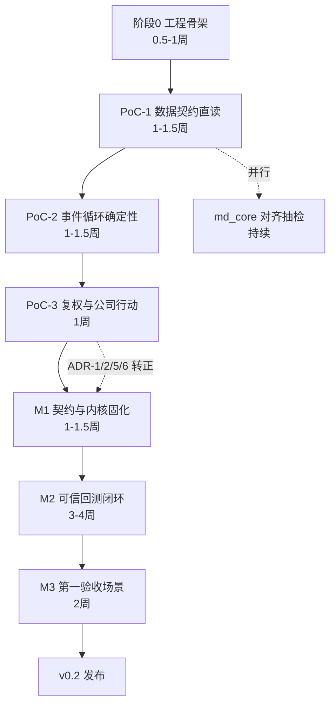
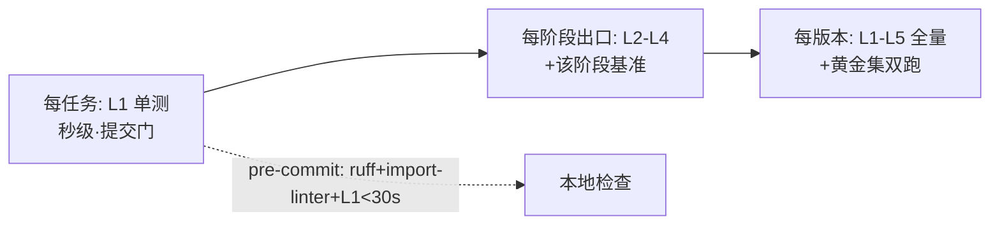

# 18 分步编码计划与执行时间线（代码实施蓝图 → v0.2 … **1.0.0 定版**，逐批留痕）

> **本文档有两重身份**：① **计划**（§一–§七：编码纪律、工程骨架、阶段/WBS、测试节奏、风险检查点、集成约定）；
> ② **执行时间线**（**§八·A–§八·C**：v0.2 → **1.0.0** 逐批/逐步的「新增 / 修改 / 删除 / 订正」+ 门禁实测 + 留痕位置）。
> 对应实现版本 **btf 1.0.0（2026-09-29 定版）**；文件名级细节以 `代码/btf/CHANGELOG.md` 各版本段落为准；
> 审查/裁决/问题台账见 [19-架构审查与重构方案-20260927.md](19-架构审查与重构方案-20260927.md)。
> **读时间线请直接跳 §八·A（总览表）→ §八·B（删除与订正总表）→ §八·C（收口现状）。**
> **格式约定（§八·A 全节统一）**：每批一段，标题 `### <版本> 交付：<主题>（<日期>）`；正文表列固定为
> `| # | 项 | 落地与实测证据 |`；每批必列「**新增 / 修改 / 删除 / 订正**」四类中实际发生的类别 + **门禁三项**
> （`pytest` 数 · `bt check` · 契约）+ 留痕位置（19 号节号 / CHANGELOG）。**批次按时间正序排列**。

> 依据：[README.md](README.md) v0.3 冻结版全部 17 文件（五轮评审闭环）。
> 性质：**执行计划**——任务分解到"单人半天~2 天、可独立验证"粒度；每任务标注产出、验收锚点（引用架构文档章节）、依赖。
> 计划版本：v1.0（2026-09-26，随 v0.3 冻结生成）
> 总量预估：约 **8-11 周**（单人 [假设]，与 11 §16.2 "MVP 8-10 周量级"对齐，含 20% 缓冲）

---

## 一、计划总则（编码纪律，来自架构文档的硬约束）

| # | 纪律 | 来源 |
|---|---|---|
| 1 | **契约先行**：每阶段先冻结该阶段涉及的 S1 协议签名（typed Protocol），实现不得先于契约 | 03 §7.5 |
| 2 | **依赖铁律**：`外围→编排→引擎/分析→领域`单向；domain 零第三方依赖（import 白名单：typing/dataclasses/enum/datetime）；import-linter 本地检查随第一次提交生效 | 03 §7.3 |
| 3 | **测试节奏**：L1 单测随任务提交（秒级）；L2-L4 在每阶段出口全跑；黄金集**只增不改** | 09 §14.1/14.4 |
| 4 | **依赖预算**：新直接依赖 ≤8（plotly/jsonschema/jinja2/pytest/import-linter/hypothesis/pytest-benchmark + 缓冲1） | 07 §12.11 |
| 5 | **不写代码先写公式对照**：记账/复权/费用实现必须逐行对照 04 §8.2.6 公式块（H4/N5/C1 三轮教训：记账口径是最高危错误域） | 16 §32.7 复核点 |
| 6 | **ADR 转正**：PoC 完成后 ADR-1/2/5/6 由草案转已接受；实现偏离架构 = 先改 ADR 再改代码 | 12 |
| 7 | 只读主库；产物写独立目录；UTF-8 显式；路径经配置不硬编码 | 01 §C3、ADR-4 |
| 8 | 插件发现 = 配置声明制（entry-points 留 v1.0）；扩展 = 新文件+注册，核心包 diff 为零 | 04 §8.5 |

## 二、代码工程骨架（阶段 0 交付物，先行确定）

**位置**：`D:\量化策略\代码\btf\`（06 §11.3 部署拓扑）；复用现有 venv（Python 3.13.15）。

```
代码/btf/
├── pyproject.toml            # 包元数据 + 工具链配置（ruff/import-linter/pytest）
├── requirements.txt          # 锁版本（现有 28 条 + 新增 ≤8）
├── btf/
│   ├── __init__.py           # api Facade（btf.run/dataset/report——M2 起）
│   ├── domain/               # D 领域层（零依赖）
│   ├── data/                 # L0：feed 协议 / tushare_parquet 适配 / 合成层（state/adjust/universe/derived）
│   ├── engine/               # L2：事件循环 / SimClock
│   ├── execution/            # L2：handler / cost / slippage
│   ├── risk/                 # L2：规则链
│   ├── portfolio/            # L2：Portfolio/Rebalancer
│   ├── strategy/             # L1：StrategyBase/Context
│   ├── analytics/            # L3：Analyzer
│   ├── experiment/           # L3：RunStore/manifest
│   ├── config/               # C：分层配置+Schema
│   ├── registry/             # R：配置声明制发现
│   ├── viz/                  # L5：ChartSpec/报告
│   └── cli/                  # L5：bt 命令族
├── schemas/                  # JSON Schema（backtest.v1 等）
├── tests/                    # L1-L4（unit/integration/system/regression/golden/）
├── benchmarks/               # L5 基准（B1-B5 结果归档）
├── examples/                 # rotation.py 单文件示例策略（M2）
└── tools/                    # build-golden / md_core 对齐抽检等开发脚本
```

---

## 三、阶段总览与依赖图



**关键路径**：S0 → P1 → P2 → P3 → M1 → M2 → M3。PoC 三项**顺序执行**（11 §21.1，评审确认不动）；阶段内任务尽量并行（如测试与实现交替）。

---

## 四、任务分解（WBS）

### 阶段 0：工程骨架（0.5-1 周）

| # | 任务 | 产出 | 验收 | 依赖 | 预估 |
|---|---|---|---|---|---|
| 0.1 | 包骨架与空模块 | 目录树 + `__init__.py` 全套 | import btf 成功 | — | 0.5d |
| 0.2 | 工具链配置 | pyproject.toml：ruff / import-linter（分层规则按 03 §7.3 六铁律）/ pytest | `bt check`（本地检查脚本）跑通：lint 0 错、分层规则生效（故意制造反向 import 被拦截） | 0.1 | 0.5d |
| 0.3 | 依赖清单与锁定 | requirements.txt 增量（jsonschema/pytest/import-linter 先装 3 个；其余按需） | 现有 venv 安装无冲突；依赖预算计数器（工具脚本）就位 | 0.2 | 0.5d |
| 0.4 | 路径与编码基线 | `btf/config/paths.py`：全部路径经环境变量 `BTF_*` 派生（ADR-4 反例教训：禁止硬编码盘符） | 中文路径冒烟测试（含 `D:\量化策略` fixture）通过 | 0.1 | 0.5d |

**出口**：`bt check` 全绿 + 中文路径冒烟通过。

### PoC-1：数据契约直读（1-1.5 周）——回答"直读路径是否成立"

> 验证点清单见 11 §21.1 PoC-1（含 17 表、B1 <10s、状态面板抽查、指纹耗时、md_core 对齐抽检）。

| # | 任务 | 产出 | 验收（架构锚点） | 依赖 | 预估 |
|---|---|---|---|---|---|
| 1.1 | domain 最小值对象 | `TradingDate`（frozen, order）、`Instrument`、`Bar`、`TradingState`、`AssetClass`（04 §8.2.1-8.2.3 签名照抄） | 值对象单测：不可变/全等/TradingDate↔YYYYMMDD 互转；**domain import 白名单检查首次生效** | 0.1 | 1d |
| 1.2 | Parquet 布局读取器 | `data/parquet_reader.py`：by_year/single 双布局 + 谓词下推（列裁剪+日期过滤） | 单测：两种布局各抽 2 表读取正确；`glob(*.parquet)` 陷阱用例（拿到年份列表→报错） | 1.1 | 1d |
| 1.3 | 表元数据登记 | `data/tables_meta.py`：17 表（表名/布局/日期列/起点/单位换算标记，05 §9.4 字典数字化） | 元数据与 05 字典一致（起点：daily 1990-12-19、etf_limit **2019-06-26**、moneyflow **2008-01-02**…） | 1.2 | 0.5d |
| 1.4 | 单位换算契约 | 读取层换算：vol 手→股、amount 千元→元、市值万元→元（T-01/T-10/T-13） | 换算单测逐表；**换算后量纲断言**（vol≥0、amount/vol≈价格量级合理性） | 1.2 | 0.5d |
| 1.5 | TushareParquetFeed 原型 | `DataFeed` 协议 + `read_range` 截面迭代 + `read_code` 单标的（04 §8.3.1 前四方法） | 截面迭代日期升序、停牌股当日缺席；MemoryFeed 占位（PoC-2 用） | 1.3/1.4 | 1.5d |
| 1.6 | 状态面板合成 | `data/state.py`：stk_limit+suspend_d+namechange+stock_basic+dividend 五表 → TradingState（04 §8.2.3） | **10 个手工案例抽查**（11 §21.1）：ST 区间边界、停牌口径（在表即停）、涨跌停价、退市标记 | 1.5 | 1.5d |
| 1.7 | DataVersion 指纹 | `data/version.py`：行数+日期范围+列级抽样哈希（05 §20.3 算法） | 同参数重复调用一致；耗时实测（全库 vs 抽样两档，[待验证] 项落定） | 1.3 | 1d |
| 1.8 | B1 基准 | `benchmarks/b1_load.py` + pytest-benchmark | **10 年全市场日线载入 <10s**（不达标→查谓词下推/列裁剪，回来修订 ADR-2 证据） | 1.5 | 0.5d |
| 1.9 | md_core 对齐抽检 | `tools/align_mdcore.py`：单位/日期/停牌/复权因子/资金流五维抽样比对（09 §14.6 精简版；md_core 为真源） | 50 标的×5 日期截面抽检：逐值相等或登记口径差异理由 | 1.5/1.6 | 1d |

**出口（PoC-1 退出标准，11 §21.1）**：9 任务验收全过或明确降级路径 → **ADR-2（直读路径）转正**；B1 基线归档 benchmarks/。

### PoC-2：事件循环确定性（1-1.5 周）——回答"内核语义是否自洽"

| # | 任务 | 产出 | 验收（架构锚点） | 依赖 | 预估 |
|---|---|---|---|---|---|
| 2.1 | 事件类型与订单域 | `domain/events.py`（七类事件，04 §8.4）+ Order/Fill/Fee/OrderType（04 §8.2.5） | 冻结 dataclass；事件 JSONL 序列化往返单测 | P1 | 1d |
| 2.2 | MemoryFeed + SimClock | 测试专用内存 Feed（手写小数据集）+ 模拟时钟 | 3 个手写场景数据集（T+1 冻结/涨跌停/停牌各一） | 2.1 | 1d |
| 2.3 | Position/Portfolio 记账 | `portfolio/`：名义记账公式**逐行对照 04 §8.2.6 实现四式**（买入/卖出/现金/重估）+ available_qty（T+1） | **守恒式单测**：每 Fill 后 Δcash+ΔMV(名义)+fee=0；af=2 案例数值=评审实证脚本输出（1000≠0 不复现） | 2.1 | 1.5d |
| 2.4 | ExecutionHandler（NextOpen） | `execution/handler.py`：T-1 订单 T 开盘撮合 + 拒单规则（SUSPENDED/LIMIT_UP/LIMIT_DOWN/T_PLUS_1/LOT_SIZE/INSUFFICIENT_CASH，04 §8.3.3） | 拒单六 code 各一单测；涨跌停浮点容差 1e-4（09 §14.2） | 2.2/2.3 | 1.5d |
| 2.5 | 引擎主循环 | `engine/loop.py`：十步骤时序（06 §10.1：①公司行动→②撮合→③更新→④on_open→⑤重估→⑥on_close→⑦再平衡→⑧风控→⑨入队→⑩快照） | 时序单测：步骤顺序断言（事件日志顺序）；**前视封堵**：ctx.history 未来日期访问触发运行时断言 | 2.4 | 2d |
| 2.6 | 事件溯源日志 | events.jsonl 落盘（含采样开关与 50 万上限预算，08 §13.6） | 事件量级单测；回放器骨架（逐行读） | 2.5 | 1d |
| 2.7 | 双跑确定性测试 | `tests/regression/test_determinism.py`：同配置跑两遍 events.jsonl 逐行哈希比对 | **双跑 diff=0**（黄金集确定性纪律的第一条落地） | 2.6 | 0.5d |
| 2.8 | B2 基准 | 沪深300 轮动 10 年月调仓（MemoryFeed→真实 Feed） | **<15s**（不达标→profile 引擎热点，禁止无证据优化） | 2.5 | 0.5d |

**出口**：PoC-2 全验证点过（含 T+1 冻结三场景、B2 达标）→ **ADR-5（事件模型）转正**。

### PoC-3：复权与公司行动正确性（1 周）——回答"最高频错误域是否可控"

| # | 任务 | 产出 | 验收（架构锚点） | 依赖 | 预估 |
|---|---|---|---|---|---|
| 3.1 | AdjustService | `data/adjust.py`：hfq/qfq 换算（**研究层专用**，04 §8.2.4） | 5 只多次送转个股 hfq 序列连续性（数据层断言，G9） | P2 | 1d |
| 3.2 | CorporateAction 事件 | `domain/action.py` + 引擎接入：ex_date（送转调 qty/avg_cost；派息摊 avg_cost）+ pay_date（按 **qty_at_ex** 入现金）两时点（04 §8.2.6 公式块含 C1/E5 修正） | **G1 五案例=独立手算**：送转/派息/混合/老数据 ex≠pay/pay_date 缺失回退 | P2 | 2d |
| 3.3 | 连续性断言 | 守恒扩展：送转单日 Δ=0；派息跨窗口合并 Δ=0（**含窗口内卖出 60 股按 qty_at_ex=100 到账**，C1 案例） | 黄金集断言三态全测（老数据/两日重合/窗口内卖出） | 3.2 | 1d |
| 3.4 | 实现注意两条落地 | ①送转日 available_qty ×(1+stk_div)；②qty_at_ex 跨窗口 **pending 登记**（清仓后仍发放） | 单测两案例（终审实现注意①②，09 §14.2） | 3.2 | 1d |
| 3.5 | 数学等价断言 | 事件链累积收益率 ≡ hfq 序列收益率（5 只全历史，G9 引擎侧） | 等价断言浮点容差内全过 | 3.2/3.1 | 1d |

**出口**：PoC-3 全过 → **ADR-6（名义记账+事件再除权）与 ADR-1（总体架构）转正**；进入 M1。

### M1：契约与内核固化（1-1.5 周）——"契约先行"的全面落地

| # | 任务 | 产出 | 验收 | 依赖 | 预估 |
|---|---|---|---|---|---|
| 4.1 | S1 协议全集定稿 | 04 号全部 Protocol 落代码：DataFeed 全方法/Strategy/RiskManager/Rebalancer/Analyzer/Optimizer/RulesProvider/BTFRuntime（§8.3 全节）+ `contract_version` 字段与协商逻辑 | 协议签名与 04 文档逐条 diff 评审（人工）；版本协商单测（主版本不符→拒载） | P3 | 2d |
| 4.2 | registry 配置声明制 | `registry/`：名字表+配置发现+组装（**不做** entry-points，04 §8.5） | 未知插件名→显式报错；六类扩展点注册冒烟 | 4.1 | 1d |
| 4.3 | config 分层体系 | `config/`：默认→环境变量→用户 YAML→CLI 参数合并 + JSON Schema 校验（06 §11.5 示例即验收样例）+ 敏感项脱敏 | Schema 校验错误信息可读；rules 段字面量拒绝（无 override 声明→启动失败，H2）；`bt config-check` 命令 | 4.2 | 2d |
| 4.4 | 架构守护自动化 | import-linter 规则全量生效 + domain 白名单 + 插件目录外修改检查脚本 | 故意违例（domain import pandas / viz import engine）三例全被拦截 | 0.2 | 1d |

**出口（M1，11 §16.3）**：PoC-1/2/3 通过 + 白名单检查通过 + 四 ADR 转正。

### M2：可信回测闭环（3-4 周）——v0.2 主体

| # | 任务 | 产出 | 验收 | 依赖 | 预估 |
|---|---|---|---|---|---|
| 5.1 | CostModel/SlippageModel | `execution/cost.py`：FeeSchedule **三段过户费**（2015-08 前仅沪需 MarketRule 时间分段/之后双向两档）+ 印花税 2023-08-28 两段 + 佣金最低 5 元；滑点固定/百分比 | 分段各测（09 §14.2：费率分段断言）；G7 数值 | M1 | 1.5d |
| 5.2 | RiskManager 规则链 | `risk/`：max_weight/cash_check/tradability 三规则 + 有序链编排 | 规则链单测（REDUCE/REJECT 语义）；空链→放行+警告 | M1 | 1d |
| 5.3 | Rebalancer + Strategy 层 | FullRebalancer（差额+整手化+**卖先买后排序**，04 §8.3.5）+ StrategyBase/Context（on_open/on_close） | 同日卖买资金链断言（G7 扩展，S2）；ctx API 边界（无 I/O） | M1 | 2d |
| 5.4 | Analyzer 15 指标 | `analytics/`：年化/波动/Sharpe/最大回撤/Calmar/胜率/盈亏比/换手/费用占比等 + **NAV 四式**（04 §8.2.6 N5-1：total_value/daily_return/cumulative/drawdown） | 指标纯函数单测；**加法禁区回归**：realized_pnl+分红现金≠总收益用例（N5） | 5.3 | 2d |
| 5.5 | RunStore/manifest | `experiment/`：run 目录产物（snapshots/trades/fills/rejections/events/metrics/manifest 四版本+rules_version）+ 原子写 | manifest 先骨架后补全（崩溃可审计）；R1 复现：同 manifest 重跑 metrics_digest 一致 | M1 | 2d |
| 5.6 | 黄金数据集构建器 | `tools/build_golden.py`：从主库截取 G1-G10 案例数据 + **独立参考计算器**（~200 行显式循环，不 import btf）生成断言 JSON | 断言文件只增不改纪律生效；G1 第一断言=名义入账四式 | 5.4/5.5 | 2.5d |
| 5.7 | L3 对账测试 | 参考计算器 vs 引擎端到端对账（容差 1e-10） | 对账全绿（09 §14.3） | 5.6 | 1d |
| 5.8 | HTML 报告 | `viz/`：ChartSpec/ChartQuery 契约 + 6 图（资金曲线/回撤/月度热力/交易表/指标卡/权重面积）+ Jinja2 单文件自包含 + **假设与披露强制章节**（费率分段/规则版本/降级事件） | 报告可再生成幂等；缺假设章节=测试失败 | 5.5 | 2.5d |
| 5.9 | CLI 命令族 | `cli/`：`bt run/report/verify/test/dataset/config-check`（注册表式，延续 main.py 范式） | 六命令冒烟；--dry-run 语义 | 4.3/5.8 | 1.5d |
| 5.10 | L1-L4 全量 + B3 基线 | 测试收口 + 全市场扫描基准 | L1-L4 全绿；**B3<60s**；示例策略 rotation.py 首回测 <30 分钟（DXP 验收） | 全部 | 1.5d |

**出口（M2，11 §16.3）**：黄金集 G1-G10 全绿 + 对账通过 + B2/B3 达标。

### M3：第一验收场景（2 周）——回答"为什么现在建这个系统"

| # | 任务 | 产出 | 验收（09 §14.7 场景 A/B 断言） | 依赖 | 预估 |
|---|---|---|---|---|---|
| 6.1 | rules_loader | `strategy/rules.py`：MirrorJsonRulesProvider + 镜像导出脚本（md_core 镜像区→JSON）+ `check_rule_mirror.py` 扩四方纳管 | 规则参数字面量 Schema 拒绝；override 留痕进 manifest；四方机检 PASS | M2 | 2d |
| 6.2 | v7.7 规则策略适配 | L2 硬筛子（PE/PB/ROE_WAA/股息率 **PIT 匹配**）+ L0-LIQ 状态机（含微盘 DerivedIndexProvider 接入）策略类 | A1：选股与 md_core screening 同日一致；A2：LIQ 状态序列断言；A4：规则升级 diff 受控 | 6.1 | 3d |
| 6.3 | 奇点战法复跑适配 | QIDIAN_POOL 全量（**读 qidian.py 常量，不复制清单**）+ 周线 W-FRI 自聚合 + 指数双重确认策略类；ETF BoardRule 子类 t_plus（511180/511380=T+0） | B1：信号一致率 100%；B2：23 只名单验证；B3：ETF 撮合含 T+0 断言 | M2 | 3d |
| 6.4 | 验收报告与发布 | 场景 A/B 验收报告（含区间声明：奇点复跑 ≥2019-06-26 或回退披露，E3）+ v0.2 CHANGELOG | 两报告产出 → **M3 出口 → v0.2 发布** | 6.2/6.3 | 1d |

**出口（M3）**：v7.7 回归 + 奇点复跑双验收通过 → **v0.2 发布**（MVP 完成）。

---

## 五、测试与验收节奏（随代码推进）



- 黄金集从 **5.6 起只增不改**（此前允许重构）；每次 domain/execution/portfolio/engine 提交必跑 L4（09 §14.4 纪律）。
- 基准 B1-B5 各自随阶段归档（B1→1.8、B2→2.8、B3→5.10、B4→v0.5 优化器、B5→5.8）；回退 >2x 触发架构评审。

## 六、风险与检查点

| 检查点 | 时点 | 风险信号 | 应对（架构预案） |
|---|---|---|---|
| CP1 | PoC-1 出口 | B1 >10s 或状态面板合成成本失控 | 谓词下推/列裁剪复查；[开放问题] Q3 提前决断（物化 Parquet 派生表） |
| CP2 | PoC-2 出口 | 双跑 diff≠0（非确定性） | 排查 dict 迭代序/浮点归约序；修不好=事件设计缺陷，回 ADR-5 |
| CP3 | PoC-3 出口 | 事件链≡hfq 等价断言失败 | 公式对照 04 §8.2.6 逐行审查（最高危错误域，冷却复审固定点） |
| CP4 | M2 中期 | 黄金集断言反复返工 | 冻结 G1-G10 范围，新增案例进 G11+（只增不改） |
| CP5 | M3 | v7.7 选股与 md_core 不一致 | 先跑 S4 对齐测试定位（口径漂移 vs 引擎 bug），md_core 为真源 |
| 持续 | 全程 | 依赖蔓延/过度设计 | 依赖预算计数器；16 §32.1 D 组 Checklist 每阶段自查 |

## 七、与现有工程的集成约定

1. **btf 独立成包**（`代码/btf/`），不修改现有 `main.py`/`config.py`/`fetch/` 任何文件；CLI `bt` 独立入口（v0.2 发布后评估是否并入 main.py 命令族）。
2. **主库只读**：全部数据访问经 `btf.data`；写入主库目录=启动失败级违例（沿用 alt 库 assert_writable 语义）。
3. **产物目录**：`D:\量化策略\回测产物\runs\`（06 §11.3）；黄金/示例数据集 `代码/btf/btf_datasets/`。
4. **调读现有资产**：qidian.py 常量（import 读取，不复制）、md_core 镜像 JSON（rules_loader）、trade_cal（日历真源）——全部只读。
5. **定时任务**：v0.2 后如需每日信号验证回测，经 WorkBuddy automations 调 `bt run`（E1 修正后口径）。

---

## 八、执行状态跟踪

| 阶段 | 状态 | 完成日期 | 备注 |
|---|---|---|---|
| 阶段 0 工程骨架 | ✅ 完成 | 2026-09-26 | `bt check` 5/5 全绿（ruff/import-linter 六契约 kept/冒烟 10 测试/依赖预算 8/8/包导入）；违例拦截实证（domain→pandas/engine 探针被 2 契约精确拦截后删除）；修复 4 个真实陷阱（GBK 控制台编码、anchor 类型、tomllib 解析、importlinter Windows 入口） |
| PoC-1 数据契约直读 | ✅ 完成 | 2026-09-26 | 任务 1.1-1.8 全交付；B1 实测 9.74s < 10s（CP1 过），成本分解留档 `tools/profile_b1_breakdown.py`；`_LazyCrossSection` 懒截面 + `StateSynthesizer` 五表合成 + md_core 对齐抽检（`tools/align_mdcore.py`，语义差异登记备查）；物化段 22s 证据落 B2 预算分解 |
| PoC-2 事件循环确定性 | ✅ 完成 | 2026-09-26 | 任务 2.1-2.8 全交付；双跑 diff=0（真实 Feed 全链路 + T+1 冻结/涨跌停/停牌三拒单场景）；B2 实测 **12.99s < 15s**（三次复测 12.7-13.4s 稳定；初测 17.48s，四刀优化留痕 `benchmarks/README.md`：摘要计数化/LazyStates 惰性装载/__len__ 快速路径/stk_limit 子集过滤缓存）；122 测试全绿 + `bt check` 5/5（收口补账：ruff 全量清欠 137→0、config 归位稳定核层、engine.loop 装配豁免三条 import——依据 06 §2 装配时序，六契约全 KEPT）；**ADR-5 已转正**（12 号文档登记） |
| PoC-3 复权与公司行动 | ✅ 完成 | 2026-09-26 | 任务 3.1-3.5 全交付；G1 五案例双层断言（单元层 avg_cost 手算锚点 + 集成层守恒式三态：老数据 ex≠pay/两日重合/窗口内卖出）+ 实现注意①②（T+1 冻结同步扩张/pay 跨窗登记）；混合行动公式修正为先派息后送转（A 股除权价同构）；G9 等价断言 5 只全过（600276/000001/000002/600811/600867，2008-2025=三表覆盖交集窗口，事件链≡hfq 容差 1% 内）；同日多行动 pending_divs 以行动编号索引（600811 19960730 案例）；159 测试全绿 + bt check 5/5 + B2 复测 13.62s < 15s；真实数据三 bug 修复留痕：dividend 跨年归档漏读（feed 改 read_full + ex_date 过滤；600276 漏 20080411 → G9 偏差 17%）、同行动重复实施行 1,228/59,510 业务键归一去重（000001 双重送转 → 偏高 29%）、早期年文件 schema 异构 `_concat_unified`；**ADR-6 与 ADR-1 已转正**（12 号文档登记） |
| M1 契约与内核固化 | ✅ 完成 | 2026-09-26 | 前置 4.0 + 任务 4.1-4.4 全交付。4.0：PyYAML 入预算第 2 槽、matplotlib 预占槽位回收、ADR-11 登记。4.1：`CONTRACT_VERSION="1.0"` + 主版本协商（不符拒载 ContractVersionError）；DataFeed 补 universe/history（含与 04 §8.3.1 的三处已实证偏差 docstring 留痕：corporate_actions 全市场区间口径/universe 静态身份与 trading_states 动态标记职责切分/history 全字段返回）；Risk/Analyzer/RulesProvider/BTFRuntime 协议落地；现有实现全量补 `contract_version`。4.2：registry 六+1 扩展点（RISK_RULE 留 M2 实现）名字表 + 版本协商 + 未知名显式报错。4.3：L1-L4 四层合并（默认→BTF_* 环境变量类型推断→YAML→CLI）+ JSON Schema（`schemas/backtest.v1.json`，06 §11.5 样例即验收）+ 脱敏 + `bt config-check`（正例/H2 红线反例/敏感项脱敏三验收全过）。4.4：domain 白名单脚本（含标准库白名单外拦截）+ 插件边界检查（register() 注册点唯一性 + 核心 44 文件 SHA256 基线 `.plugin_baseline.json`）+ 三例故意违例拦截测试。收口：220 测试全绿（l1-l4）+ `bt check` **6/6**（扩第六项 domain 白名单）；真实数据冒烟：universe(2020-01-01)=3760 只（板块分布 main 2899/gem 791/star 70）、history(000001.SZ) 升序契约正确——留痕教训：stock_basic 物理无 market 列，请求列前先 `peek_columns` 求交集（列缺失直传 pyarrow → ArrowInvalid）；测试基线纪律修复：守护测试改保存/恢复基线原件（不再 `--update` 静默吸收核心改动）；ruff 收口清欠 11→0（含 `__all__` 排序/ClassVar/match 元字符）。分层规则拆三层（cli\|viz → runtime → registry）消同层互引。**ADR-2 已转正**（M1 出口证据：B1 9.74s + DataFeed 全协议真实数据冒烟）。出口标准全满足：PoC-1/2/3 通过 + 白名单检查通过 + 四 ADR（1/2/5/6）转正 |
| M2 可信回测闭环 | ✅ 完成 | 2026-09-27 | 5.2：`risk/rules.py` 三内置规则（max_weight/cash_check/tradability）三态 + 链序"首个非 ALLOW 生效" + `on_batch_start` 批次钩子 + 引擎⑧步接线（否决→Rejection(RISK_REJECTED)，drafts 标的先 mark_all 盯市），29 单测。5.3：再平衡差额法（未列出=清仓、整手向下取整）+ G7 扩展 S2 同日卖买资金链（卖先买后，失效则买单 insufficient_cash）+ 幂等 + ctx API 边界白名单，9 测试。5.4：`analytics/metrics.py`——NAV 四式纯函数（含 `audit_nav_four` 快照字段双轨对账）+ 15 项核心指标（final_nav/total_return/年化/波动/Sharpe/最大回撤/Calmar/胜率/盈亏比/n_fills/总费用/总成交/年化换手/费用占比/交易日数）注册 ANALYZER 扩展点 + 降级 NaN（04 §8.5 扩展点 8）+ **加法禁区 N5 回归**（派息场景 realized_pnl+分红现金=200≠总收益 0），50 单测。5.5：`experiment/manifest.py` 四版本（data/code/config/env 运行时实采 E2）+ rules_version/rules_overrides + 脱敏 + `config_hash`/`metrics_digest`；`experiment/store.py` LocalRunStore——run 目录七产物（snapshots/trades/fills/rejections/events/metrics/manifest）+ **原子写**（tmp + os.replace）+ 骨架先写（RUNNING）/结束补全（COMPLETED + digest）/崩溃 FAILED 终态 + 幂等（撞名加 -2 后缀，历史不可变）；`analytics/trades.py` FIFO 开平配对（04 §8.2.5 Trade，费用按数量摊、总额守恒）产出 trades；domain 补 `Trade` 类型；registry RUN_STORE 注册 `local_jsonl`；runtime `run()` 接线落盘、`load_run()`/`load_manifest()` 交付（M1 留白断言升级为真实往返）。45 单测 + 6 集成，**R1 复现**：同 config 两次落盘 `metrics_digest` 一致、落盘产物重算 digest 一致、篡改指标即变。**载体留痕**：08 §13.3 契约写 Parquet，实以**零依赖 JSONL** 落盘（pyarrow 属数据层既有隐式依赖，未入 8/8 依赖预算）——目录/文件名契约不变，Parquet 归预算重评后接入；**5.6 黄金集（独立参考计算器 + G1-G10 共 16 案例，只增不改）· 5.7 L3 对账（容差 1e-10 零漂移）· 5.8 HTML 报告（六图 + 假设与披露强制）· 5.9 CLI 六命令（verify R1 双项比对）· 5.10 L1-L4 全绿 + B3（十年 32.9s < 60s，已于 v0.5 CP1 关闭）；收口 490 测试绿 / bt check 6/6** |
| M3 第一验收场景 | ✅ 完成 | 2026-09-27 | 6.1：`strategy/rules.py` MirrorJsonRulesProvider（指纹 `v7.7@sha256:` / 取参 / aliases 文档键桥接 / units 单位显式 / 未登记显式报错 / overrides 留痕）+ `tools/export_rules_mirror.py`（幂等载荷 + 内容敏感指纹）+ `tools/check_rules_four_way.py`（源↔镜像↔消费绑定↔btf 缓存**四方机检 PASS**）+ registry `RULES_PROVIDER` 注册 `mirror_json` + runtime 装配（path 缺失→ConfigError；override 进 manifest）——H2 红线落地。6.2：`data/fundamentals.py::screen_l2`（L2 硬筛 PE/PB/ROE_WAA/股息率，**真 PIT**：ROE 按 `ann_date ≤ 回测日` 且只取年报 `end_date` 尾 1231；与 md_core 建库视角口径差异显式留痕）+ `data/liq.py`（L0-LIQ 状态机 NORMAL/WATCH/CRISIS + **RECOVERY 序列判定** + 仓位上限）+ `strategy/v77.py` 策略类 + `tools/align_v77.py` 对账 CLI。**A1/A2 实证**（20260923 与 md_core 对账）：选股名单 **901 = 901 完全一致**、LIQ 状态 **NORMAL = NORMAL**；PIT 无前视机检通过。测试：20 单测（6.1）+ 14 单测 + 7 集成（6.2）。**留痕**：md_core 顶层不导出 `screen_stocks_v75`/`get_l0_liq_state`（实际在 `md_core/screening.py`、`md_core/market_state.py`）→ 集成测试与 `tools/align_v77.py` 均改为子模块导入并显式传镜像参数（原 CLI 调用为坏链，已修）；ruff 4 处未清欠（中断残留）已清 → `bt check` 复归 **6/6**。6.3：`strategy/qidian.py` 奇点信号层——真源 `代码/strategies/qidian.py` **运行时加载**（重依赖以桩模块屏蔽；`BTF_QIDIAN_REF` 可覆盖，路径入 `config/paths` 单一真源）+ **纯 Python 复刻**（零 numpy/pandas：W-FRI 周线自聚合 / 标准 KDJ(N=9, M1=M2=3，K/D 初值 50) / CCI(20) / 阈值与**买入优先** / ETF×指数**双重确认**）+ `pool_groups()` 按真源**注释分组**解析名单（14 推荐 / **23 双回测一致优秀** / 4 行业 / 2 可转债；btf 源码零清单副本——机检拦截）+ `QidianStrategy`（周五收盘决策、逐周截断无前视）；`domain.infer_instrument/infer_etf_subclass`（ETF 子类名称优先 + 代码段兜底）取代 M1「默认 main/lot100」占位，runtime 宇宙解析对 ETF 接地。**验收实证**：B1 与真源实现（`indicators.calc_kdj_standard` + 真源 `aggregate_to_weekly`/`calc_cci`/`check_signal_detail`）同真实数据逐项一致——**42 对 ETF/指数、84 条序列零差异**（周线聚合/KDJ/CCI/信号，容差 1e-9）；B2 **23/23 只**数据可用（缺数据空集）；B3 撮合 T+0——511180/511380 同日往返成交，股票型 ETF 510300 仍拒 `t_plus_1`。测试：32 单测 + 8 回归。**留痕**：部分指数源端仅 close 无 OHLC（H30315.CSI 等）→ 对账样本按 OHLC 齐全过滤；`PROJECT_ROOT` 实为 `代码/btf`（docstring 旧述偏一层的既有问题），真源路径以 `PROJECT_ROOT.parent/strategies` 派生。6.4：`回测产物/场景A验收报告-20260927.md`（A1 选股 901=901 / A2 状态 NORMAL=NORMAL / A3 override 为空逐项等于镜像 + 四方机检 / A4 单参数升级 diff 受控）+ `回测产物/场景B验收报告-20260927.md`（B1 84 条真实周线序列零差异 / B2 23 只分组机检 + 数据可用 23/23 / B3 511180/511380 同日往返 T+0，含 **E3 区间声明与回退披露**：引擎截面与 `ctx.history` 暂仅 `daily` 通路 → 引擎级全区间净值复跑归 v0.3；信号对账区间 2024-01-01~2026-09-23）+ `代码/btf/CHANGELOG.md`（v0.2.0；版本号 pyproject 与包内同步 → `btf 0.2.0`，smoke 断言同步）。**M3 出口达成**：场景 A A1–A4 全通过 + 场景 B B1/B2/B3 通过 → **v0.2 发布（MVP 完成）**；全量 **588 测试**绿 + `bt check` **6/6** + 插件边界（核心 53 文件基线）通过。 |

| v0.3 数据层装配与场景 B 复跑 | ✅ 完成 | 2026-09-27 | V3-1 混合表 Feed（股票 `daily` + ETF `fund_daily` + 指数 `index_daily`，代码段路由 + 多表逐日归并截面）+ V3-2 ETF 限价通道（`etf_limit` 起点 2019-06-26，更早 BoardRule 回退并披露）+ V3-3 引擎级全区间净值复跑（2019-06-26→2026-09-23：1761 日 / 4493 成交 / +28.05% / Sharpe 0.532，R1 双项复核一致）→ **E3 回退披露解除**；见 `回测产物/场景B引擎级净值复跑-20260927.md` |
| v0.5 功能补全与性能达标 | ✅ 完成 | 2026-09-27 | **V5-1~V5-7 全项交付 → v0.5.0 发布**（详见 §四 v0.5 表与下文完备性核验）：VPP 撮合量上限（VOLUME_CAP 新拒单码）+ 黄金集 **16 案例全建**（pending 清零）+ 优化器 grid_search（`bt optimize` + **B4 外推 667s < 1800s**）+ 指数成分宇宙（index_weight 严格 PIT，hs300 逐月一致）+ ThresholdRebalancer（threshold=0 与差额法逐单一致）+ api Facade（与 CLI 等价）；顺带：**标的谓词下推**（B4 场景 6x）+ **B3 十年 129.3s→32.9s**（A2 关闭）+ B2 测试策略 PIT 订正（上月末快照）；全量 **705 测试**绿 · `bt check` **6/6** · 六契约 KEPT · 插件基线 55 文件 |
| v0.5.1 19 号审查修正第一批 | ✅ 完成 | 2026-09-27 | **R0 安全网 + R1 P0 止血 + 高优先 P1/P3**（依 `19-架构审查与重构方案-20260927.md` 执行，逐项留痕见其附录 D）：**LIQ 预计算十年 760s→3.74s（203x，2430 日等值零差异）** + `data/core.YearTableStore` 表级资源层 + **基准对比层**（`report.benchmark` 死键转活，11 项相对指标）+ **区间覆盖度守卫**（2008 前涨跌停静默失效 → 装配期拒绝/披露）+ 风控 fail-closed（Q1-B：显式空链声明 + 强制披露）+ 策略版本协商（EX-2）+ 三扩展点接线（EX-1）+ **V77 首次真实全区间端到端**（904 日 / +10.08%）+ 性能门槛常跑化（`tests/perf/BASELINE.md`）；顺带实证修复「rules_provider 装配晚于策略加载 → 注入恒不生效」；全量 **732 测试**绿 · `bt check` **6/6** · 插件基线 59 文件；未执行项（R2 完整/R4/R5）见附录 D.3 |

### 任务级完成度（WBS 逐条核验，2026-09-27）

> 口径：**✅ 完成**（验收通过）｜**🔶 部分完成 / 回退披露**｜**⚠️ 未达标**（留痕）｜**⬜ 未开始**。逐条对应本文件 §四 任务分解（WBS）表格原文。

#### 阶段 0 工程骨架（4/4 ✅）

| # | 任务 | 状态 | 验收证据 |
|---|---|---|---|
| 0.1 | 包骨架与空模块 | ✅ | `btf/` 13 架构模块骨架；`import btf` 成功 |
| 0.2 | 工具链配置 | ✅ | `pyproject.toml`（ruff / import-linter 六铁律 / pytest 分层）；`bt check` 跑通 + 故意反向 import 被拦截实证 |
| 0.3 | 依赖清单与锁定 | ✅ | `requirements.txt`（锁版本）+ `tools/deps_budget.py`（预算 8/8） |
| 0.4 | 路径与编码基线 | ✅ | `config/paths.py` 全 `BTF_*` 派生、零硬编码盘符；中文路径冒烟通过 |

#### PoC-1 数据契约直读（9/9 ✅）

| # | 任务 | 状态 | 验收证据 |
|---|---|---|---|
| 1.1 | domain 最小值对象 | ✅ | `TradingDate`/`Instrument`/`Bar`/`TradingState`/`AssetClass`；domain 白名单检查首次生效 |
| 1.2 | Parquet 布局读取器 | ✅ | by_year/single 双布局 + 列裁剪与日期谓词下推；`glob(*.parquet)` 陷阱用例 |
| 1.3 | 表元数据登记 | ✅ | `tables_meta.py` 17 表（起点与 05 字典一致：daily 19901219 / etf_limit 20190626 / moneyflow 20080102） |
| 1.4 | 单位换算契约 | ✅ | vol 手→股、amount 千元→元、市值万元→元；量纲断言 |
| 1.5 | TushareParquetFeed 原型 | ✅ | DataFeed 前四方法 + `_LazyCrossSection` 懒截面 + MemoryFeed |
| 1.6 | 状态面板合成 | ✅ | `state.py` 五表合成 TradingState；10 个手工案例抽查 |
| 1.7 | DataVersion 指纹 | ✅ | 行数 + 日期范围 + 列级抽样哈希；同参重复调用一致 |
| 1.8 | B1 基准 | ✅ | **9.74s < 10s**；成本分解留档 `tools/profile_b1_breakdown.py` |
| 1.9 | md_core 对齐抽检 | ✅ | `tools/align_mdcore.py` 五维抽样（单位/日期/停牌/复权/资金流）；语义差异登记备查 |

#### PoC-2 事件循环确定性（8/8 ✅）

| # | 任务 | 状态 | 验收证据 |
|---|---|---|---|
| 2.1 | 事件类型与订单域 | ✅ | `domain/events.py` 七类 + Order/Fill/Fee/OrderType；JSONL 序列化往返单测 |
| 2.2 | MemoryFeed + SimClock | ✅ | 三场景数据集（T+1 冻结 / 涨跌停 / 停牌各一） |
| 2.3 | Position/Portfolio 记账 | ✅ | 记账四式逐行对照 04 §8.2.6；守恒式 Δcash+ΔMV(名义)+fee=0 |
| 2.4 | ExecutionHandler（NextOpen） | ✅ | 拒单六 code 各一单测；涨跌停浮点容差 1e-4 |
| 2.5 | 引擎主循环 | ✅ | 十步骤时序单测；**前视封堵**运行时断言 |
| 2.6 | 事件溯源日志 | ✅ | events.jsonl（采样开关 + 50 万上限预算）+ 回放器骨架 |
| 2.7 | 双跑确定性测试 | ✅ | events.jsonl 逐行哈希比对 **diff=0** |
| 2.8 | B2 基准 | ✅ | **12.99s < 15s**（`benchmarks/README.md` 四刀优化留痕） |

#### PoC-3 复权与公司行动（5/5 ✅）

| # | 任务 | 状态 | 验收证据 |
|---|---|---|---|
| 3.1 | AdjustService | ✅ | hfq/qfq 消费侧换算（研究层专用，不入引擎记账——ADR-6） |
| 3.2 | CorporateAction 事件 | ✅ | ex/pay 两时点 + `qty_at_ex`；G1 五案例 = 独立手算 |
| 3.3 | 连续性断言 | ✅ | 送转单日 Δ=0；派息跨窗口合并 Δ=0（含窗口内卖出按 qty_at_ex 到账） |
| 3.4 | 实现注意两条 | ✅ | ①送转日 `available_qty` 同步扩张 ②`qty_at_ex` 跨窗 pending 登记 |
| 3.5 | 数学等价断言 | ✅ | 事件链收益 ≡ hfq 收益（5 只 / 2008–2025，容差 1%） |

#### M1 契约与内核固化（5/5 ✅）

| # | 任务 | 状态 | 验收证据 |
|---|---|---|---|
| 4.0 | 前置（预算 / ADR） | ✅ | PyYAML 入第 2 槽；matplotlib 预占槽位回收（ADR-11） |
| 4.1 | S1 协议全集定稿 | ✅ | 04 §8.3 全节落地 + `CONTRACT_VERSION="1.0"` + 主版本协商（不符拒载） |
| 4.2 | registry 配置声明制 | ✅ | 扩展点名字表 + 未知名显式报错 + 两处版本协商 |
| 4.3 | config 分层体系 | ✅ | L1–L4 合并 + JSON Schema + 脱敏 + `bt config-check`；rules 字面量（H2）拦截 |
| 4.4 | 架构守护自动化 | ✅ | domain 白名单 + 插件边界（注册点唯一 + SHA256 基线）+ 三例违例拦截 |

#### M2 可信回测闭环（10/10 ✅；验收缺口 A1/A2 已于 v0.5 关闭）

| # | 任务 | 状态 | 验收证据 |
|---|---|---|---|
| 5.1 | CostModel / SlippageModel | ✅ | 分段费率（印花税两段 + 过户费三段含沪市面额口径）+ 最低佣金 5 元；滑点 fixed/pct |
| 5.2 | RiskManager 规则链 | ✅ | 三内置规则三态 + 链序「首个非 ALLOW 生效」+ 引擎⑧步接线（RISK_REJECTED） |
| 5.3 | Rebalancer + Strategy 层 | ✅ | 差额法 + 整手化 + 卖先买后；G7 资金链（S2）断言 + ctx API 边界 |
| 5.4 | Analyzer 15 指标 | ✅ | NAV 四式 + `audit_nav_four` 双轨对账 + 15 指标注册 ANALYZER + 加法禁区 N5 回归 |
| 5.5 | RunStore / manifest | ✅ | 七产物 + 原子写 + 骨架/补全/FAILED 终态 + R1 复现（digest 一致） |
| 5.6 | 黄金数据集构建器 | ✅ | 构建器 + **独立参考计算器** + 只增不改纪律；**G1–G10 共 16 案例全建**（G1 除权除息 3 / G2 涨跌停 2 / G3 停牌 / G4 T+1 与 T+0 ETF 2 / G5 ST / G6 退市 / G7 手数费用分段 2 / G8 日历 / G9 复权链 / **G10 VPP 2**——v0.5 V5-6 落地后补建）；参考计算器扩展：**拒单链**（suspended→limit_up/limit_down→lot_size→t_plus_1→volume_cap→insufficient_cash，顺序镜像引擎）+ 显式订单 + 估值基准镜像 `_last_close` + T+N 属性；`--list` **pending 清零** |
| 5.7 | L3 对账测试 | ✅ | 引擎 vs 参考计算器 **容差 1e-10 零漂移**（G1 三案例，28 项） |
| 5.8 | HTML 报告 | ✅ | 六图 + Jinja2 单文件自包含 + 假设章节强制 + 再生成幂等；B5 < 5s |
| 5.9 | CLI 命令族 | ✅ | 六命令注册表式 + `--dry-run` 语义 + `verify` R1 双项复核 |
| 5.10 | L1-L4 全量 + B3 基线 | ✅ | L1–L4 全绿 ✅、DXP 示例 860s < 1800s ✅；**B3 十年尺度达标：32.9s < 60s**（129.3s → 3.9x，CP1 四刀：from_ymd memo / 截面 `closes()` 轻量视图 / stk_limit 按日切片索引 + 小集双路混合 / snapshot 单遍融合；成交·拒单逐位一致）——A2 关闭 |

#### M3 第一验收场景（4/4 ✅；E3 回退披露已于 v0.3 解除）

| # | 任务 | 状态 | 验收证据 |
|---|---|---|---|
| 6.1 | rules_loader | ✅ | MirrorJsonRulesProvider（指纹 / 取参 / aliases / units / overrides 留痕）+ 镜像导出 + **四方机检 PASS** |
| 6.2 | v7.7 规则策略适配 | ✅ | `screen_l2`（真 PIT）+ `liq`（L0-LIQ + RECOVERY）+ `v77` 策略；A1 **901=901**、A2 **NORMAL=NORMAL**、A3/A4 通过 |
| 6.3 | 奇点战法复跑适配 | ✅ | 信号层 + 撮合层（B1 84 序列零差异 / B2 23/23 / B3 T+0）**+ 引擎级全区间净值复跑**（2019-06-26→2026-09-23：**1761 日 / 4493 成交 / +28.05% / Sharpe 0.532 / maxDD −12.98%**，R1 双项复核一致，138s）——由 V3-1 混合表 Feed + V3-2 ETF 限价通道交付，**E3 回退披露解除**；见 `回测产物/场景B引擎级净值复跑-20260927.md` |
| 6.4 | 验收报告与发布 | ✅ | 场景 A/B 验收报告（含场景 B 净值复跑补充报告）+ M3 收口报告 + `CHANGELOG.md`（v0.2.0 / `btf 0.2.0`） |

**合计 45 条 WBS：✅ 45 · ⚠️ 0 · ⬜ 0**（5.6 G2–G9 与 5.10 B3 于 2026-09-27 收口）。

### v0.2 交付物与完备性核验（2026-09-27）

**状态：7 个里程碑（阶段 0 / PoC-1 / PoC-2 / PoC-3 / M1 / M2 / M3）全部交付并登记 → v0.2 发布（MVP 完成）。**
质量门：全量 **588 测试**绿 · `bt check` **6/6** · 插件边界（注册点唯一 + 核心 **53 文件** SHA256 基线）· ruff 全清。

#### v0.2 交付物清单

```
代码/btf/（btf 0.2.0 → **0.5.0**，v0.5 新增以 ▸ 标注）
├── pyproject.toml · requirements.txt · CHANGELOG.md
├── btf/                      # 15 架构模块
│   ├── domain/               # TradingDate/Instrument/Bar/TradingState/Order/Fill/Fee/Trade/
│   │                         #   Rejection/CorporateAction + 事件七类 + rule_for/infer_instrument
│   ├── data/                 # parquet_reader(标的谓词下推) · tables_meta(17 表) · state(按日切片索引) ·
│   │                         #   version · adjust · feed(closes() 轻量视图) · memory ·
│   │                         #   fundamentals(screen_l2) · liq(L0-LIQ) ▸ index_universe(V5-4)
│   ├── strategy/             # base · context · rebalance · rules(MirrorJson) · v77 · qidian
│   │                         #   ▸ monthly(MonthlyEqualWeight)
│   ├── engine/               # loop（十步时序）· events_log（事件溯源）
│   ├── execution/            # handler(NextOpen + ▸ VPP volume_participation) · cost(分段费率) · slippage
│   ├── risk/                 # manager（有序规则链）· rules（max_weight/cash_check/tradability）
│   ├── portfolio/            # portfolio（记账四式 + snapshot 单遍融合）· rebalancer(差额法 + ▸ threshold)
│   ├── analytics/            # metrics(NAV 四式 + 15 指标) · trades(FIFO 配对) · protocols
│   ├── experiment/           # manifest(四版本) · store(LocalRunStore 七产物 + 原子写)
│   ├── viz/                  # contracts · charts(六图) · render(Plotly + 降级回退) · report(自包含)
│   ├── registry/             # catalog（扩展点名字表 + 版本协商；▸ OPTIMIZER/REBALANCER 扩容）
│   ├── config/               # paths(单一真源) · loader(L1-L4 合并) · validation(Schema) · mask
│   ├── ▸ optimize/           # grid_search（进程池网格；V5-3）
│   ├── ▸ api.py              # Facade：btf.run/report/dataset（V5-7；__init__ 惰性暴露）
│   └── cli/                  # main（七命令族：config-check/run/report/verify/test/dataset/▸optimize）
├── schemas/backtest.v1.json
├── benchmarks/ · examples/(rotation.py + config) · btf/btf_datasets/golden_v1/(**16 案例**)
├── tools/                    # check · check_domain_whitelist · check_plugin_boundary · deps_budget ·
│                             #   build_golden · golden_refcalc · align_mdcore · align_v77 ·
│                             #   export_rules_mirror · check_rules_four_way · profile_b1*
└── tests/                    # **705** 项（unit / integration / regression / system / benchmark）
```

#### 基准结果（B1–B5 与 DXP；B3/B4 为 v0.5 终态，历史过程见 A2/V5-3）

| 基准 | 阈值 | 实测 | 状态 |
|---|---|---|---|
| B1 全市场日线载入（10 年） | < 10s | **9.74s** | ✅ |
| B2 沪深300 轮动月调仓（10 年） | < 15s | **14.55s**（CP1 后实测；全量并发负载下单次曾报 15.76s——负载波动，单跑通过） | ✅ |
| B3 全市场截面扫描（10 年） | < 60s | **32.9s**（2431 日 × 3788 标的 / 360,410 成交 / 50,998 拒单，余量 1.82x；`test_b3_full_decade_scan` 常跑硬门槛；历史 17.5s(2y)/129.3s(10y)/MemoryError → CP1 关闭，见 A2） | ✅ |
| B4 优化器（1000 组 × B2 场景，8 进程） | < 30 min | **外推 667s**（12 组合 × 8 进程 8.0s 实测，余量 2.70x；V5-3 交付 + 标的谓词下推 6x） | ✅ |
| B5 报告生成 | < 5s | 通过 | ✅ |
| DXP 示例首回测（rotation，728 日） | < 30 min | **860s** | ✅ |

#### 验收报告索引

| 报告 | 内容 |
|---|---|
| `回测产物/场景A验收报告-20260927.md` | v7.7 规则引擎回归 A1–A4（含口径留痕） |
| `回测产物/场景B验收报告-20260927.md` | 奇点战法复跑 B1–B3 + **E3 区间声明与回退披露**（历史） |
| `回测产物/场景B引擎级净值复跑-20260927.md` | **补充报告（2026-09-27）**：引擎级全区间净值复跑（V3-1/V3-2 交付后）→ E3 回退披露解除、缺口关闭 |
| `回测产物/M1收口报告-20260926.md` · `M2收口报告-20260927.md` · `M3收口报告-20260927.md` | 各里程碑出口核验与留痕 |

#### 未完成项登记（2026-09-27 完备性核验——不静默）

**A. 计划出口标准内的未达标 / 回退项**

> **三项（A1/A2/A3）已于 2026-09-27 全部关闭**——下表为关闭留痕（过程证据），非待办。

| # | 项 | 实际 | 归属 |
|---|---|---|---|
| A1 | ~~黄金集 G2–G10~~ —— **2026-09-27 全部关闭（含 G10）** | G2–G9（11 案例）：参考计算器扩展拒单链/显式订单/估值镜像后与引擎逐项对账（拒单、成交、NAV、指标）全绿；顺带修复构建器 **NaN 误报漂移**（零成交案例指标含 NaN，JSON 往返后 `nan != nan`）与参考计算器 **费用合计取整口径**（按未取整分量之和取整，镜像引擎；原逐项取整差 1 分）。G10（2 案例）：V5-6 VPP 落地后补建（部分成交 + volume_cap 拒单）→ **16 案例全建、`--list` pending 清零** | **已关闭** |
| A2 | ~~B3 全市场扫描十年尺度 < 60s~~ —— **2026-09-27 已关闭（32.9s < 60s，余量 1.82x）** | **CP1 四刀**（129.3s → 32.9s，3.9x）：① `TradingDate.from_ymd` 进程级 memo（适配层逐 bar 调用 68 万次/年）；② 列式截面 `closes()` 轻量视图（引擎 mark 步骤免 ~8M Bar/十年全量物化——「快照字段物化削减」）；③ `stk_limit` **按日切片索引**（年表排序一次 + `{ymd: (lo,hi)}` 区间 + (年,日) 缓存；旧实现按每日变化标的集过滤全年 → ~100 万行 dict/查询，占 40% 耗时——「状态面板索引化」；**小标的集仍走 (年,集合) 缓存双路混合**——首版单路曾致 B2 15.25s>15s 回归，混合后 14.55s）；④ `Portfolio.snapshot` 单遍融合（三次持仓遍历 → 一次）。**语义不变量**：B2 2272 成交 / B3 1 年 26,648 成交 / B3 十年 360,410 成交·2431 日·50,998 拒单与优化前逐位一致；黄金集 L3 对账（1e-10）全绿；skip 已解除，`test_b3_full_decade_scan` 转为**常跑硬门槛** | **已关闭** |
| A3 | ~~场景 B 引擎级全区间净值复跑~~ —— **2026-09-27 已完成，缺口关闭** | V3-1 混合表 Feed（代码段路由 + 多表逐日归并截面）+ V3-2 ETF 限价通道（`etf_limit` 起点 2019-06-26；更早由 BoardRule ±10% 计算回退并计数披露）→ 全区间 **1761 日 / 4493 成交 / +28.05%**，R1 双项复核一致；降级披露 1 条（159666.SZ 配对指数无 OHLC） | **已关闭** |

**B. 计划明示归后续版本、尚未实现的功能**

> **四项（B1~B4）已于 2026-09-27 全部交付**——下表为交付留痕，非待办。

| # | 项 | 实际 | 归属 |
|---|---|---|---|
| B1 | ~~优化器 `grid_search`~~ | **已交付（V5-3）**：`registry.available(OPTIMIZER) == ["grid_search"]` + `bt optimize` + B4 基准达标 | **已关闭** |
| B2 | ~~指数成分宇宙~~ | **已交付（V5-4）**：`run.universe.source=index` + `index=hs300`（别名→000300.SH）；hs300 逐月复算一致 | **已关闭** |
| B3 | ~~跟踪误差最小化变体~~ | **已交付（V5-5）**：`ThresholdRebalancer`（registry `threshold`）；threshold=0 与差额法逐单一致 | **已关闭** |
| B4 | ~~流动性边界 VPP（G10）~~ | **已交付（V5-6 + V5-1 G10）**：`volume_participation` 撮合量上限 + VOLUME_CAP 拒单码 + 黄金集 16 案例全建 | **已关闭** |

**C. 代码注释 / 文档字符串与计划文本不一致（2026-09-27 已订正）**

初判 3 处，全量扫描后实际订正 **11 处**（全部为注释 / 描述字符串，无逻辑变更）：

| 位置 | 原表述 | 订正为 |
|---|---|---|
| `registry/catalog.py` | 「未实现扩展点（**M2/M3 交付**）: optimizer grid_search（**M2**）」+ `OPTIMIZER: {},  # M2：grid_search` | v0.5（计划 §基准 B4） |
| `analytics/protocols.py` | 「实现归 **M2**：… GridSearch → 优化器（进程池）」 | 15 指标**已交付**；GridSearch 归 v0.5 |
| `runtime.py`（docstring） | 「M1 明确留白：… 引擎接线归 **M2** / mirror_json 归 **M3** / 指数成分归 **M3**」 | 留白已兑现（M2 5.2 / M3 6.1 已交付）；指数成分归 v0.5 |
| `runtime.py`（报错文案） | 「`run.universe.source: …` 归 **M3**」 | 归 **v0.5**（`test_runtime_vertical` 同步改名 `..._deferred_v05` 并改 `match`） |
| `cli/__init__.py` | 命令族列了 **`optimize`**（实际不存在） | 六命令实名（config-check/run/report/verify/test/dataset）；`optimize` 归 v0.5 |
| `portfolio/rebalancer.py` | 「threshold rebalancer 归 **M3+**」 | 归 v0.5 |
| `config/loader.py` | 「`bt run --set` 映射归 **M2**」 | 已交付 |
| `btf/__init__.py` | 「api Facade（btf.run/dataset/report）**自 M2 起在此暴露**」（实际不存在） | 入口 = CLI + `BTFRuntime` 门面；Facade 未实现，归 v0.5 评估 |
| `schemas/backtest.v1.json` | `source` 描述「…归 **M3**（index_weight）」 | 归 v0.5 |
| `requirements.txt` | viz 依赖仍**注释占位**（plotly 6.x / jinja2 3.1.x） | 启用为 `plotly==7.1.0` / `jinja2==3.1.6`（M2 5.8 已实装） |
| `tests/regression/__init__.py` | 「黄金集 **G1-G10**」（G2–G10 未建） | G1 已建 + G2–G10 归 v0.5 |

> 订正后复验：`bt check` **6/6** · 插件基线刷新（核心 53 文件）· 受影响测试全绿（`test_runtime_vertical` / `test_config` / `test_cli_config_check` / `test_registry` / `test_cli_commands`）· ruff 全清。

### v0.5 交付物与完备性核验（2026-09-27）

**状态：v0.5 任务 V5-1~V5-7 全部交付（B 组四项同步关闭）→ v0.5.0 发布，18 号计划版本轴闭合。**
质量门：全量 **705 测试**绿（含 B1–B4 基准常跑）· `bt check` **6/6**（六契约 KEPT）· 插件边界（注册点唯一 + 核心 **55 文件** SHA256 基线）· ruff 全清 · 黄金集 **16 案例** `--list` pending 清零。

#### v0.5 任务级完成度（7/7 ✅；与「任务列表」v0.5 表同源）

| # | 任务 | 状态 | 验收证据 |
|---|---|---|---|
| V5-1 | 黄金集 G2–G10 构建（九组） | ✅ | G2–G9 11 案例 + **G10 双案例**（部分成交 / volume_cap 拒单）→ **16 案例全建、`--list` pending 清零**；L3 引擎 vs 参考计算器逐笔一致 |
| V5-2 | B3 十年尺度达标（CP1 性能专项） | ✅ | **32.9s < 60s**（129.3s → 3.9x，四刀优化；成交·拒单与优化前逐位一致）——详见 §八 A2 |
| V5-3 | 优化器 `grid_search` + `bt optimize` | ✅ | registry `OPTIMIZER=["grid_search"]`；**网格一致性**（进程池 vs 单跑逐位一致）+ CLI 冒烟；**B4 外推 667s < 1800s（余量 2.70x）** |
| V5-4 | 指数成分宇宙（PIT 复算） | ✅ | `universe.source=index` + 别名表 + 月度映射注入策略；**hs300 逐月宇宙与 index_weight 直读复算一致**（128 快照 × 300 成分）+ PIT 边界断言 |
| V5-5 | ThresholdRebalancer | ✅ | 带内不动/带外到目标/目标外全清；**threshold=0 与差额法逐单一致**（对账锚点） |
| V5-6 | 流动性边界 VPP | ✅ | `volume_participation` 撮合量上限 + **VOLUME_CAP 拒单码** + 部分成交余量取消（`vpp_stats` 披露）；22 单测 |
| V5-7 | api Facade | ✅ | `btf.run/report/dataset` 惰性暴露（import 零成本）；**与 CLI 等价**：同配置 digest 一致 + 同 run 报告**字节一致** |

**顺带交付（性能与正确性）**：
- **标的谓词下推**：`iter_day_slices(symbols=…)`——B2/B4 子集宇宙场景免扫全市场年表（12 组合×8 进程 47.9s→8.0s，6x；B3 全市场语义不变，成交数逐位一致）；
- **B3 十年 129.3s→32.9s**（CP1 四刀，见 A2；`test_b3_full_decade_scan` 解除 skip 转常跑硬门槛）；
- **B2 测试策略 PIT 订正**：Hs300TopN 决策快照「当月」→「上月末」（消除前视，与 V5-4 同口径）；
- **`btf/_version.py` 版本单一真源**（manifest 不经包根取版本——import-linter 假链治理）+ `btf.api`（入口层）/`btf.optimize`（编排层）入 layers 契约；
- **拒单码六→八**（+VOLUME_CAP / RISK_REJECTED 登记）、CLI 六→七命令（+optimize）。

**留痕（过程问题与修复）**：① B4 首测外推 66min 超标 → 根因每 worker 重复扫全市场年表 → 谓词下推解决；② 首版按日切片单路使 B2 15.25s>15s（小标的集逐日同集模式回归）→ 双路混合（小集走 (年,集合) 缓存）→ 14.55s；③ `__init__` 惰性 api + 包根取版本构成 import-linter 跨层假链 → `_version` 真源 + 动态加载。

> **版本轴**：阶段 0 / PoC-1~3 / M1 / M2 / M3 → **v0.2（MVP）** ✅ 2026-09-27；**v0.3**（数据层混合表 + 场景 B 全区间复跑，E3 解除）✅ 2026-09-27；**v0.5**（本节，V5-1~V5-7 + CP1）✅ 2026-09-27（v0.5.0）；**v0.5.2**（19 号第二轮审查待执行清单 X-1~X-12，RECOVERY 语义收口 + 风控默认 fail-closed）✅ 2026-09-28；**v0.5.3**（19 号第三轮审查：P0-NEW-4 `source=all` 宇宙起点冻结修复 + Y-2/Y-4 + X-11 兜底）✅ 2026-09-28；**v0.5.4**（19 号第四·五轮：P0-NEW-7 带基准 CLI run 崩溃修复 + 披露闭环 P1-NEW-5/6 + CLI 真入口铁律）✅ 2026-09-28；**v0.5.5**（19 号第六轮 + 裁决二 Z-1~Z-5：报告转义修复 + 渲染级断言与常跑机检 + 基准双重 IO 消除 + B2 软/硬双门槛）✅ 2026-09-28；**v0.5.6**（19 号第七轮 + 裁决三 AA-1~AA-3：伪防线转真断言与变异性自检 + 计算链验证定性注 + 基线刷新留痕机制）✅ 2026-09-28；**v0.5.7**（19 号轮次八 + 裁决四 BB-1~BB-4：数据指纹**重路实算**去空洞 + 展示层/告警/策略可加载性 + 报告强制复现章节）✅ 2026-09-28；**v0.5.8**（批 8 = CC-1..CC-6 数据不变量校验 + 附录 D.3 结转 18 项 + 担保-1 风控 e2e 3→9 + 新契约 7–10 + R4 第一刀 `btf.app`）✅ 2026-09-28；
**v0.5.9–0.5.16**（批 9 → 批 11：CC-2 ST 接线 → **R4 四批（拆包/编排下沉/`feed→state` 反转/EX-4 IO 单一入口）** → 关闭项清零 → EE-1/EE-2 → EE-3 修正）✅ 2026-09-29；
**v1.0.0 定版**（审查通过；8 项判据全满足 + 定版日冷备 + 文档 01–17 收口 / 18 全时间线重建）✅ **2026-09-29**。
18 号计划内全部任务**无剩余**；后续仅远期项（期货/期权、Web 仪表盘、贝叶斯优化等，见 [11 §16.2](11-演进路线风险与PoC.md)）。

### 任务列表（更新版：v0.3 / v0.5 可执行清单）

> 由上文「未完成项登记」A/B 组转写为**可执行任务**（编号 = 版本前缀 + 序号）；排序即建议执行顺序，依赖未满足前不启动；单人工作日预估。

#### v0.3 —— 数据层接通 ✅ **已完成（2026-09-27；v0.3 出口达成）**

| # | 任务 | 状态 | 验收证据 |
|---|---|---|---|
| V3-1 | Feed 混合表装配 | ✅ | `data/feed.py::MixedDailyFeed` + `tables_meta.daily_table_of` 路由（股票 / ETF·LOF / 指数三类，含 `000001.SH` 沪市指数 vs `000001.SZ` 深市股票的双维歧义处理）+ 多表逐日归并截面 `_MergedCrossSection`（仍为懒切片，不破 B1/B2 性能纪律）+ engine `cross_section` 参数（runtime 依 `requires_explicit_symbols` 传入交易宇宙）+ registry `DATA_FEED` 注册 `mixed` + `preload()` 批量预载（每表 1 次区间读，替代 88 标的 × 8 年的 ≈700 次读）——13 单测 |
| V3-2 | ETF 状态面板降级与披露 | ✅ | `StateSynthesizer` 接入 `etf_limit`（起点 2019-06-26）；更早区间由 BoardRule ±10% 依 `pre_close` 计算回退并登记 `fallback_limit_dates` → `degraded_notes()` 供报告披露；测试覆盖「起点前回退」与「起点后零回退」 |
| V3-3 | 场景 B 引擎级全区间净值复跑 + 净值级报告 | ✅ | `tools/run_qidian_rerun.py`：2019-06-26→2026-09-23 **1761 日 / 4493 成交 / +28.05% / Sharpe 0.532 / maxDD −12.98% / 138s**；R1 双项复核一致；报告 `回测产物/场景B引擎级净值复跑-20260927.md` |

#### v0.5 —— 功能补全与性能达标 ✅ **已完成（2026-09-27；v0.5 出口达成）**

| # | 任务 | 状态 | 验收证据 |
|---|---|---|---|
| V5-1 | ~~黄金集 G2–G10（九组）构建~~ —— **全部完成**（G2–G9 2026-09-27 上午；**G10 于 V5-6 落地后补建**：`g10_vpp_partial_fill`（601599.SH 20191108 vol=30000×5%=1500 股 → 10 万委托部分成交，余量当日取消）+ `g10_vpp_volume_cap_rejected`（600265.SH 20191126 vol=151×5%=7<100 → volume_cap 拒单）——**16 案例全建，`--list` pending 空** | ✅ | G10 断言可复现（L3 引擎 vs 参计算器逐笔一致）；无 pending |
| V5-2 | ~~B3 十年尺度达标（CP1 性能专项）~~ —— **2026-09-27 已提前完成**（from_ymd memo + 截面 `closes()` 轻量视图 + stk_limit 按日切片索引（小集双路混合）+ snapshot 单遍融合 → **32.9s < 60s**） | ✅ | 10 年全市场截面扫描 < 60s 且常驻内存可承载（`test_b3_full_decade_scan` 常跑门槛：2431 日 / 32.9s / 余量 1.82x） |
| V5-3 | **优化器 `grid_search`**（进程池）+ registry `OPTIMIZER` 名字表 + `bt optimize` 命令 | ✅ | `btf/optimize/grid.py`（笛卡尔积网格保序 + ProcessPoolExecutor + objective 排名 NaN 末位 + workers=0 内联调试路径）+ registry `grid_search` + CLI `bt optimize --grid/--objective/--workers/--out`；**网格一致性**（同组合进程池 vs 单跑指标逐位一致）+ CLI 冒烟 + **B4 基准**（12 组合×8 进程 8.0s → 外推 1000 组 **667s < 1800s，余量 2.70x**，09 §14.5） |
| V5-4 | **指数成分宇宙**：`run.universe.source=index`（`index_weight` 月末快照机器复算，PIT 口径） | ✅ | `btf/data/index_universe.py::IndexUniverseProvider`（快照日<查询日的严格 PIT；别名 hs300/zz500/sz50/zz1000/cyb；无前向填充）+ runtime 接线（月度映射注入策略签名 `index_universe`）+ `btf/strategy/monthly.py::MonthlyEqualWeight`；**hs300 逐月宇宙与 index_weight 直读复算一致**（128 快照 × 每月 300 成分） |
| V5-5 | **threshold rebalancer**（跟踪误差最小化变体） | ✅ | `ThresholdRebalancer(FullRebalancer)`：`_target_qty` 覆写（带内不动/带外到目标/目标外全清）；registry `threshold` + `rebalancer_params` 配置；**threshold=0 与差额法逐单一致** + 带宽触发断言 |
| V5-6 | **流动性边界 VPP**（G10：冲击成本模型） | ✅ | `NextOpenHandler(volume_participation=rate)`：成交=min(委托, vol×rate)，买整手化（cap<一手→**新拒单码 VOLUME_CAP**），部分成交余量当日取消（vpp_stats 披露）；现金检查按受限数量；runtime `handler_params` 配置；refcalc 镜像 + G10 双案例 + 22 单测 |
| V5-7 | **api Facade**（`btf.run/dataset/report` 顶层函数）评估与落地 | ✅ | `btf/api.py` + `__init__` 惰性 `__getattr__`（import btf 零成本，子进程验证）；**与 CLI 等价**：同配置 digest 一致 + 同 run 报告**字节一致** + dataset 同构 |

**顺带交付（B4 性能前置）**：`iter_day_slices(symbols=…)` **标的谓词下推**（B2/B4 子集宇宙场景免扫全市场年表，12 组合×8 进程 47.9s→8.0s，6x；B3 全市场语义不变）+ runtime 截面限制统一（全宇宙 source=all 不变）；`btf/_version.py` 版本单一真源（manifest 不经包根取版本——import-linter 假链治理）。

**出口建议（已达成）**：~~v0.5 出口 = V5-1 / V5-2 达标（黄金集 G1–G10 全绿 + B3 < 60s），其余为功能补全~~ → **全项达成（V5-1~V5-7 全 ✅）**。

---

### 八·A 执行时间线（v0.2 → **1.0.0 定版**，逐批详录 · 时间正序）

> **本节的读法**：每一批给出「**新增 / 修改 / 删除 / 订正**」四类变更 + 门禁实测 + 留痕位置。
> 完整逐项证据在 [19-架构审查与重构方案-20260927.md](19-架构审查与重构方案-20260927.md)（历次审查与执行记录）；本节是**编码过程的时间线索引**。
> 文件名级细节以各版本 CHANGELOG 段落为准（`代码/btf/CHANGELOG.md`）。

#### 时间线总览（一表）

| # | 时间 | 版本 | 批次 / 主题 | 质量门（测试 · `bt check` · 契约） | 变更性质（新增 / 修改 / 删除 / 订正） | 留痕 |
|---|---|---|---|---|---|---|
| 1 | 09-26 | — | 阶段 0：工程骨架 + 架构文档冻结 | 冒烟 10/10 · `check.py` **5/5** | 新增（骨架 13 模块 / 门禁 / 契约 6 条） | 本文 §二 · §阶段 0 |
| 2 | 09-26 → 09-27 | — | PoC-1/2/3 + M1 契约与内核固化 | 黄金集雏形 | 新增（直读层 / 事件内核 / 复权） | 本文 §三 / §四 |
| 3 | 09-27 | 0.2.0 | **v0.2 MVP**：可信回测闭环 | **705** | 新增（引擎 / 产物 / 报告 / CLI）；订正（完备性核验） | 本文「v0.2 交付」 |
| 4 | 09-27 | 0.3.0 | **v0.3**：数据层混合表接通 | 13 单测 + 场景 B 复跑 | 新增（`mixed` feed / 路由 / 回退披露 / 复跑工具） | 本文「v0.3 交付」 |
| 5 | 09-27 | 0.5.0 | **v0.5.0**：功能补全 + 十年尺度达标 | **732** · 6/6 | 新增（grid / threshold / index 宇宙 / api / VPP / G2–G10）；修改（B3 三项优化）；订正（版本单源） | 本文「v0.5.0 交付」 |
| 6 | 09-27 | 0.5.1 | 19 号第一批（R0 安全网 + R1 P0 止血 + P1/P3） | 732 · 6/6 | 新增（LIQ 预计算 / `YearTableStore` / 基准层 / 覆盖度守卫 / perf）；**删除（`completeness` 死键及其 3 处消费点）**；订正（装配顺序 / 版本双源） | 19 号 §1–§18 · CHANGELOG 0.5.1 |
| 7 | 09-28 | 0.5.2 | 第二轮清单 X-1..X-12（12/12 关闭） | **748** · 6/6 | **删除（RECOVERY 自我维持子句 / 伪造输入测试 / 阈值自造副本）**；修改（检查口径改正）；订正（CHANGELOG 三处措辞） | 19 号 §19 · 本文 v0.5.2 |
| 8 | 09-28 | 0.5.3 | 第三轮发现项 | **755** · 6/6 | 新增（`universe_span` 并集 / 风控 e2e 3 例）；修改（十年可见标的 2808 → 5655）；订正（"语义不变"注释） | 19 号 §21 · 本文 v0.5.3 |
| 9 | 09-28 | 0.5.4 | 第四·五轮发现项 | **765** · 6/6 | 修改（基准崩溃 / 披露闭环 / 装配守卫 / 并集精确）；**删除（`metrics` 中的字符串元信息）** | 19 号 §25 · 本文 v0.5.4 |
| 10 | 09-28 | 0.5.5 | 裁决二派单 Z-1..Z-5 | **768** · **7/7** | 修改（报告 `| safe` / 渲染级断言 / 双重 IO / 门槛双档）；新增（渲染机检）；订正（`index_series` 注释） | 19 号 §29 · 本文 v0.5.5 |
| 11 | 09-28 | 0.5.6 | 裁决三派单 AA-1..AA-3 | **771** · 7/7 | 修改（机检第 6 项**伪防线 → 真断言**）；新增（`--self-test` + 基线留痕机制）；订正（v77 测试定性注） | 19 号 §32 · 本文 v0.5.6 |
| 12 | 09-28 | 0.5.7 | 轮次八（§33）+ 裁决四派单 BB-1..BB-4 | **790** · 7/7 | 新增（数据指纹实算 / `meta` 档 / `--resolve-strategy` / 极短区间告警 / 强制章节）；**删除（指纹 `build()` 接线、`DEFAULTS` 缺项）**；订正（插件基线补 `viz`） | 19 号 §40 · 本文 v0.5.7 |
| 13 | 09-28 | 0.5.8 | 批 8（CC-1..CC-6）+ 附录 D.3 结转批 + 新契约 7–10 + R4 第一刀 | **820** · **8/8** · **10/10** | 新增（数据不变量校验 / `btf.app` / `BoundedDict` / `--verbose` / 契约 7–10）；**删除（`engine.loop` 死代码、质检首版接线位置）**；修改（18 项 IO / 缓存）；订正（domain 白名单工具漏项） | 19 号 §41 · 本文 v0.5.8 |
| 14 | 09-29 | 0.5.9 | 批 9（裁决七派单 DD-1..DD-3，修 **P2-NEW-8**） | **824** · 8/8 · 10/10 | 修改（**CC-2 ST 上限接线**：`st_pairs` / `st_source` / `calendar_days` 公开 + runtime 传参）；新增（ST fixture 三处 + 产物字段）；订正（注释"偏保守"→"会漏检"） | 19 号 §45 · 本文 v0.5.9 |
| 15 | 09-29 | 0.5.10 | **R4 第一刀**：`btf.runtime` 拆包 + 重复编排收敛 | **825** · 8/8 · 10/10 | 修改（`ConfigResolver` / `UniverseResolver` / `ComponentAssembler` 下沉，门面只留委托）；收敛（`compute_run_metrics` 单源；日期 helper **3→1**）；修复（**ST 5% 只适用主板**：假阳性 **4,393 → 1,024**）；守卫补强（`CORE` 纳入 `btf/runtime`） | 19 号 §46 · 本文 v0.5.10 |
| 16 | 09-29 | 0.5.11 | **R4 第二刀**：`RunOrchestrator` 下沉 + `ComponentAssembler` 类化 | **825** · 8/8 · 10/10 | 修改（`run()` 落盘编排整体搬出，门面变一行委托）⇒ **拆分四件套齐备**；观察登记（B2/B3/B4 机器态漂移 + **OBS-4**：B4 余量 1.03x） | 19 号 §47 · 本文 v0.5.11 |
| 17 | 09-29 | 0.5.12 | **R4 余项 ①**：`feed → state` 例外边**反转**（契约新 8 零豁免） | **832** · 8/8 · 10/10 | 修改（状态面板**构造期注入** `state_provider=` / `attach_state_provider()`，装配根自动注入；**未注入即显式报错**）；**删除（pyproject 新 8 豁免行）**；新增（注入回归 **7 例**）；测试站点显式注入 5 文件 | 19 号 §48 · 本文 v0.5.12 |
| 18 | 09-29 | 0.5.13 | **R4 余项 ② / EX-4 完全体**：IO 单一入口（R4 收官） | **843** · **9/9** · 10/10 | 修改（`data` 域 **7 模块 20 处直连 IO** → `core`；契约新 9 强化为"仅 `core` 可 import `parquet_reader`"）；新增（`tools/check_io_boundary.py` = `bt check` 第 9 项（AST + `--self-test` + 变异测试）；`test_core_io_surface.py` **11 例**语义等值）；**删除（`version._table_files` 自建布局解析、非登记布局兜底）** | 19 号 §49 · 本文 v0.5.13 |
| 19 | 09-29 | 0.5.14 | **关闭项清零**：Z-6/X-1 + Y-3 + 冷备机制 + 托管准备 + 稳健性首轮 | **855** · 9/9 · 10/10 | 修改（`liq` 状态机**单步递推两段窗口**（确认期归 CRISIS）+ `raw/phase/phase_days` 双披露；`v77` 改 `prev=` 递推；四方机检增 Z-6 语义锚点）；新增（`tools/cold_backup.py` + 7 例含变异；`tools/run_v77_robustness.py`；`btf/.gitignore`）；注册（`btf-code-audit` 技能）；规则源（`赤潮/rules/` 两文件写明确认期归属） | 19 号 §50 · 本文 v0.5.14 |
| 20 | 09-29 | 0.5.15 | 批 10 = **EE-1..EE-2**（裁决八派单） | **869** · 9/9 · 10/10 | 修复（`quality.py` **CC-2 六条子口径标定**：ST 时点化 / 退市整理期 / 档位容差 / 前日无行情 / `*.BJ` 段 / IPO 锚点）⇒ **全市场十年 findings 2,005 → 0**；新增（**13 例双向单测** + 机检 **⑦ 双向对照**）；变异测试（时点 / 首日分支打残 → 必红）；修一处自引入缺陷（老股误入 IPO fallback） | 19 号 §53 · 本文 v0.5.15 |
| 21 | 09-29 | 0.5.16 | 批 11 = **轮次十一处置**（EE-3 + P3-NEW-6） | **876** · 9/9 · 10/10 | 修复（**`_bench_series` 日期规范化 `_ymd()`**——P1-NEW-9 基准端点被截；**端点留痕** + 未对齐告警；**`_PCT_EPS` 浮点松弛**——P3-NEW-6）；新增（端点回归 **6 例含变异** + 档位上界 1 例；`--ee1` 复现入口）；重跑（EE-1 双路径逐位一致 + 矩阵 10 格端点全 `aligned`）；订正（§50.5 / §53.1 / 时间线 #39 / §28.4 #9 / §53.2.4 / CHANGELOG 0.5.15 / 市场研究报告 **v2**）；登记（**OBS-6/7/8** + **NOTE-4**） | 19 号 §55 · 本文 v0.5.16 |
| **22** | **09-29** | **1.0.0** | **定版**：审查通过 → 8 项判据全满足 | **876** · **9/9** · **10/10** | 版本（`_version.py` → `1.0.0`）；**执行定版日跨版本源码冷备**（213 文件 / 1996 KB / sha256 自校验）；文档（**01–17 按 1.0.0 现状收口**；18 号全时间线重建）；余（**私有托管 push = 老大动作**） | 19 号 §57 · 本文 v1.0.0 定版 |

---

#### v0.2 交付：MVP 可信回测闭环（2026-09-26 → 09-27）

**新增**（13 个架构模块就位）：

- `domain`（值对象/事件/订单/持仓/公司行动/`BoundedDict` 雏形）；`config`（四层合并 + JSON Schema + `paths` 环境变量派生）；
- `registry`（10 注册点 + 契约协商）；`data`（`tables_meta` 登记 + `parquet_reader` 三布局 + `TushareParquetFeed` + `state` 六源状态面板 + `adjust`）；
- `engine`（**10 步日循环** + `events_log`）；`execution`（`next_open` + `tiered_v1` 成本 + 滑点三态）；`risk`（三内置规则 + 规则链）；`portfolio`（持仓/T+1/再平衡 `full`）；
- `analytics`（15 指标纯函数）；`experiment`（`local_jsonl` RunStore + `RunManifest`）；`viz`（报告 + 图表插件）；`cli`（命令面）；`runtime`（装配根）；
- 门禁与工具：`tools/check.py`（5 项）、`deps_budget.py`、冒烟测试（中文路径）、pytest 五层标记。

**删除**：无（骨架期无存量代码）。

**订正**：以「v0.2 交付物与完备性核验」清单形式逐条核验（见本文前半部分），修的是**声明与实现的不一致**（文档/注释层面）。

**门禁**：全量测试 **705**；`bt check` 5 项。

#### v0.3 交付：数据层混合表接通（2026-09-27）

**新增**：`MixedDailyFeed`（股票/ETF/指数三类按代码段路由 + 多表懒切片归并截面 + `preload()`）；`etf_limit` 接入状态面板 + **起点前回退**（`fallback_limit_dates` → `degraded_notes()` 披露）；`tools/run_qidian_rerun.py`（场景 B 引擎级全区间复跑）。

**修改**：`runtime` 依 `requires_explicit_symbols` 传入交易宇宙；`registry` 注册 `mixed`。

**删除**：无。

**订正**：ETF 限价回退口径显式化（"回退 vs 缺失"两种情形的披露路径分离）。

**验收**：13 单测；场景 B 复跑 **1761 日 / 4493 成交 / +28.05% / Sharpe 0.532 / maxDD −12.98%**（138s）。

#### v0.5.0 交付：功能补全 + 十年尺度达标（2026-09-27）

**新增**：`grid_search`（进程池 + 保序 + NaN 末位 + `workers=0` 内联）；`ThresholdRebalancer`；`IndexUniverseProvider`（`index_weight` 月末快照 PIT）；`btf.api`（Facade，与 CLI 字节等价）；`NextOpenHandler(volume_participation)`（VPP + **新拒单码 `volume_cap`**）；黄金集 **G2–G10**（16 案例全建）。

**修改**（B3 十年达标三项）：`from_ymd` memo、截面 `closes()` 轻量视图、`stk_limit` 按日切片索引（小集双路混合）+ `snapshot` 单遍融合 → **32.9s < 60s**；**`iter_day_slices(symbols=…)` 标的谓词下推**（B2/B4 子集宇宙免扫全市场：47.9s → 8.0s）。

**删除**：无（v0.5 期内无功能回退；`pyproject` 的版本双源改为 `dynamic` 读 `btf/_version.py`）。

**订正**：版本单一真源（manifest 不经包根取版本，避免 import-linter 假链）。

**验收**：**732 测试** · `bt check` **6/6** · 六契约 KEPT · B3 **32.9s** · B4 外推 **667s**。

#### v0.5.1 交付：19 号第一批（R0 安全网 + R1 P0 止血 + 高优 P1/P3）（2026-09-27）

**新增**（关键能力）：

- **LIQ 序列预计算**（P0-1）：`data/liq.precompute_liq_series`（Arrow `index_in`+`take` 对齐 / `group_by` 计数 / 逐年并行 / 免排序装载 / `index_daily` 谓词下推）→ **十年 760s → 3.74s（203x）**，2430 日与 `state_of` **逐字段零差异**；
- **表级资源层**（Q2=A）：`data/core.YearTableStore`（年装载/按日索引/`read_year_where` 谓词下推/有界缓存/**装载计数**）+ `data/index_series.load_index_closes`；
- **基准对比层**（P1-10）：`analytics/benchmark.relative_metrics`（11 项相对指标）+ runtime 接线 → `report.benchmark` **死键转活**；
- **区间覆盖度守卫**（P1-11）：`data/coverage.check_coverage`（区间早于 `stk_limit` 起点或起止倒置 → 装配期 `ConfigError`）；
- **缺口披露对称**（P2-9）：`stock_limit_missing_dates` → `degraded_notes()`；
- **V77 真实全区间端到端**（R1-2，首次）：`tests/system/test_v77_full_range.py`；
- **性能门槛常跑化**（R0-2/R5-5）：`tests/perf/` + `tests/perf/BASELINE.md`（B1–B5 档案）。

**修改**：

- 风控三规则新增 `strict` 参数（缺数据拒单 vs 降级放行）+ `risk.allow_empty_chain` 声明通道（**该版落地为 B 方案**：默认层写 `true`）；
- 策略版本协商（P1-2/EX-2）：`runtime._load_strategy` 经 `negotiate` 校验 `contract_version`（未声明/主版本不符拒载）；
- 扩展点接线（P1-1/EX-1）：RUN_STORE / RULES_PROVIDER 经 registry 取用；ANALYZER 经 `compute_all(analyzer_names, resolver)` 注入；
- 性能：`closes(wanted)`（PF-3）、`snapshot` 真单遍（PF-8）、`TushareAdjustService` 经 `symbol_range`（P1-9：N 标的 N 次 36 年全表 → 单次装载）；
- schema：补 `analysis` 段 + `risk.allow_empty_chain` + `data.allow_degraded_limit`；样例配置同步。

**删除**：`data.completeness.missing_bars_action|max` **死键删除**（声明而不消费）。

**订正**：**装配顺序修复**（`rules_provider` 必须先于策略加载——原顺序下 `rules`/`liq_series` 注入恒不生效）；注释/措辞订正（P3-1/P3-2/P3-6/P3-7）；版本双源不一致修复（`pyproject` → `dynamic`）。

**门禁（当时的自述）**：732 测试 · `bt check` 6/6 · 六契约 KEPT。
> ⚠ **后续独立验收的订正**（2026-09-28，见 19 号 §17）：① 实测**并非全绿**（3 处失败：样例配置死键 ×2 + smoke 子进程隔离）；② 「fail-closed」措辞与行为不符（默认 `allow_empty_chain=True` = 默认放行）；③ 死键仅删 schema/DEFAULTS，**3 处消费点残留**；④ v77「+10.08%」的数字是在 RECOVERY 状态机卡死的世界里跑出的，**不可采信**。上述四点分别在 **v0.5.2 / v0.5.3 / v0.5.7** 逐条收口。

#### v0.5.2 交付：19 号第二轮审查待执行清单 X-1~X-12（2026-09-28，12/12 全部关闭）

> 依据：`19-架构审查与重构方案-20260927.md` §17（第二轮**独立验收**）+ §18.1 老大裁决 + §18.2 待执行清单；完整执行留痕见该文 **§19**。

**状态：X-1~X-12 全部执行并验收 → btf 0.5.2。** 质量门：全量 **748 测试**绿 · `bt check` **6/6** · 规则机检（数值四方 + 状态机语义锚点）**PASS** · 插件基线刷新（核心 7 文件）· ruff 全清。

| # | 项 | 落地与验收证据 |
|---|---|---|
| **X-1** | L0-LIQ `RECOVERY` 自维持（**P0-NEW-1**） | `data/liq._finalize` 删自我维持子句 `or RECOVERY in prev_statuses[:1]` → 十年 RECOVERY **27.1% → 1.7%**（19 段 × 最长 **3 日**，原最长 182 日）；v77 区间平均仓位上限 **33.90% → 48.24%**（与 §17.3.3 修正值逐位吻合） |
| **X-2** | 序列推进测试（替换等值测试） | `TestRecoverySequence`：真实推进 12 日 = `CRISIS → RECOVERY×3 → NORMAL×8`；60 日平静期零 RECOVERY |
| **X-3** | v77 系统测试补状态分布断言 | 904 日：NORMAL 95.4% / RECOVERY 2.1%（<5%）/ 连续 ≤3 日 / 平均仓位上限 48.24%（>45%） |
| **X-4** | 四方机检补状态机语义锚点 | `run_state_machine_checks`：源「3 日恢复」× md_core「连续 3 日 status」× btf 窗口结构 + **自我维持回归守卫**（`_code_only` 去注释/docstring 免误报）；合成 fixture 回归 6 项（含反向检出） |
| **X-5/X-6** | `data.completeness` 死键残留清零 | 样例 YAML / `cli/main.py` 打印 / `test_config.py` env 三处；`test_example_rotation` 转绿 |
| **X-7** | Q1 改 A（**默认 fail-closed**） | 默认层不再声明 `allow_empty_chain` → 空链装配期 `ConfigError`；三规则 `strict` 默认 **`True`**；失败面 17 处逐处显式声明调试意图 + `TestRiskFailClosedDefault` 4 项 |
| **X-8** | CHANGELOG 三处措辞订正 | `fail-closed` / `732 绿` / 死键"删除" —— 均以引用块标注日期与 §17 出处 |
| **X-9** | `YearTableStore` 并发安全 | `threading.Lock`（**IO 在锁外**保留并行）+ 装载双检（并发重复只计一次）；预计算 3.6s<5s 不变；`liq.py` 失实注释订正 |
| **X-10** | perf 阈值改用镜像真值 | 真值 −5.0/−3.0/−6.0/−4.0/800/300/10.0/5.0（原自造副本 −3.0/−1.5/100/30/20.0/10.0）+ `test_thresholds_match_mirror` 防漂移 |
| **X-11** | smoke 子进程隔离硬化 | `-p no:cacheprovider` + 剥离 `PYTEST_CURRENT_TEST`（父子共用 `.pytest_cache` 为最可能污染源）；**原失败未复现**（全量/混跑/单跑均绿），不作"已修复"断言 |
| **X-12** | 测试铁律 | 「**序列依赖逻辑必须做序列推进测试**」写入 19 号 §6.3（新 11）+ 首例 + 机检 + 分布锚点三处留痕 |

**连带发现并修复（清单外真实缺陷）**：

- **配置宇宙未被 `ctx.universe()` 尊重 → 静默零成交**：引擎 `universe_loader` 原恒取 `feed.universe(date)`，与截面 `cross_section`（= `instruments`）**不同源** → 子集宇宙（`source=explicit|index`）下策略选出的标的不在截面 → 再平衡**零订单**（样例实测 728 日 / **0 成交** / 0 拒单）。改为以 `instruments` 为宇宙（无显式则回落 feed）→ 修复后 **201 成交 / 35 拒单**。
- **`examples/rotation.py` 缺 `contract_version`**（此前被死键拦在 config-check，X-5 后才暴露）→ 补 S1 声明。
- **`test_runtime_version_matches` 写死 `"0.5.1"`**（每次发版必假绿）→ 改为对 `btf._version` 单一真源取齐 + 语义化版本形制断言。

**未执行（19 号附录 D.3 结转，本轮未动）**：P1-3（`state._closes_on` / `feed.universe` 缓存）· P1-4/IO-7（optimize 子进程共享数据源）· P1-8/IO-3（`corporate_actions` 区间化）· P2-1~P2-8 / R4（`btf.app` 装配收敛与去重）· R5（`--verbose` 进度与分步耗时）· IO-9/IO-10（`memory_map` / `atomic_write` fsync）· 新契约 7–10（import-linter 追加 4 条）。

#### v0.5.3 交付：19 号第三轮审查发现项（2026-09-28 夜间）

> 依据：`19-架构审查与重构方案-20260927.md` §20（第三轮独立验收）+ §20.7；执行留痕见该文 **§21**。
> 第三轮对 v0.5.2 的判定：**X-1~X-12 十二项全部真修且独立复验属实**（RECOVERY 十年 27.1%→**1.7%**，
> 最长连续 182 日→**3 日**，v77 平均仓位上限 33.90%→**48.24%**，与审查方修正值**差值 0.00pp**）。

**状态：P0-NEW-4 已修 + Y-2 / Y-4 / X-11 兜底已落地（Y-1 评估后不采纳、留裁决；Y-3 平台侧非代码项）→ btf 0.5.3。**
质量门（实测摘要）：`pytest -q` **755 passed**（+7）· `bt check` **6/6** · 规则机检（数值四方 + 状态机语义锚点）**PASS** · ruff 全清 · 插件基线刷新（核心 `data/feed` / `runtime` / `cli/main`）。

| # | 项 | 落地与实测证据 |
|---|---|---|
| **P0-NEW-4** | `source=all` 宇宙在起点冻结（十年 48.3% 标的不可见） | 新增 `TushareParquetFeed.universe_span(start, end)`（期间并集闭式，**一次** stock_basic 读；与 `universe` 共用 `_stock_basic_instruments`，差异只在在市谓词）+ `MixedDailyFeed` 委托 + runtime `_resolve_all_universe`（回退起止快照并集）+ **装配期强制披露**跨期新增；「语义不变」注释订正（该注释与事实相反，曾劝退追查）。实测：十年 2,808 → **5,655**（+2,847 = 期末 52.4%）；v77 区间 5,067 → **5,690**（+623）；期间新 IPO 锚点 **688001.SH** 由全程不可见 → 可见 |
| **Y-2** | 真实风控链端到端用例（13 处逃生开关致覆盖偏薄） | 新增 `tests/integration/test_risk_chain_e2e.py`（3 项，**不使用逃生开关**）：max_weight 5% 使成交显著小于宽松链（1.0）；预算不足一手 → 零成交且 `risk_rejected` 进结果拒单（message 含规则名）；生产形态三规则链正常放行 |
| **Y-4** | 铁律：禁"全绿"验收用语 | 19 号 §6.3 立**新 12**（须附可复现实测输出摘要）；CHANGELOG 0.5.3 起改用「N/N passed + 实测摘要」写法 |
| **X-11 兜底** | 第三轮环境归因（批量删 329 临时文件被守卫拦截） | `bt test` 子进程加 `--basetemp`（显式 basetemp 下 pytest 不做历史临时目录 GC）+ 自建目录自行回收 |
| **Y-1** | RECOVERY 入闸侧「连续 3 日无危机+无 WATCH」 | **评估后不采纳**（留痕待裁决）：落实后序列变为 `CRISIS→NORMAL×3→RECOVERY×3→NORMAL`，与 §17.3.3 已验收序列 `RECOVERY×3→NORMAL` 冲突，且危机后立刻回到 5 成仓位上限与"逐步恢复"本义相反；现状量级已极小（1.7%） |

**基准对比可信度（P0-NEW-4 修复后 v77 实测）**：904 日 / **447 成交** / **+23.62%**；基准 000300.SH +16.19% → 超额 **+7.44%** / IR 0.0548
（对照：v0.5.1 状态机卡死下 408 成交 / +10.08%，§17.3.4 已判不可采信）。

#### v0.5.4 交付：19 号第四·五轮审查发现项（2026-09-28 深夜）

> 依据：`19-架构审查与重构方案-20260927.md` §22（第四轮独立验收）/ §23（可用性判定）/ §24（第五轮扩展性实测）
> + §22.7 / §23.3 / §24.7 待裁决；执行留痕见该文 **§25**。

**状态：P0-NEW-7 / P1-NEW-5 / P1-NEW-6 / P2-NEW-3·4 全修 + §24.7 三条落地 → btf 0.5.4。**
质量门（实测摘要）：`pytest -q` **765 passed**（+10）· `bt check` **6/6** · 规则机检（数值四方 + 状态机语义锚点）**PASS** · ruff 全清。

| # | 项 | 落地与实测证据 |
|---|---|---|
| **P0-NEW-7** | **配置 `report.benchmark` 后 CLI run 必崩（跑完白烧）** | ① 根因：`relative_metrics` 的 `benchmark_symbol`（字符串）混入数值指标集 → `save_metrics` 的 `float()` 在跑完 51s 后崩；**修**：元信息剥离（挂 `runtime.benchmark_symbol`），数值项留 metrics；② **第二层守卫**：`save_metrics` 数值守卫（非数值键指名报错）；③ **衍生修复**：`verify_run` 补算基准项（原复核只算基础 15 项 → 配基准的 run 摘要**必然不符**的假告警）+ 复核路径 `self.config is None` 崩溃。实测（真入口四步）：`bt run`（落盘不崩）→ metrics 纯数值 → `bt report` 含基准披露 → `bt verify` **退出码 0** |
| **P1-NEW-5** | 口径披露未闭环（`assembly_notes` 零消费者） | `RunManifest.assembly_notes`（随产物落盘，缺键向后兼容）+ `viz/report` 新增「**口径与装配披露**」区（装配笔记 + 宇宙口径 + 基准口径）——与 `degraded_notes` 对称 |
| **P1-NEW-6** | 基准无装配期守卫（校验晚于执行） | Schema 加形制 `^[0-9]{6}\.(SH|SZ|BJ)$`；`runtime._guard_benchmark` 装配期探测 `index_daily` 区间覆盖（零行即 `ConfigError`）。实测：`000300` → config-check 退出 1；`999999.SH` → 装配期拒 |
| **P2-NEW-3** | `universe_span` 回退漏「期间上市且退市」标的（十年 13 只 / 0.23%） | `MemoryFeed.universe_span`（精确并集）；回退分支**显式披露**回退口径与量级 |
| **P2-NEW-4** | `MixedDailyFeed.universe_span` 委托无 `getattr` 保护 | 加兜底（delegate 无该方法 → 起止快照并集，不再 `AttributeError`） |
| **§24.7-3** | 立「CLI 真入口」铁律（治第五种逃逸：测试用 `persist=False`） | 19 号 §6.3 **新 13**；首例 `tests/system/test_cli_benchmark_e2e.py`（run→report→verify 真入口四步） |
| **§24.7-2** | 外部策略接入未文档化 | `examples/README.md` 补接入教程（策略放哪 / `PYTHONPATH` / 参数契约 / 自动注入钩子） |
| **§22.6** | Y-1 重定性 | 由「btf 待执行清单」转为**规则源澄清项**（`rules/single-source.md` 明确入闸确认期状态归属），btf 侧不再列为代码待办 |
| **§22.4** | 并集抗噪留痕 | 「十年仅差 57s（3%）+ 20160104 多命中 43 只」写入 `universe_span` docstring |

#### v0.5.5 交付：19 号第六轮审查（§26）+ 裁决二派单 Z-1~Z-5（2026-09-28 傍晚）

> 依据：`19-架构审查与重构方案-20260927.md` §26（第六轮独立验收）+ §27（裁决二 + Z-1..Z-6）；执行留痕见该文 **§29**。
> 注：**Z-6**（Y-1 规则源澄清）按裁决归属赤潮（文档侧），本批未动。

**状态：Z-1~Z-5 全部关闭 → btf 0.5.5。** 质量门（实测摘要）：
`pytest -q` **768 passed**（+3）· **`bt check` 7/7**（新增第 7 项「报告渲染级结构」）· 规则机检 PASS · ruff 全清。

| # | 项 | 落地与实测证据 |
|---|---|---|
| **Z-1** | **P1-NEW-7 HTML 报告正文整体被转义（六图全灭，自诞生起即坏、五轮全漏）** | `viz/report.py` 模板 `{{ section.html }}` → **`| safe`**（`{{ css }}` 同处理 + 转义纪律注释）。真实产物重生成实测：**`<div>=31 / <script>=8 / <table>=6`，转义残留 = 0**（对照修复前 `<div>=0 / <script>=0 / 转义=31/8`，与审查数字逐项一致） |
| **Z-2** | 报告断言**升级为渲染级**（铁律新 14） | 三处：`test_viz_report.py::test_render_level_structure`（卡片/表格/脚本 + `&lt;div class=` 反向断言 + `<section` ≥6）、`test_cli_benchmark_e2e.py`（**真入口**报告渲染级断言）；**旧文本断言全保留**防退化 |
| **Z-3** | **P2-NEW-5 基准取数双重 IO** | `runtime._table_store()`（共享 `YearTableStore(max_entries=16)`）传 `probe_index_coverage` / `load_index_closes` 两处；回归用例断言 run 期**零新装载**（卸载计数前后相等）；`index_series` 注释订正（第 12 处「声明 vs 事实」） |
| **Z-4** | **B2 门槛余量 6.5% → 负载机假失败** | 软目标 15s（超限仅告警）+ **硬门槛 20s**（隔离基线 1.42x，余量 43%）；依据写入 `tests/perf/BASELINE.md` §四「门槛余量纪律」；真正回归守卫 = B3 十年 < 60s（余量 1.82x） |
| **Z-5** | 铁律新 14 的**机检留痕** | 新增 **`tools/check_report_render.py`** 并入 **`bt check` 7/7**；**负向对照实证**：还原旧模板 → 机检判失败（exit 1），还原后 exit 0 —— 证明机检真能抓住本类缺陷 |
| **连带** | `relative_metrics` **n=2 除零**（抛 ZeroDivisionError 而非 `BenchmarkError`） | 守卫 `< 2` → **`< 3`**（样本方差需 n−1 ≥ 2）+ 边界用例 |

#### v0.5.6 交付：19 号第七轮审查（§30）+ 裁决三派单 AA-1~AA-3（2026-09-28 傍晚二批）

> 依据：`19-架构审查与重构方案-20260927.md` §30（第七轮独立验收）/ §31（裁决三 + AA-1..AA-4）；执行留痕见该文 **§32**。
> 注：**AA-4**（铁律新 15 登记）由赤潮完成；**Z-6**（Y-1 规则源澄清）归赤潮。

**状态：AA-1~AA-3 全部关闭 → btf 0.5.6。** 质量门（实测摘要）：
`pytest -q` **771 passed**（+3）· `bt check` **7/7** · 渲染机检 `--self-test` **A/B 两处突变均变红** · 规则机检 PASS · ruff 全清。

| # | 项 | 落地与实测证据 |
|---|---|---|
| **AA-1** | **P2-NEW-6：报告机检第 6 项恒真（伪防线，第七种逃逸模式）** | fixture **注入 HTML 探针**（`title="… <script>alert(1)</script>"`），第 6 项判据升级为双向（裸串不存在 ∧ 必须被转义）→ **真断言**；机检新增 **`--self-test`** 变异性自检：突变 A（去 `\| safe`）→ 前 5 项红；突变 B（title 误加 `\| safe`）→ **第 6 项红**（`<script=9`、探针裸奔=True）；还原后 PASS |
| **AA-2** | **P3-NEW-1：v77 测试缺"非系统级"定性注** | 文件头 + 两处用例 docstring 显式标注「**计算链验证，非系统级 e2e**」（指明 `persist=False` 覆盖不到落盘/报告/复核，正是藏住 P0-NEW-7 的路径），并指向 `test_cli_benchmark_e2e.py`；执行路径不变 |
| **AA-3** | **P3-NEW-2：基线刷新无留痕**（非 git 下"核心 diff 为零"事后不可证） | `check_plugin_boundary.py` 新增 `--reason` + 变更文件**旧→新哈希**追加 `tools/.plugin_baseline_history.jsonl` + 打印 CHANGELOG 建议行 + 无变更路径提示；**批 5 那次刷新已 retro 补记**（4 个核心文件）；常驻测试 `test_baseline_ledger.py`（3 项，含"变更路径真写记录"） |

#### v0.5.7 交付：19 号轮次八（§33）+ 裁决四派单 BB-1~BB-4（含裁决六-3「重路」）（2026-09-28 深夜）

> 依据：`19-架构审查与重构方案-20260927.md` §33（四项能力验收）/ §34.3（BB-1..BB-4）/ **§39.4（重路释义与实施要点）**；执行留痕见该文 **§40**。
> 注：**BB-5**（铁律新 16 登记）由赤潮完成（§6.3 / §34.2）。

**状态：BB-1~BB-4 全部关闭 → btf 0.5.7。** 质量门（实测摘要）：
`pytest -q` **789 passed**（+18）· `bt check` **7/7** · 规则机检 PASS · ruff 全清 · 插件基线**两次留痕刷新**（含补入 `btf/viz`）。

| # | 项 | 落地与实测证据 |
|---|---|---|
| **BB-1** | **`data_version` 空洞（P2-NEW-7）→ 重路实算** | 落盘路径调 `data/version.compute()`：`content_hash = sha256:d43ed09d10a2bb07`（≠ `unknown`）／`tables` 6 表／`anchor_date = 20240630`（数据水位，裁剪到区间末）／`tables_detail`；报告「数据指纹」栏**渲染级可见**；**fail-closed**（失败即抛，不回落占位）；内存 Feed 显式标注 `sha256:in-memory:Nsym`；新增 `years` 区间年过滤 + **`meta` 缺省档**（Parquet 元数据，毫秒级）+ 进程内 memo；变异性检查（键列/full 数值级/meta 重写三档均可被证伪） |
| **BB-2** | 终端 `nan` vs 落盘 `null`（P3-NEW-3） | `cli._fmt_metric` 统一 `null`；真入口实测（1 交易日）终端 `annualized_return: null` == `metrics.json`，全文无 `nan` |
| **BB-3** | `config-check` 策略可加载性（P3-NEW-5） | 新增 `--resolve-strategy`（import + 属性存在 + `StrategyBase` 子类；**默认关**、向后兼容）；拼错 → exit 1 精确定位；模块缺失 → 提示 `PYTHONPATH` |
| **BB-4** | 极短区间告警（OBS-1） | 阈值单源 `SHORT_PERIOD_TRADING_DAYS=20`；3 交易日 → `[warn] …优化 --objective 排序` 且 **exit 0**；25 交易日（合成源）→ 无告警 |
| **连带 D-4** | **默认报告静默丢「复现说明」章节**（`DEFAULTS.report.sections` 缺 `reproduce`/`appendix` + 过滤只强制 `assumptions`）→ 真实产物仅 4 章，**指纹无处可见** | `_MANDATORY_SECTIONS=(assumptions, reproduce)` + DEFAULTS 默认**全章**；`sections=[summary]` 时仍保留复现说明且指纹可见；默认 6 章 |
| **连带 D-5** | fast/full 档位语义未文档化（fast 只指纹键列） | `data.fingerprint_mode`（`meta/fast/full`，schema `enum`）+ 落 `mode` 字段；三档差异**钉成断言** |
| **连带 D-6** | 附录默认缺席 | 并入 DEFAULTS 全章 |
| **连带 D-7** | **BB-1 首版接线错误：指纹算在 `build()`** → 网格每组合各付 7.2s → **B4 8.0s→43.8s、外推 664s→3647s**（超预算） | 指纹移到**落盘路径** + 缺省 `meta` 档 + memo；**实测 B4 43.8s → 11.1–11.6s**（外推 926–965s，余量 1.9x）；单组合 inline 2.92s；不变量用例常驻守卫 |
| **连带 D-8** | 墙钟门槛普遍窄余量（B1 8% / LIQ 5.0s vs 实测 3.6–5.3s）→ 并发假失败 | 统一软/硬口径：**B1 软 10s/硬 14s**、**LIQ 软 5s/硬 8s**（B2 已于 Z-4 为软 15s/硬 20s）；依据入 `tests/perf/BASELINE.md` §四/§六；回归守卫交机器无关断言（LIQ 语义等值 + `loads ≤ 40` + 分布锚点）；**LIQ 3.7→4.9s 归因**：锁开销仅 2–4%（非 X-9，属机器态） |
| **连带 D-9** | 插件基线 CORE **遗漏 `btf/viz`**（报告层改动不可证） | `CORE` 补入 `btf/viz`（5 文件）；本轮刷新两次留痕（6 + 5 文件，含旧→新哈希与依据） |

#### v0.5.8 交付：批 8（CC-1..CC-6）+ 附录 D.3 结转批 + 担保-1 + 新契约 7–10 + R4 第一刀（2026-09-28 深夜）

> 依据：`19-架构审查与重构方案-20260927.md` **§39.2**（裁决六-1 立批 CC）/ **§38.7.1**（一区 #7 技术债结转批、#8 风控 e2e）/ 附录 D.3；执行留痕见该文 **§41**。

**状态：代码侧结转清零 → btf 0.5.8。** 质量门（实测摘要）：`pytest -q` **820 passed**（+30）· `bt check` **8/8** · import-linter **10/10 KEPT** · 规则机检 + 数据质检机检 PASS · ruff 全清 · 插件基线刷新（核心 16 文件，含新包 `btf/app`）。

| 组 | 内容 | 落地与实测证据 |
|---|---|---|
| **CC-1..CC-6** | **数据不变量校验**（新建能力，P1） | `btf/data/quality.py`：OHLC 一致性／涨跌幅边界（板块+ST+新股+复牌豁免）／日历一致（含全日停牌口径）／复权因子（正性+事件行+单调性）／量价互斥（有价无量+限价越界）；**区间化 + 谓词下推**（20 标的十年 **45.6s→2.0s PASS**）；装配期门（`data.quality.strict`）+ 产物 `data_quality_report.json` + 强制章节披露；**`bt check` 第 8/8 项含负向对照（5/5 注入缺陷必检）**；**口径经 4 轮真实主库标定**，残余（退市整理期 22 行 / 退市股因子断层 5 行）**保留为发现**；测试 22 项 |
| **D.3 结转** | **IO/缓存/区间化 18 项** | IO-5 `_closes_on` 年索引 · IO-6 `universe` 缓存 · PF-5 ST 事件时间线+二分 · PF-4 淘汰年触发 · PF-9 `BoundedDict`×5 · **IO-3 dividend 回看 5 年（33,451 条超集等价 + 滞后守卫）** · **IO-7 → B4 11.1s→7.0s（外推 581s，余量 3.10x）** · IO-9 `memory_map`（仅主库） · IO-10 fsync · PF-7 事件日志延迟编码 · P2-1b manifest 主版本校验 · P3-1 死代码 · PF-10 registry 惰性装载 · R5-4 `--verbose` |
| **担保-1** | **风控 e2e 3 → 9** | 真实链、零逃生开关：现金约束拒单（`weight=1.2` 触发）／ST·停牌·退市三态注入／`reject_st` 正反对照／规则顺序归因／未登记规则名装配期失败 |
| **新契约 7–10** | import-linter **6 → 10 条** | 新 7 `data.core` 纯度 · 新 8 data 域互不依赖 · 新 9 上层不直连 `parquet_reader` · 新 10 cli/api 只经门面 → **10 kept, 0 broken**（新 8 保留 1 处已知例外 `feed→state`，R4 收敛时移除） |
| **R4 第一刀** | **`btf.app` 应用服务层** | 5 组重复收敛为单源（环境过滤／类型推断／run 主链路／报告装配／dataset 编排）；layers 契约新增 `btf.app`；`api.py` 的"与 CLI 字节等价"改由**同一实现**保证 |

**连带发现（清单外）**：① **B4 "加载为主"归因偏高**（实测 build 0.39s / run 1.67s ⇒ 加载仅 ≈19%，已留痕校正）；② 数据质检首版**接线位置错**（置于 instruments 解析前 → 空标集静默退化，由集成测试抓出）；③ **domain 白名单工具漏 `typing`**（与 pyproject 契约注释不符，第 13 处"声明 vs 实现"）。

**未执行（明确登记）**：**R4 剩余**（`BTFRuntime` 拆分、`compute_all` 三处链、日期 helper 三份、EX-4 完全体——动核心装配根，**须独立批次**）
⇒ ✅ **已于 v0.5.10–0.5.13 四批全部完成**（本文 v0.5.10/0.5.11/0.5.12/0.5.13 交付段；19 号 §46–§49）。
非代码项 Z-6（赤潮）/ Y-3（平台侧）⇒ ✅ 已于 v0.5.14 关闭；多区间稳健性（业务）⇒ ◐ 首轮已做（转恒演进项）；v1.0 托管与冷备 ⇒ **冷备已执行（1.0.0 定版日）**，push 待老大。

---

#### v0.5.9 交付：批 9（裁决七派单 DD-1..DD-3，修 P2-NEW-8 —— CC-2 的 ST 上限接线）（2026-09-29）

> 依据：`19-架构审查与重构方案-20260927.md` §43.3（轮次九验收发现 P2-NEW-8）+ **§44.1 派单** + §44.2 设计要点（四道边界）；执行留痕见该文 **§45**。
> 性质：**修正批**（不新增能力；把"已交付但有暗角"的数据不变量校验补成"真在跑"）。

**状态：DD-1..DD-3 全部关闭 → btf 0.5.9。** 质量门（实测摘要）：`pytest -q` **824 passed**（+4）· `bt check` **8/8** · 契约 **10/10 KEPT** · 机检（5/5 + ST 分支双向）PASS · ruff 全清。

| # | 项 | 落地与实测证据 |
|---|---|---|
| **DD-1** | **接线 `st_symbols`**（核心） | `StateSynthesizer.st_pairs(start,end,symbols,*,cal)`（复用 PF-5 事件时间线+二分）+ `st_source()`（`namechange`/`unavailable`）+ `quality.calendar_days()` 公开；`runtime._run_data_quality` 取用并传入 `run_checks(st_symbols=…)`。**四边界**：日历同源（`cal` 与 `run_checks` 同函数）· 抽样一致（子集对齐）· 取不到即披露+告警（`strict` 下可硬失败）· 性能实测 `st_pairs` **0.014s（1 年）/0.020s（10 年）**，装配期只算一次 |
| **DD-2** | **补 fixture**（铁律新 15） | 单测 `test_cc2_st_branch_is_triggerable`（**+8% 双向**：传 ST 检出 / 不传不检出）；集成真入口 `TestCC2STBranch` ×3（装配期真检出、`st_source="namechange"` ∧ `st_pairs_count>0`、产物携带字段）；机检负向对照 **⑥ ST 分支**（+8% 双向）。**变异测试闭环**：打残 `st_pairs` → 机检 **exit 1**（"ST 分支未检出（伪防线）"）+ **2 个测试失败** |
| **DD-3** | **订正注释语义** | `run_checks` docstring 与 CC-2 分支注释：原"`None` → 按板块上限（**偏保守**…）"改为如实"**会漏检 ST 越界（false negative）**，调用方**必须**传入真实 ST 集合" |
| **产物** | `st_source` / `st_pairs_count` | `data_quality_report.json` 新增可核字段（铁律新 16：非占位） |

**诚实登记**：`strict=true` 且 ST 名单不可用时选择「告警 + 披露」而非额外抛异常（"取不到名单"≠"数据有异常"）；披露已满足新 16（19 号 §45.6）。

#### v0.5.10 交付：R4 剩余（第一刀）—— `BTFRuntime` 拆分 + 重复编排收敛（2026-09-29）

> 依据：19 号 §41.5 / §44.4（R4 剩余）；执行留痕见该文 **§46**。
> **处置原则**：动核心装配根 ⇒ **增量子批**（每子批可独立验收/回退）。

**状态：本子批 3 项完成 → btf 0.5.10。** 质量门：`pytest -q` **825 passed**（+1）· `bt check` **8/8** · 契约 **10/10 KEPT** · 数据质检机检 PASS · ruff 全清。

| # | 项 | 落地与实测证据 |
|---|---|---|
| **R4-1** | **`BTFRuntime` 拆分** | `btf.runtime` 单文件（870 行）→ **包**：`config_resolver.ConfigResolver`（四层合并+Schema）、`universe_resolver.UniverseResolver`（explicit/all 期间并集/index 月末 PIT，只依赖 feed+披露收集器）、`component_assembler.ComponentAssembler`（基准守卫/表集/CC 门/数据指纹；`DataQualityError` 随之下沉并再导出）；`_runtime.py` 只留**门面状态 + 一行委托**。**对外 API 零改动**（`BTFRuntime`/`make_store`/`fee_segments`/`DataQualityError`/`SHORT_PERIOD_TRADING_DAYS`）；方法体**逐字搬移**（脚本）+ 825 测试验证等价 |
| **R4-2** | **`compute_all` 三处链收敛** | 新增 `btf/analytics/run_metrics.py::compute_run_metrics`（统一 `snapshots/fills/config/analyzer_names/resolver/extras`），三处（run 落盘 / verify 复核 / grid 组合）全部改用；网格不传 `extras` ⇒ **与既有结果逐位一致** |
| **R4-3** | **日期 helper 收敛 3 → 1** | `domain/types.py` 增 `parse_trading_date()` / `ymd_of()` 单一真源；`runtime._ymd`、`experiment.store._ymd`、`data.state._ymd_to_date` 全部改调真源（脏日期仍按缺值） |
| **连带修复** | **ST 5% 只适用主板** | 创业板/科创板 ST 仍 20%、北交所仍 30%；接线后 v77 十年区间曾报 **4,393 行假阳性**（样例 300089.SZ@20230103）→ 修正 `quality._st_limit` 后 **1,024 行**（消除 3,369）；新增反向对照 `test_cc2_st_limit_is_board_aware` |
| **守卫补强** | 插件边界 `CORE` 纳入 `btf/runtime` | 拆包后若仍按 `CORE_FILES=["btf/runtime.py"]` 跟踪，五个新文件不进快照 ⇒ 装配根"未改核心"不可证；现整体跟踪（核心 71 文件） |

**OBS-3（登记待办）**：残留 1,024 行疑为**退市整理期**与 ST 摘帽边界未标定；默认告警+披露（不阻断），标定前不建议对真实长区间启用 `strict`。

**未执行（结转下一子批，含理由）**：① **RunOrchestrator**（`run()` 落盘编排，宜与 ComponentAssembler 一并改为持有显式依赖的类）→ ✅ **已于 v0.5.11 完成（§47）**；② **`feed→state` 例外边反转**（牵动 DataFeed 协议与 registry 工厂签名，单独立批）→ ✅ **已于 v0.5.12 完成（§48）**；③ **EX-4 完全体**（需给 `core` 增通用访问器 + 多模块迁移 + 性能复验，非一次可安全完成）→ ⏳ **R4 剩余唯一项**。

#### v0.5.11 交付：R4 剩余（第二刀）—— `RunOrchestrator` 下沉 + `ComponentAssembler` 类化（2026-09-29）

> 依据：19 号 §46.4 余项 #1；执行留痕见该文 **§47**。

**状态：R4 拆分四件套齐备 → btf 0.5.11。** 质量门：`pytest -q` **825 passed**（全绿）· `bt check` 8/8 · 契约 **10/10 KEPT** · ruff 全清 · 基线刷新留痕（3 文件）。

| # | 项 | 落地 |
|---|---|---|
| **R4-4** | **`RunOrchestrator` 下沉** | `btf/runtime/run_orchestrator.py`：落盘编排整体搬出（create_run 骨架 → 数据指纹〔**仅落盘路径**〕→ CC-6 质检产物 → 引擎 → 产物落盘 → 指标 + manifest 补全；**异常 → mark_failed 后抛出**）；`BTFRuntime.run` = 一行委托；`DATA_QUALITY` 常量随编排落位 |
| **R4-5** | **`ComponentAssembler` 类化** | 模块函数 → 持有显式依赖 `rt` 的类（4 方法 + `DataQualityError` 下沉再导出） |

**四件套**：`ConfigResolver` ✅ · `UniverseResolver` ✅ · `ComponentAssembler` ✅ · `RunOrchestrator` ✅（`btf/runtime` 包 6 文件；门面只留状态与委托；对外 API 零改动）。

**性能观察（未改门槛）**：B1 8.75s / B2 16.1–17.7s / B3 42.1s / **B4 外推 1753s（余量 1.03x）** / LIQ 4.83s — 全在硬门槛内；B2/B3/B4 一致偏高而本批改动均在热循环之外 ⇒ 判为**机器态漂移**（已登记 `BASELINE.md` §六·A）；**OBS-4**：B4 余量待复测。

**未执行（结转）**：① `feed→state` 例外边反转（协议层变更）→ ✅ **已于 v0.5.12 完成（§48 / 本文 v0.5.12 交付）**；② EX-4 完全体（多模块迁移 + 性能复验）→ ✅ **已于 v0.5.13 完成（§49 / 本文 v0.5.13 交付）**。

#### v0.5.12 交付：R4 剩余（第三刀 / 余项 ①）—— `feed→state` 例外边**反转**，契约新 8 零豁免（2026-09-29）

> 依据：19 号 §47.4 余项 ①；执行留痕见该文 **§48**。

**状态：依赖反转完成 → btf 0.5.12。** 质量门：`pytest` **832**（+7）· `bt check` **8/8** · 契约 **10/10 KEPT（新 8 零豁免）** · ruff 全清 · 基线刷新留痕（2 文件）。

| # | 项 | 落地 |
|---|---|---|
| **R4-6** | **`feed → state` 例外边反转**（DIP） | `TushareParquetFeed(root, *, state_provider=None)` / `MixedDailyFeed(root, *, state_provider=None)` + `attach_state_provider()`（幂等、透传同一对象）；**`BTFRuntime.build` 自动注入** `StateSynthesizer(feed.root)`；**未注入而取状态 → `RuntimeError`（可执行指引，不静默降级）** |
| **R4-7** | **契约新 8 零豁免** | `pyproject.toml` 删除 `"btf.data.feed -> btf.data.state"` ⇒ `10 kept, 0 broken` |
| **R4-8** | 注入回归用例 | `tests/unit/test_state_injection.py` **7 例**：未注入必抛（`states`/`trading_states`）+ 文案可执行 + 幂等覆盖 + 混合表同对象透传 + 真合成器端到端可用 |

**测试站点显式注入（5 文件）**：B2/B3 基准、`test_determinism`、奇点复跑（4 处）、`test_action_equivalence`（G9）——**B3 的 `universe()` 夹具保持免注入**（反证"仅状态路径需要"）。

**未执行（R4 剩余仅 1 项）**：**EX-4 完全体**（"只有 `data.core` 触 IO"）→ ✅ **已于 v0.5.13 完成（§49 / 本文 v0.5.13 交付）**。

#### v0.5.13 交付：**EX-4 完全体** —— IO 单一入口 / R4 收官（2026-09-29）

> 依据：19 号 **§9.2**（EX-4 原始条文）+ **§47.4 余项 ②**（"给 `core` 增通用访问器 + 多模块迁移 + 性能复验"）；执行留痕见该文 **§49**。

**状态：IO 单一入口达成 → btf 0.5.13；R4 剩余清零。** 质量门：`pytest` **843**（+11）· `bt check` **9/9** · 契约 **10/10**（新 9：source=整个 `btf`，**1 条豁免**）· ruff 全清 · 基线刷新留痕（9 文件）。

| 组 | 内容 | 落地与实测证据 |
|---|---|---|
| **IO 收拢** | `data` 域 **7 模块 20 处直连 IO** → 全部经 `core.YearTableStore` | `version`（footer/read_schema/read_table + 自建布局解析 → `file_metas`/`file_stems`/`schema_names`/`read_file`）· `state`（**7 处**）· `quality`（**5 处**）· `feed`（**6 处**）· `index_universe`（1）· `liq`（3）· `fundamentals`（2） |
| **API 提升** | `parquet_reader` **+5 公共 API**（`table_files`/`file_stems`/`read_file`/`schema_names`/`file_metas` + `FileMeta`）；`core` **+9 出口** | **零新增缓存**（委托方法不缓存 ⇒ IO 次数不变）；`FileMeta.stats` 保留**原始值** ⇒ `meta` 档指纹与 BB-1 **逐字节一致** |
| **守卫（双层）** | 契约 **新 9 强化**（`source_modules=["btf"]`，豁免仅 `core → parquet_reader`）+ 新增 **`bt check` 第 9 项** | `tools/check_io_boundary.py`：AST 扫描 80 文件 → `[ok] 仅 core + parquet_reader 可触磁盘`；`--self-test`（3 违例必检出 + 4 合规不误报）+ **变异测试**（打残 `state.py` → `exit 1`） |
| **语义等值** | `tests/unit/test_core_io_surface.py` **11 例** | `read_range`/`read_full`/`read_codes`/`iter_day_slices`/`peek_columns` **逐行等价** + 缺失语义（`None`/`[]`）+ 元数据档同源 + **读路径严格性回归**（列表容忍 ≠ 读容忍） |
| **连带** | D-14 非登记布局兜底移除（fail-closed 保留）· D-15 机检改 AST 判定（行正则会误报注释）· D-16 `version` 自建布局解析删除（布局单源） | 见 19 号 §49.7 |

**R4 收官**：第一刀（0.5.10 拆包/收敛）→ 第二刀（0.5.11 `RunOrchestrator`+`ComponentAssembler`）→ 余项 ①（0.5.12 `feed→state` 反转）→ 余项 ②（**0.5.13 EX-4 完全体**）。**`btf` 侧无待办代码批次**。

#### v0.5.14 交付：**关闭项清零** —— Z-6/X-1 + Y-3 + 冷备 + 托管准备 + 多区间稳健性首轮（2026-09-29）

> 依据：19 号 §26.5 / §22.6（Z-6、X-1）· §20.7-5（Y-3）· §37.4.2 / §38.3⑥ / §39.3（冷备）· §23.2 / §38.7.3（稳健性）；
> 执行留痕见该文 **§50**。**老大令：完成所有关闭项。**

**状态：关闭项清零 → btf 0.5.14；未关闭项 = 0（余 2 项为定版日动作）。** 质量门：`pytest` **855**（+12）· 四方机检 **PASS**（含 Z-6 语义锚点）· ruff 全清 · 冷备自校验通过 · 稳健性 **10 格 / 0 失败**。

| # | 项 | 落地与实测证据 |
|---|---|---|
| **Z-6 / X-1** | **入闸确认期**（规则源澄清 + btf 对齐；**策略语义变更**） | 规则源写明「确认期归属 = CRISIS（0 成）、须连续 3 日非 CRISIS 且非 WATCH」；`liq.py` 改**单步递推**（`phase`/`phase_days`）⇒ 序列 `CRISIS → CRISIS×2 → RECOVERY×3 → NORMAL`、**上限单调**（0→1→5 成）；`LiqState` 双披露（`raw` vs `status`）；904 日实测确认期 **15 日**、平均上限 **47.28%**；**四层守卫**（语义锚点 / 结构断言 / 单测三态 / fixture 变异样本）；历史缺陷两例（WATCH 打断、久远危机误触发）由递推写法**结构性消除** |
| **Y-3** | **`btf-code-audit` 技能注册**（四轮未推进） | 注册到 `赤潮/.agents/skills/btf-code-audit/`（平台位）+ `D:\量化策略\.codebuddy\skills\`（本工作区）；frontmatter `name/group/description` **YAML 解析通过** |
| **冷备** | **跨版本源码冷备**（裁决六-2 定时机） | 新增 `tools/cold_backup.py`：`btf-src/` + `MANIFEST.json`（逐文件 sha256）+ `SHA256SUMS.txt` + 还原说明；`--verify` 复算；**fail-closed**（拒覆盖 / 自校验失败即非零）；测试 **7 例含变异测试**（篡改→哈希不符、缺失→报缺、退出码 0/1）；已实跑 v0.5.14 冷备并自校验通过 |
| **托管** | **v1.0 私有 GitHub**（裁决五-1 定时） | 准备就绪：`btf/.gitignore`（数据/产物/缓存/草稿不入库；**插件基线留痕入库**）+ **定版日三步清单**（§50.6）；**执行按裁决留定版日** |
| **稳健性** | **多区间 × 多基准 × 多参数**（业务） | `tools/run_v77_robustness.py` → **5 区间 × top_k{10,5} = 10 格 / 0 失败**；全区间 **+73.54%**（HS300 +33.46%）**超额 +40.08pp、IR 0.094**；P1 −26.43pp / P2 **−17.72pp** / P3 **+35.11pp（IR 1.508）** / P4 −3.71pp ⇒ **区间依赖 + 参数不稳健**；报告 `文档/市场研究/v7.7-多区间稳健性验证-20260929.md` |

**未关闭项终局**：**0 项**；余 **2 项定版日动作**（私有托管 push、定版冷备——按裁决五-1/六-2 定时，非"未完成"）。

#### v0.5.15 交付：**批 10 = EE-1..EE-2**（裁决八派单）—— Z-6 新旧对照 + OBS-3 口径标定（2026-09-29）

> 依据：19 号 **§52.3**（裁决八派单）；承 §51.5 问题二 / 问题三；执行留痕见该文 **§53**。

**状态：EE-2 交付（1.0 前应完成项）→ btf 0.5.15。** 质量门：`pytest` **869**（+14）· `bt check` **9/9** · 契约 **10/10** · 质检机检 **PASS（①–⑦）** · 四方机检 PASS · ruff 全清。

| # | 项 | 落地与实测证据 |
|---|---|---|
| **EE-2** | **OBS-3：ST 摘帽 / 退市整理期口径标定**（执行方，**1.0 前应完成**，不新增门槛数） | `quality.py` 六条子口径（ST 时点化 2026-07-06 / 整理期 15 交易日 + 首日不限 / 价格档位容差 / 前日无行情不判 / `*.BJ` 段明示豁免 + 降级说明 / IPO 锚点 fallback）；**全市场十年 CC-2 findings 0**（5819 标的 / 1080 万行；标定前 2,005）；披露 `extra.clauses`（6 条 + 计数 + 生效日期）；**13 例双向单测**（`test_data_quality_ee2.py`）+ 机检**第 ⑦ 项**（整理期双向）+ **变异测试双红**（时点分支 / 首日豁免）；修一处自引入缺陷（老股误入 IPO fallback） |
| **EE-1** | **Z-6 新旧对照**（业务侧；执行方提供产物） | 同区间（2023-01-01~2026-09-23 / 000300.SH / top_k=10）真入口重跑：收益 **+23.38%**（旧 +23.62%）· 夏普 0.6446（旧 0.650）· 回撤 −12.96%（旧 −12.77%）· 成交 **441**（旧 447）· **超额 +4.30% / IR −0.0365**（旧 +7.44% / 0.0548）⇒ 策略指标微降、**旧结论在统一算法下不再成立**；9 处口径标注已落 |

**边界**：EE-1 的**结论采纳**归业务侧（不卡 btf 1.0）；EE-2 的**数据源侧待办**已登记（`*.BJ` 段层级/交易方式字段补齐后可收窄豁免）。

#### v0.5.16 交付：**批 11 = 轮次十一处置** —— EE-3（P1-NEW-9 基准端点缺陷修正）+ P3-NEW-6（2026-09-29）

> 依据：19 号 **§54 轮次十一**（EE-1 ❌ → **P1-NEW-9**；EE-2 ✅ → **P3-NEW-6** + 观察 5 项 + **NOTE-4**）；
> 执行留痕见该文 **§55**。

**状态：EE-1 证据已修正并可复现 → btf 0.5.16。** 质量门：`pytest` **876**（+7）· `bt check` **9/9** · 契约 **10/10** · ruff 全清 · 基线刷新留痕（1 文件）。

| # | 项 | 落地与实测证据 |
|---|---|---|
| **EE-3** | **P1-NEW-9：基准端点被静默截断**（EE-1 三格误报 + §50.5 矩阵 10 格基准列偏低） | 根因：`_bench_series` **日期比较未规范化**（紧凑 `20260923` vs 连字符 `2026-09-23` 字典序）⇒ end 年整年被过滤、基准终点截到 `2025-12-31`。修复：`_ymd()` 规范化 + **端点留痕**（`strat_*/bench_*/aligned`）+ 未对齐告警 + 回归 **6 例含变异测试**。验证：`run_id 20260929_203022_562fd0` ⇒ **基准 +16.19% / 超额 +7.19% / IR 0.0504**，与赤潮**双路径逐位一致**；矩阵 10 格端点全 `aligned=True`（ALL 超额 **+43.33%** / IR **0.112**） |
| **P3-NEW-6** | 档位容差"细不可证伪" → **可区分** | 实现侧 `_PCT_EPS=1e-9` 浮点松弛（恰在上界 ⇒ 未越界）；单测改「1.80→1.90（+5.556%）**不报**」⇒ 无容差必报、有则不报；**两路变异必红**（`_TICK=0` / `_PCT_EPS=0`） |
| **登记** | **OBS-6/7/8 + NOTE-4** | strict 边界（只标定 CC-2）/ 数据侧真实 findings（496+12+10+6 行）/ 缺口日 31,145 行 / 产物版本一致性（先定版再重跑） |
| **订正** | 19 号 §50.5 · §53.1 · 时间线 #39 · §28.4 #9 · §53.2.4 · CHANGELOG 0.5.15 · 市场研究报告 **v2** | 见 §55.2 清单 |

**余**：老大 **2 项定版日动作**（私有托管 push + 定版冷备）——**定版冷备已于 v1.0.0 定版日执行**（见下段），余 **1 项**（push）；**OBS-7/8 归数据治理议题**（本批只登记）。

#### v1.0.0 交付：**定版**（2026-09-29）

> 依据：**老大令「审查通过，定版 V1.0」**；验收尺子见 [16](16-架构评审与验收标准.md)（8 项判据），审查与裁决链见 19 号（§51–§55）。

| # | 项 | 落地与实测证据 |
|---|---|---|
| **V1-1** | **版本定版** | `btf/_version.py` → **`1.0.0`**（单一真源）；`import btf` → `1.0.0`；CHANGELOG `[1.0.0]` |
| **V1-2** | **定版日跨版本源码冷备**（判据 6 落地） | `python tools/cold_backup.py --reason "btf 1.0.0 定版…"` → `备份/20260929-2153-btf-1.0.0-cold`（**213 文件 / 1996 KB**），**逐文件 sha256 自校验通过**；`--verify` 可复验 |
| **V1-3** | **8 项判据全满足** | 数据溯源（实算指纹）· 结构不变量（CC-1..CC-5 + 机检）· 门禁常跑（**9 项**）· 契约机器守卫（**10 条**）· 渲染级断言 · **可回退（冷备已执行）** · 质量担保（托管就绪，push 待老大） · **文档即真相（01–17 按 1.0.0 收口）** |
| **V1-4** | **文档收口（本轮）** | **01–17**：版本行 → `1.0.0`；计数（876 / 9/9 / 10 契约）与基准（B1 8.86s · B2 16.95s · B3 43.3s · B4 1670s · LIQ 4.90s）同步；**删除已关闭项与过时表述**（R4 剩余 / EX-4 / 一区卡口 / 0.X 托管口径）——只留最新；**18**：时间线总览表重建（1–22 行）+ 批次段按时间正序重排 + 标题与表列统一；**19**：新增 **§57**（定版执行记录） |
| **V1-5** | **门禁（定版态实测）** | `pytest` **876**（exit 0，100%）· `bt check` **9/9** · `lint-imports` **10 kept, 0 broken** · ruff 全清 · 质检机检 PASS · 四方机检 PASS · IO 机检 + `--self-test` PASS |
| **V1-6** | **余项（不阻塞定版）** | 私有托管 push（老大动作）；数据抽样对账（需第二数据源）；数据治理 OBS-7/8；稳健性继续迭代（业务恒演进） |

**⇒ btf 工具侧条件全部满足，2026-09-29 定版 1.0.0。**

### 八·B 删除与订正总表（跨批汇总，逐条可追溯）

> 口径：**"删除"= 代码/配置/字段被移除**；**"订正"= 声明与实现不符被改齐**（含注释、文档、CHANGELOG 措辞）。
> 二者都是"清理负资产"，与"新增能力"同等重要——**本节是这套工程的自证材料**（避免"只看到加、看不到减"）。

| # | 版本 | 类型 | 内容 | 触发 | 留痕 |
|---|---|---|---|---|---|
| 1 | v0.5.1 | 删除 | `data.completeness.missing_bars_action|max` 死键（schema/DEFAULTS） | 声明而不消费 | 19 §17.4.3 / CHANGELOG |
| 2 | v0.5.1 | 订正 | 装配顺序（`rules_provider` 先于策略加载）——原顺序下注入恒不生效 | 端到端首次跑通暴露 | CHANGELOG 0.5.1 |
| 3 | v0.5.1 | 订正 | 版本双源不一致（`pyproject` → `dynamic` 读 `_version`） | P3-4 | 同上 |
| 4 | v0.5.2 | **删除** | `liq._finalize` 的 **RECOVERY 自我维持子句** `or RECOVERY in prev_statuses[:1]` | 十年分布异常（27.1%） | 19 §19 / §40（X-1） |
| 5 | v0.5.2 | **删除** | RECOVERY 的"**伪造输入**"测试（手工构 `prev_statuses`）→ 换序列推进测试 | 该输入真实推进下不可能出现 | X-2 |
| 6 | v0.5.2 | **删除** | perf 阈值的**自造副本**（−3.0/100/20.0…）→ 改镜像真值（−5.0/800/10.0…） | 同字段不同值致代表性失真 | X-10 |
| 7 | v0.5.2 | 删除 | `completeness` **残留 3 处消费点**（样例 YAML / CLI 打印 / 测试 env） | 残留未被 v0.5.1 清完 | X-5/X-6 |
| 8 | v0.5.2 | 订正 | CHANGELOG 三处措辞（fail-closed / 732 绿 / 死键"删除"） | 独立验收判"措辞与事实不符" | X-8 |
| 9 | v0.5.3 | 订正 | `universe_span` 的"语义不变"注释（与事实相反，曾劝退追查） | 十年 48.3% 标的不可见 | P0-NEW-4 |
| 10 | v0.5.3 | 订正 | 立铁律「禁"全绿"验收用语」（须附实测摘要） | 假绿曾多次逃逸 | 19 §6.3 新 12 |
| 11 | v0.5.4 | 删除 | `metrics` 中混入的**字符串元信息**（`benchmark_symbol` 挂到 runtime 属性） | 配基准的 run 跑完即崩 | P0-NEW-7 |
| 12 | v0.5.4 | 订正 | 立铁律「系统级结论必须经**真入口**」（禁 `persist=False` 冒充系统级） | 第五种逃逸模式 | 19 §6.3 新 13 |
| 13 | v0.5.5 | **修改（含删除旧模板写法）** | 报告模板 `{{ section.html }}` 缺 `| safe`（正文整体被转义、六图全灭） | 报告自诞生起即坏、五轮未检出 | Z-1 |
| 14 | v0.5.5 | 订正 | `index_series` 注释（双重 IO 描述不实） | 第 12 处"声明 vs 事实" | Z-3 |
| 15 | v0.5.5 | 修改 | B2 门槛余量 6.5% → **软 15s / 硬 20s**（治负载假失败） | 假失败 | Z-4 |
| 16 | v0.5.6 | **修改（删除伪防线）** | 报告机检第 6 项**恒真判据** → 注入 HTML 探针的双向**真断言** + `--self-test` | 第七种逃逸模式（伪防线） | AA-1 |
| 17 | v0.5.6 | 订正 | v77 测试补"**非系统级（计算链验证）**"定性注 | 覆盖边界被误读 | AA-2 |
| 18 | v0.5.6 | 新增（治流程） | 基线刷新**留痕机制**（`--reason` + 历史 JSONL）；批 5 那次刷新 **retro 补记** | 非 git 下不可事后举证 | AA-3 |
| 19 | v0.5.7 | 删除 | 数据指纹的 **`build()` 接线**（每组合各付 7.2s → B4 超预算）→ 移到落盘路径 | 性能回归 D-7 | 19 §40.5 |
| 20 | v0.5.7 | 删除 | `DEFAULTS.report.sections` 的**缺项**（不含 `reproduce`/`appendix`）→ 强制章节 + 默认全章 | 指纹/摘要无处可见（D-4） | 同上 |
| 21 | v0.5.7 | 订正 | 插件边界 `CORE` **补入 `btf/viz`**（原遗漏致报告层改动不可证） | D-9 | 同上 |
| 22 | v0.5.7 | 修改 | 墙钟门槛统一**软/硬双档**（B1 软10/硬14、LIQ 软5/硬8） | 并发假失败（D-8） | 同上 |
| 23 | v0.5.8 | **删除** | `engine.loop` **死代码**（`| {o.symbol for o in pending}`，此刻 `pending=[]`） | 死代码审计（P3-1） | 19 §41.2 |
| 24 | v0.5.8 | 删除 | 数据质检**首版接线位置**（instruments 解析前 → 空标集静默退化） | 集成测试抓出（D-11） | 同上 |
| 25 | v0.5.8 | 订正 | `check_domain_whitelist` **漏 `typing`** + `collections` 放宽（工具与契约注释不符） | 第 13 处"声明 vs 事实"（D-12） | 同上 |
| 26 | v0.5.8 | 修改 | `data/adjust.py` 经 `symbol_range`、`quality` 直读 dividend（**去掉 feed 依赖**） | 避免新增 data 域内耦合（契约新 8 方向） | 同上 |
| 27 | v0.5.9 | 订正 | CC-2 注释「ST 上限偏保守」→「**会漏检**」（实际后果与描述不符） | 批 9 独立验收（P2-NEW-8） | 19 §45 |
| 28 | v0.5.10 | 修改（口径修复） | **ST 5% 只适用主板**（原对全板块套用 5% ⇒ 十年假阳性 4,393 → 1,024，v77 十年 3,369） | 审查发现（板块口径混用） | 19 §46 |
| 29 | v0.5.10 | 删除 | 日期 helper 三份 → **单源**（`domain.types.parse_trading_date`/`ymd_of`） | 重复实现漂移风险 | 同上 |
| 30 | v0.5.11 | 修改 | `BTFRuntime.run` 的落盘编排**整体搬出**（→ `RunOrchestrator`），门面只留一行委托 | 单文件 870 行、职责混杂（R4） | 19 §47 |
| 31 | v0.5.12 | **删除** | `pyproject.toml` 契约新 8 的**豁免行** `"btf.data.feed -> btf.data.state"`（依赖反转后无豁免） | R4 余项①（新 8 唯一豁免边） | 19 §48 |
| 32 | v0.5.13 | **删除** | `version._table_files` **自建布局解析**（glob + stem + 三布局分支）→ 经 `core.file_stems`（布局单源 `tables_meta`） | EX-4 完全体（IO 单一入口） | 19 §49 |
| 33 | v0.5.13 | 删除 | `quality._calendar_days` 的**非登记布局兜底**（`root/trade_cal/…`，无测试/无部署依据）；缺失仍 fail-closed | D-14（本轮连带发现） | 同上 |
| 34 | v0.5.14 | 修改 | `liq` 状态机：**删去时序依赖写法**，改单步递推两段窗口（确认期归属 CRISIS）+ `raw/phase/phase_days` 双披露 | Z-6/X-1（规则源澄清） | 19 §50 |
| 35 | v0.5.15 | 修改（修自引入缺陷） | IPO 锚点分支曾把**老股**也送入 fallback（整体豁免 7 天）→ 改为**老股绝不豁免**（含回归守卫） | EE-2 自查 + 独立验收 | 19 §53 |
| 36 | v0.5.16 | **订正（结论性错误）** | EE-1「基准 +19.09% / 超额 +4.30% / IR −0.0365」三格**不成立** → 更正为 **+16.19% / +7.19% / 0.0504**；§50.5 矩阵 10 格基准列、时间线 #39、§28.4 #9、CHANGELOG 0.5.15、市场研究报告（v1 → **v2**）同步 | 赤潮轮次十一独立复算（**P1-NEW-9**：工具日期格式缺陷致端点截断） | 19 §54 / §55 |
| 37 | v0.5.16 | 修改（可证伪化） | 档位容差比较侧加 `_PCT_EPS` 浮点松弛；单测由**弱断言**（+5.00%，不可区分）改为**可区分**用例（+5.556% 恰在上界 ⇒ 不报） | P3-NEW-6（细不可证伪） | 同上 |
| 38 | **v1.0.0** | 订正（文档收口） | 01–17 的版本行/计数/基准/托管口径全部同步 1.0.0；**删除已关闭项与历史快照式表述**（R4 剩余 / EX-4 / 一区卡口 / 0.X 发布口径）；18 号批次段**按时间正序重排 + 标题表列统一** | 老大令：审查通过，定版 V1.0 | 19 §57 |

---

### 八·C 时间线收口（当前状态）

| 维度 | 当前值（**1.0.0 定版态**） |
|---|---|
| 版本 | **btf 1.0.0**（`btf/_version.py` 单一真源；2026-09-29 定版） |
| 测试 | **876**（五层 l1..l5 + 冒烟；`pytest -q` exit 0，100%） |
| 门禁 | `python tools/check.py` → **9/9**；import-linter **10 契约 KEPT**（`0 broken`）；规则四方机检 + 数据质检机检（含负向对照）PASS；IO 单一入口机检（含 `--self-test`）PASS；ruff 全清 |
| 基准（**隔离单跑**） | B1 **8.86s** · B2 **16.95s** · B3 **43.3s** · B4 **1670s** · LIQ **4.90s** · CC **0.45s**（机器态归因与 OBS-5 见 `tests/perf/BASELINE.md` §六·B） |
| 代码侧结转 | **清零**（批 1–11 全关闭；R4 四批 + EX-4 + 关闭项 + 批 10/11 均已于 0.5.9–0.5.16 交付） |
| 非执行方项 | **私有托管 push（老大，就绪）** · 数据抽样对账（需第二数据源） · 数据治理（OBS-7/8） · 多区间稳健性（业务恒演进） |
| 冷备 | **已执行（定版日）**：`备份/20260929-2153-btf-1.0.0-cold`（213 文件 / 1996 KB / sha256 自校验通过） |
| 文档 | **01–17** 已按 **1.0.0** 现状**去沿革重写**（只留当前正确设计与架构；已关闭项与过时表述已删除）；**18** = 本文（计划 + 全时间线，统一格式、时间正序）；**19** = 审查/裁决/台账/执行记录（§1–§58） |

#### 阶段 0 交付物清单（历史快照，2026-09-26）

```
代码/btf/
├── pyproject.toml        # ruff（中文项目规则）/import-linter 六铁律契约/pytest 分层标记
├── requirements.txt      # 锁版本（jsonschema 4.26.0 等 5+1 项；viz 3 项 M2 启用）
├── btf/                  # 13 个架构模块（docstring 锚定 03 §7.2 分层职责）
│   ├── config/paths.py   # 路径单一真源：环境变量派生（BTF_* 四变量），零硬编码盘符
│   └── ...
├── tests/test_smoke.py   # 10 项冒烟（中文路径 UTF-8 往返/环境覆盖/盘符机检）
├── tools/check.py        # bt check 五项检查（单人场景的"CI"）
└── tools/deps_budget.py  # 依赖预算计数器（8/8 满额）
```

> 使用约定：每完成一阶段更新本表并登记 ADR 转正；任务级偏差（顺序调整/新任务）直接修订本文件并在 README 变更表登记——**计划与架构同纪律：变更留痕**。
