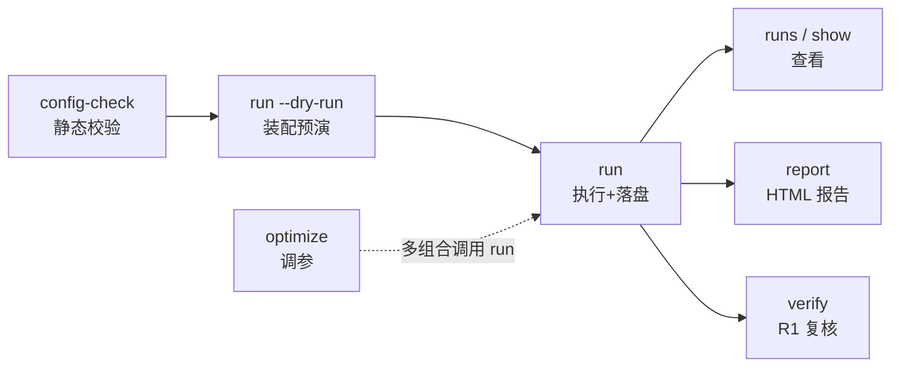

# btf 回测平台 · CLI 功能手册（v1.1.0）

> **定位**：`bt` 命令行的**完整功能参考**——逐命令给出用途、语法、参数表、行为分步、输出样例、退出码与限制。
> **只用工具**请看 [20-回测平台使用指引.md](20-回测平台使用指引.md)（5 分钟上手向）；本手册面向「查参数、排故障、写自动化脚本」。
> **口径来源**：实现 `代码/btf/btf/cli/main.py`（btf 1.1.0）；全部命令帮助与只读命令输出于 **2026-09-30 在本机实测**复现。
> **维护**：CLI 改动必须同步本手册；相邻文档：装配/引擎语义见 04/06 号，产物契约见 08 号，门禁口径见 09 号。

---

## 1. 手册使用说明

### 1.1 覆盖范围

| 覆盖 | 不覆盖 |
|---|---|
| `bt` 全部 11 个子命令的语法 / 参数 / 默认值 / 退出码 | 策略编写（→ 20 号 §10） |
| 每个命令的行为分步与输出格式 | 引擎撮合/成本/风控内部语义（→ 04/06 号） |
| 环境变量、产物目录契约、配置速查 | 架构决策与演进历史（→ 01-19 号） |
| 典型工作流、故障排查 | Python API（`btf.api`）用法 |

### 1.2 阅读约定

- 命令一律写作 `bt <子命令>`；`$ ` 开头的行为可复制命令；
- 样例输出中 `[ok]/[info]/[warn]/[error]/[fail]/[dry-run]/[note]` 是**真实输出前缀**，见 §5.2；
- 参数表「默认」列是**实际生效值**（含内置默认层）；
- 标注「**改产物**」的命令会写磁盘，其余只读。

---

## 2. 全局概览

### 2.1 命令族地图（11 命令，按场景分组）

```
① 核心回测链路   config-check → run → runs → show → report → verify
② 研究调优       optimize
③ 数据资产       dataset
④ 工程门禁       check / test / cold-backup
```

### 2.2 命令总表

| 命令 | 作用 | 关键参数 | 改产物 | 退出码 |
|---|---|---|---|---|
| `config-check` | 四层合并 + JSON Schema 校验 + 摘要 | `<config.yaml>` `--dump` `--resolve-strategy` | 否 | 0/1/2 |
| `run` | 执行回测并落盘（`--dry-run` 只装配） | `--config` `--set` `--dry-run` `--out` `--verbose` | **是**（建 run 目录） | 0/1/2 |
| `runs` | 列 RunStore 下的 run 摘要（只读） | `--latest N` `--out-dir` | 否 | 0/2 |
| `show` | 单 run 的 manifest + 指标摘要（只读，不重算） | `--run` `--out-dir` | 否 | 0/1/2 |
| `report` | 由产物再生成 HTML 报告（幂等） | `--run` `--out` `--out-dir` | 写 `report.html` | 0/1/2 |
| `verify` | R1 复核：产物重算指标 vs `manifest.metrics_digest` | `--run` `--out-dir` | 否 | 0/1/2 |
| `optimize` | 参数网格搜索（`grid_search` 进程池） | `--config` `--grid` `--objective` `--workers` `--top` `--out` | **是**（多次 run） | 0/1/2 |
| `dataset` | 黄金集：构建 / 主库对账 / 内嵌重算 | `build-golden\|verify\|refcalc` `--cases` `--list` `--force` `--out` | 视动作 | 0/1/2 |
| `test` | 运行测试层（pytest 执行器） | `--layer` `--pattern` `--path` | 否 | pytest 码 |
| `check` | 九项架构门禁（提交前必跑，无参数） | — | 否 | 0/1 |
| `cold-backup` | 跨版本源码冷备 / 校验既有冷备 | `--reason` `--out` `--verify DIR` | **是**（写备份） | 0/1/2 |

> **易混对**：`check` ≠ `test`（门禁 vs 回归测试层）；`show` ≠ `verify`（读事实 vs 重算对账）；
> `run --dry-run` ≠ `config-check`（装配期硬门 vs Schema 校验）。

### 2.3 标准调用序列



---

## 3. 运行环境与入口

### 3.1 解释器与命令入口

| 项 | 值 |
|---|---|
| 解释器 | `D:\量化策略\代码\_venv\Scripts\python.exe` |
| 命令入口 | `bt`（console script，已安装；`bt --version` → `btf 1.1.0`） |
| 等价调用 | `python -m btf.cli.main <命令>`（脚本化推荐，不依赖 console script） |
| 仓库根 | `D:\量化策略\代码\btf`（含 `btf/` 包、`tests/`、`tools/`、`schemas/`、`examples/`） |

### 3.2 全局选项

| 选项 | 说明 |
|---|---|
| `-h`, `--help` | 打印帮助（顶层或任意子命令；退出码 0） |
| `--version` | 打印 `btf 1.1.0`（版本单一真源 `btf/_version.py`） |

```bash
$ bt --version
btf 1.1.0

$ bt --help
usage: bt [-h] [--version]
          {check,cold-backup,config-check,dataset,optimize,report,run,runs,show,test,verify} ...
```

> 不给子命令、或给未知子命令 → argparse 报错并**退出码 2**（脚本中可据此区分「用法错误」与「业务失败」）。

### 3.3 工作目录与路径解析

- `bt` 可在**任意目录**运行（内部锚定仓库根，委托脚本用绝对路径调用解释器）；
- 配置里的**相对路径**（`--config`、`rules.path`、`run.strategy` 模块导入等）以**执行时的工作目录**为基准；
  脚本化时请先 `cd D:\量化策略\代码\btf` 或全程用绝对路径；
- `bt test` 与 `bt check` 固定以**仓库根**为子进程 cwd（与调用目录无关）。

### 3.4 环境变量

| 变量 | 作用 | 默认值 |
|---|---|---|
| `BTF_OUTPUT_DIR` | 回测产物根（其下建 `runs/`） | `D:\量化策略\回测产物` |
| `BTF_DATA_DIR` | 主库根（只读） | `D:\全量数据\market_data` |
| `BTF_DATASETS_DIR` | 黄金/示例数据集根 | `D:\量化策略\代码\btf\btf_datasets` |
| `BTF_ALT_DATA_DIR` | akshare 备库根（v0.5 接入预留） | `D:\全量数据\alt_data` |
| `BTF_<SECTION>__<KEY>` | **L2 配置层覆盖**（`__` 表嵌套；值自动推断 bool/int/float/str） | — |

```powershell
# 例：把产物根改到临时盘；打开风控链逃生开关（仅调试）
$env:BTF_OUTPUT_DIR = "E:\bt_runs"
$env:BTF_RISK__ALLOW_EMPTY_CHAIN = "true"
```

> `BTF_DATA_DIR` / `BTF_OUTPUT_DIR` 属**路径层专用**，不进入配置合并；其余 `BTF_*` 按 L2 覆盖处理（空值视为未设置）。

---

## 4. 命令参考

> 统一小节结构：**用途 → 语法 → 参数表 → 行为 → 输出 → 退出码 → 示例 → 注意**。实现锚点见附录 B。

### 4.1 `bt config-check` —— 配置静态校验

**用途**：不跑回测，先回答「这份配置能不能用」：四层合并 → JSON Schema 校验 → 脱敏摘要。

**语法**

```bash
bt config-check <config.yaml> [--dump] [--resolve-strategy]
```

**参数**

| 参数 | 必填 | 默认 | 说明 |
|---|---|---|---|
| `config`（位置） | ✅ | — | 用户配置 YAML 路径 |
| `--dump` | | 关 | 打印合并后**全量配置**；键名含 `token/secret/password/api_key/access_key/credential` 的值替换为 `***` |
| `--resolve-strategy` | | 关 | 额外 `import` `run.strategy` 指向的类并校验其为 `StrategyBase` 子类（类名拼写错误在最低成本环节暴露） |

**行为**

1. L1-L4 四层合并：内置默认 → `BTF_*` 环境变量 → 用户 YAML（本命令无 L4 CLI 覆盖层）；
2. Schema 校验：按 `schema_version` 路由 `schemas/backtest.v1.json`（Draft 2020-12；错误**一次性全量列出**，含 JSON 路径与违规值）；
3. 打印摘要（策略/期间/数据/执行；规则段非空时加一行）；
4. 可选 `--resolve-strategy`：模块可 import + 类属性存在 + 是 `StrategyBase` 子类；
5. 可选 `--dump`：输出脱敏全量配置。

**输出（实测）**

```bash
$ bt config-check examples/config_rotation.yaml
[ok] backtest.v1 校验通过：examples/config_rotation.yaml
     策略: examples.rotation:MonthlyMomentumRotation
     期间: 2020-01-01 → 2022-12-31（初始资金 1000000）
     数据: feed=tushare_parquet | 降级开关 allow_degraded_limit=False
     执行: handler=next_open cost=tiered_v1 slippage=none rebalancer=full
```

校验失败时（stderr）：

```
[error] 配置校验失败（2 处）：
  [1] run.period.start: '2020/01/01' does not match '^[0-9]{4}-[0-9]{2}-[0-9]{2}$'（值 '2020/01/01'）
  [2] data.feed: 'xxx' is not valid under any of the given schemas（值 'xxx'）
```

**退出码**

| 码 | 含义 |
|---|---|
| 0 | 校验通过 |
| 1 | 配置源读取失败（不可读/YAML 语法/顶层非映射）、Schema 违规、`--resolve-strategy` 不可加载 |
| 2 | 用法错误（缺位置参数等，argparse） |

**示例**

```bash
$ bt config-check examples/config_rotation.yaml                  # 日常校验
$ bt config-check config.yaml --resolve-strategy                 # 连策略类一起查（改完策略必跑）
$ bt config-check config.yaml --dump > merged.yaml               # 留档合并后配置（脱敏）
```

**注意**

- 本命令**只做合并 + Schema**，不做装配期硬门：空风控链、区间覆盖度、基准存在性、策略契约版本
  等到 `bt run`（或 `--dry-run`）才暴露——**改配置后建议 `config-check` + `run --dry-run` 各跑一次**；
- `--resolve-strategy` 默认关闭是**向后兼容**承诺：加开只多一道门，不改校验口径。

---

### 4.2 `bt run` —— 执行回测并落盘

**用途**：主链路 `load_config → build（装配）→ run（引擎 + 落盘）`；`--dry-run` 只装配预演。

**语法**

```bash
bt run --config <config.yaml> [--set K=V]... [--dry-run] [--out DIR] [--verbose]
```

**参数**

| 参数 | 必填 | 默认 | 说明 |
|---|---|---|---|
| `--config` | ✅ | — | 回测配置 YAML |
| `--set K=V` | | — | L4 CLI 覆盖，**可重复**；`a__b=1` 双下划线表嵌套；值按 int → float → str 推断 |
| `--dry-run` | | 关 | 只装配：**不建 run 目录、不执行引擎、不落盘**，打印装配计划 |
| `--out` | | `BTF_OUTPUT_DIR\runs` | 产物根目录（本次 run 目录在其下） |
| `--verbose` | | 关 | 额外打印分步耗时 / 数据质检结论 / 数据指纹 |

**行为**

1. `--set` 解析为嵌套覆盖 dict（语法错误 → 退出码 2，不进入装配）；
2. 四层合并 + Schema 校验（同 `config-check`）；
3. `build()` 装配期硬门（见 §7.4），任一不过 → `[error] 装配失败：...` 且**不建 run 目录**；
4. `--dry-run`：打印装配计划后结束；正式执行：`create_run`（写 `manifest.json` 骨架，状态 `RUNNING`）
   → 引擎日循环 → 快照/成交/拒单/事件落盘 → 指标计算 → `metrics.json` + manifest 补全（`COMPLETED`）；
5. 打印 `run_id`、产物路径、5 项关键指标；`--verbose` 追加诊断行。

**输出**

正常结束（字段格式取自实现；指标打印 `_fmt_metric` = **与落盘一致的完整精度**，非四舍五入）：

```
[ok] run_id: 20260927_163148_7ecdb4
     产物: D:\量化策略\回测产物\runs\20260927_163148_7ecdb4
     total_return: 0.2804647999999972
     annualized_return: 0.0360318206252046
     sharpe_ratio: 0.532071147084943
     max_drawdown: -0.12982320767202893
     n_fills: 4493.0
```

`--dry-run` 输出（实测）：

```
[dry-run] 装配完成（未执行引擎、未落盘）
     策略: MonthlyMomentumRotation | 标的: 10 只
     期间: 2020-01-01 → 2022-12-31
     组件: handler=NextOpenHandler cost=AShareTieredFeeModel slip=NoSlippage rebalancer=FullRebalancer
     风控: 3 条 | 规则版本: none
```

`--verbose` 追加：

```
     [verbose] 分步耗时: <分步明细>
     [verbose] 数据质检: <结论>（标的 <checked_symbols>，抽样=<sampled_symbols>）
     [verbose] 数据指纹: sha256:<content_hash>（档位 <mode>，水位 <anchor_date>）
```

极短区间告警（**不阻断**）：

```
[warn] 区间仅 3 个交易日（< 20）：部分指标数学有定义但业务无意义，勿用于 optimize --objective 排序（19 号 OBS-1/BB-4）
```

**退出码**

| 码 | 含义 |
|---|---|
| 0 | 成功（含 `--dry-run` 装配成功） |
| 1 | 装配失败（配置校验/契约版本/覆盖度/空风控链/策略加载/数据等） |
| 2 | `--set` 语法错误（如缺 `=`） |

**示例**

```bash
$ bt run --config config.yaml --dry-run                          # 新配置先预演
$ bt run --config config.yaml                                    # 正式跑
$ bt run --config config.yaml --set run.params.top_k=10          # 临时改参数（不改 YAML）
$ bt run --config config.yaml --out E:\bt_runs --verbose         # 换产物根 + 诊断输出
```

**注意**

- **类型推断不做布尔化**：`--set data.quality.strict=true` 会以**字符串** `"true"` 进入合并 →
  Schema 类型校验**报错**。布尔开关请走环境变量（`BTF_DATA__QUALITY__STRICT=true`）或直接改 YAML；
- 装配期失败**不留半成品 run 目录**；引擎期失败会留下 `manifest.json`（状态 `FAILED` + error），可用 `bt show` 复盘；
- 长回测观测耗时分布用 `--verbose`；失败后先 `bt check` 排除环境问题，再 `--dry-run` 定位装配期硬门。

---

### 4.3 `bt runs` —— 历史 run 清单（只读）

**用途**：一行一个 run 给出 `run_id / 状态 / 时间 / 5 项指标`，免 `ls` 翻目录。

**语法**

```bash
bt runs [--latest N] [--out-dir DIR]
```

**参数**

| 参数 | 必填 | 默认 | 说明 |
|---|---|---|---|
| `--latest N` | | 全部 | 只列最近 N 个（按 run 目录时间倒序） |
| `--out-dir` | | `BTF_OUTPUT_DIR\runs` | RunStore 根目录 |

**行为**

1. 扫描 RunStore 根下一级子目录（无目录 → 打印 `[info]` 提示并返回 0）；
2. 逐行读 `manifest.json`（状态）+ `metrics.json`（5 项关键指标）；
3. 排序：run 目录 mtime + run_id 倒序；
4. **坏产物不静默**：manifest 不可读的行照列，状态退化为 `?`，下一行 `[warn]` 写明原因（fail-visible）。

**输出（实测节选）**

```
run_id                    状态         时间                   指标
20260927_163148_7ecdb4    COMPLETED  2026-09-28 17:30:11  total_return=0.280465  annualized_return=0.0360318  sharpe_ratio=0.532071  max_drawdown=-0.129823  n_fills=4493
20260927_162659_7ecdb4    COMPLETED  2026-09-28 17:30:10  total_return=0.280465  annualized_return=0.0360318  sharpe_ratio=0.532071  max_drawdown=-0.129823  n_fills=4493
```

无产物时：

```
[info] 无 run 产物（先 `bt run --config <yaml>`，或用 --out-dir 指定产物根）
```

**退出码**：0（正常，含无产物）；2（用法错误）。

**示例**

```bash
$ bt runs --latest 5                       # 最近 5 个
$ bt runs --out-dir E:\bt_runs             # 查非默认产物根
```

**注意**：指标为**紧凑显示**（6 位有效数字；`n_fills` 显示为 `4493` 而非 `4493.0`）；需要全精度用 `bt show`。

---

### 4.4 `bt show` —— 单 run 详情（只读，不重算）

**用途**：看一眼这个 run 是什么——manifest 关键字段 + 5 项指标全精度。**不触发指标重算**。

**语法**

```bash
bt show --run <run_id> [--out-dir DIR]
```

**参数**

| 参数 | 必填 | 默认 | 说明 |
|---|---|---|---|
| `--run` | ✅ | — | run_id |
| `--out-dir` | | `BTF_OUTPUT_DIR\runs` | RunStore 根目录 |

**行为**：只读 `manifest.json` + `metrics.json`（不读 snapshots/fills——展示命令不付全量产物读取代价）。

**输出（实测）**

```
run_id      : 20260927_163148_7ecdb4（COMPLETED）
产物目录    : D:\量化策略\回测产物\runs\20260927_163148_7ecdb4
期间        : 2019-06-26 → 2026-09-23（初始资金 1000000.0）
策略        : btf.strategy.qidian:QidianStrategy
数据        : feed=mixed 指纹=sha256:unknown
规则版本    : none（overrides 0 条）
配置哈希    : sha256:7ecdb47c2890c1e7d479d69936da6273fe0bcd115efb1b414b7299ce8910cba6
重算锚      : sha256:d34e32749d397aa7ce5ee333ef48d33c137f565b1596970a03f5c55ee7190a16（manifest.metrics_digest；`bt verify` 的对账锚点）
契约版本    : runresult.v1 | 契约基线=1.0
代码版本    : btf==0.2.0（commit unknown）
指标:
     total_return: 0.2804647999999972
     annualized_return: 0.0360318206252046
     sharpe_ratio: 0.532071147084943
     max_drawdown: -0.12982320767202893
     n_fills: 4493.0
```

补充行为：manifest 有 `assembly_notes` 时逐行 `[note] ...`；状态非 `COMPLETED` 时 stderr 提示
`[warn] run 状态 FAILED（非 COMPLETED）：<error>（指标可能不完整）`；不可算指标（NaN/null）打印 `null`（与落盘一致）。

> 样例解读：`代码版本` 是**该产物生成时**的版本（此 run 产生于 btf 0.2.0 时代，与当前 `--version`
> 不一致属正常）；`指纹=sha256:unknown` 表示该产物未记录数据内容哈希（无记录时如实显示 unknown，
> 不冒充有值）；`配置哈希` 前 6 位 = run_id 末段 `7ecdb4`。

**退出码**：0；1（run 不存在 / manifest 不可读 / 契约不兼容）；2（用法错误）。

**示例**

```bash
$ bt show --run 20260927_163148_7ecdb4
$ bt show --run 20260927_163148_7ecdb4 --out-dir E:\bt_runs
```

**注意**：`show` 只打印**落盘事实**；要验证「事实没被篡改/口径没漂移」用 `bt verify`（慢，重算）。

---

### 4.5 `bt report` —— 生成 HTML 报告（幂等）

**用途**：由 run 产物再生成 HTML 报告，默认落盘 `run 目录/report.html`。

**语法**

```bash
bt report --run <run_id> [--out <HTML路径>] [--out-dir DIR]
```

**参数**

| 参数 | 必填 | 默认 | 说明 |
|---|---|---|---|
| `--run` | ✅ | — | run_id |
| `--out` | | `<run目录>\report.html` | 输出 HTML 路径（父目录自动创建） |
| `--out-dir` | | `BTF_OUTPUT_DIR\runs` | RunStore 根目录 |

**行为**

1. 读 run 产物（snapshots / fills / manifest / metrics）；
2. 装配「假设与披露」（撮合口径、滑点口径、费率分段、规则版本与覆盖、事件日志降级事件）；
3. 渲染 HTML 写盘；打印路径与字节数。

**输出**

```
[ok] 报告: D:\量化策略\回测产物\runs\20260927_163148_7ecdb4\report.html（123,456 字节）
```

**退出码**：0；1（run 不存在，`FileNotFoundError`）；2（用法错误）。

**示例**

```bash
$ bt report --run 20260927_163148_7ecdb4                       # 默认位置
$ bt report --run 20260927_163148_7ecdb4 --out E:\report.html  # 指定路径
```

**注意**

- **幂等**：同一份产物重复生成内容一致，可安全重跑（清缓存/换机器后重建报告）；
- 报告章节由 `report.sections`（配置层）控制；**「假设与披露」「复现说明」是强制章节**不可关闭——
  报告的版本/指纹/种子披露必然存在；
- 报告**不参与** `bt verify` 对账（对账锚是 manifest 摘要）；删除报告可随时重建。

---

### 4.6 `bt verify` —— R1 复核（重算对账）

**用途**：从落盘产物**重算**全部指标 → 与 `manifest.metrics_digest` 比对，抓「产物被篡改 / 口径漂移」。

**语法**

```bash
bt verify --run <run_id> [--out-dir DIR]
```

**参数**

| 参数 | 必填 | 默认 | 说明 |
|---|---|---|---|
| `--run` | ✅ | — | run_id |
| `--out-dir` | | `BTF_OUTPUT_DIR\runs` | RunStore 根目录 |

**行为**：`snapshots.jsonl + fills.jsonl` → 重算指标 → 计算摘要 → 与 manifest 摘要、落盘 `metrics.json`
摘要**双向比对**（复核路径与生成路径分离，报告/归档后仍可自校验）。

**输出（实测）**

```
run_id      : 20260927_163148_7ecdb4（COMPLETED）
快照 / 成交 : 1761 / 4493
重算 digest : sha256:d34e32749d397aa7ce5ee333ef48d33c137f565b1596970a03f5c55ee7190a16（一致）
落盘 digest : sha256:d34e32749d397aa7ce5ee333ef48d33c137f565b1596970a03f5c55ee7190a16（一致）
manifest    : sha256:d34e32749d397aa7ce5ee333ef48d33c137f565b1596970a03f5c55ee7190a16
[ok] R1 复核通过：重算指标与落盘指标均与 manifest 摘要一致
```

（上例三行 digest 相同 = 重算 / 落盘 / manifest 三方一致；该值与 `bt show` 的「重算锚」一致。）

不一致时（stderr）：

```
[fail] R1 复核失败：摘要不一致（产物被篡改或口径漂移）
```

**退出码**：0（一致）；1（不一致 / run 不存在）；2（用法错误）。

**示例**

```bash
$ bt verify --run 20260927_163148_7ecdb4        # 审计/归档前复核
```

**注意**：比 `show` 慢（读全量 snapshots/fills 并重算）；建议**周期性抽查**。复核失败先查：
产物是否被手改、`btf` 在 run 之后是否改过口径（对照 `manifest.code_version`）。

---

### 4.7 `bt optimize` —— 参数网格搜索

**用途**：对配置中若干参数位做笛卡尔积扫描，每个组合一次回测，按目标指标排名。

**语法**

```bash
bt optimize --config <config.yaml> --grid "<spec>" [--objective X] [--workers N] [--top N] [--out FILE]
```

**参数**

| 参数 | 必填 | 默认 | 说明 |
|---|---|---|---|
| `--config` | ✅ | — | 回测配置 YAML（基准配置） |
| `--grid` | ✅ | — | 网格 spec：`path=v1,v2;path2=v1,v2`（见下） |
| `--objective` | | `sharpe_ratio` | 排名指标名（不做白名单：任何出现在指标集里的名字都接受） |
| `--workers` | | `8` | 进程数；`0` = 内联顺序执行（调试 / 注入型 feed 用） |
| `--top` | | `10` | 打印前 N 名 |
| `--out` | | 不写 | 结果 JSON 输出路径（父目录自动创建） |

**`--grid` spec 语法**

- 分号 `;` 分隔多个参数位；每个参数位 `点分配置路径=值1,值2,...`（如 `run.params.top_k=3,5,10`）；
- 取值类型按 **int → float → str** 推断（与 `--set` 同源）；
- 空 spec / 空取值列表 → 报错退出码 2。

**行为**

1. 解析 grid（语法错 → 退出码 2）；读取基准配置（读失败 → 退出码 1）；
2. 经注册表取 `grid_search` 优化器，进程池并行跑全部组合（每组合 `persist=False`，**不落 run 产物**）；
3. 按 objective 降序排名（指标缺失/NaN 按 `-inf` 垫底，不剔除记录）；
4. 打印 `n_combos × workers` 概览 + 前 `--top` 名；`--out` 写全量结果 JSON。

**输出**

```
[ok] grid_search：9 组 × 8 进程 | objective=sharpe_ratio
rank       value  params
   1      1.2345  run.params.lookback=20, run.params.top_k=5
   2      1.1021  run.params.lookback=40, run.params.top_k=5
     结果: E:\grid_result.json
```

**退出码**：0；1（配置读取失败）；2（`--grid` 解析失败 / 用法错误）。

**示例**

```bash
$ bt optimize --config config.yaml \
              --grid "run.params.top_k=3,5,10;run.params.lookback=10,20,40" \
              --objective sharpe_ratio --workers 8 --top 10 \
              --out E:\grid_result.json

$ bt optimize --config config.yaml --grid "run.params.top_k=5" --workers 0   # 单组合内联调试
```

**注意**

- 结果 JSON 结构：`objective / n_combos / workers / results[]（每组合 params+metrics+rank）/ top[]（最多 10 项）`。
  `--out` 写**全量记录**；`--top` 只影响屏幕打印；
- **极短区间污染排名**：区间太短时部分指标「数学有定义、业务无意义」，排名不可信；
- 组合为**独立 run**（不共享随机状态），可复现性由 `seed.master` 保证；
- `--workers 0` 用于 `memory` feed 或调试；负数进程数非法。

---

### 4.8 `bt dataset` —— 黄金集（构建 / 对账 / 重算）

**用途**：回归测试的黄金数据集三条路——构建写盘、与主库对账、只用案例内嵌数据独立重算。

**语法**

```bash
bt dataset [build-golden|verify|refcalc] [--cases g1|all|id,id] [--list] [--verify] [--force] [--out DIR]
```

**参数**

| 参数 | 必填 | 默认 | 说明 |
|---|---|---|---|
| `action`（位置） | | `build-golden` | 子动作（choices）：`build-golden` / `verify` / `refcalc` |
| `--cases` | | `g1` | 案例选择：单组（`g1`）、`all`、逗号分隔 case_id |
| `--list` | | 关 | 列出案例与待补组（**不写盘**） |
| `--verify` | | 关 | 只校验不写（等价 `action=verify`） |
| `--force` | | 关 | 显式覆盖已构建案例（留痕） |
| `--out` | | `BTF_DATASETS_DIR\golden_v1\cases` | 输出目录 |

**三动作语义**

| 动作 | 读主库 | 写盘 | 判据 |
|---|---|---|---|
| `build-golden` | ✅ | ✅ | 从主库构建/更新案例文件；断言漂移 → FAIL |
| `verify` | ✅ | ❌ | 现有案例与主库对账（主库变了/案例陈旧即暴露） |
| `refcalc` | ❌ | ❌ | 只用**案例文件内嵌数据**独立重算断言（黄金集自洽性） |

**输出（`--list` 实测节选）**

```
g10_vpp_partial_fill     G10  built    VPP 部分成交：601599.SH 20191108 vol=30000 × 5% = 1500 股 → 10 万股委托部分成交，余量当日取消
g1_cash_div_ex_ne_pay    G1  built    派息 ex≠pay（600000.SH 2012）：ex 日缺口 / pay 日到账，窗口合并 Δ=0
g1_cash_div_same_day     G1  built    派息且 pay≡ex（2020+ 常态）：单日 Δ=0，avg_cost 摊薄
...（其余 13 个案例，按 case_id 字典序，略）
-- pending（未实现，显式的）--
```

**案例清单（16 个，`--list` 为准）**

| 组 | case_id | 场景 |
|---|---|---|
| G1 | `g1_cash_div_same_day` / `g1_cash_div_ex_ne_pay` / `g1_stk_div_mixed` | 派息 pay≡ex / ex≠pay / 送转+派息混合 |
| G2 | `g2_limit_up_buy_rejected` / `g2_limit_down_sell_rejected` | 涨/跌停拒单 |
| G3 | `g3_suspension_buy_rejected` | 停牌期拒单、复牌可成交 |
| G4 | `g4_t1_same_day_sell_rejected` / `g4_t0_etf_same_day_roundtrip` | T+1 拒单 / T+0 ETF 同日回转 |
| G5 | `g5_st_interval` | ST 状态区间面板 |
| G6 | `g6_delist_last_day` | 退市末日出清 |
| G7 | `g7_lot_and_min_commission` / `g7_fee_segments_pre2015` | 整手/最低佣金 / 费率分段 |
| G8 | `g8_calendar_spring_festival` | 春节日历缺口 |
| G9 | `g9_dividend_chain_hfq` | 复权链守恒 |
| G10 | `g10_vpp_partial_fill` / `g10_vpp_volume_cap_rejected` | 部分成交 / 量上限拒单 |

**退出码**

| 码 | 含义 |
|---|---|
| 0 | 动作完成且断言全部通过（含 `--list`） |
| 1 | 断言漂移（`[FAIL] ...`） |
| 2 | 未知动作 / 主库不可用（路径不存在）/ 工具脚本缺失 |

**示例**

```bash
$ bt dataset --list                              # 看案例与状态
$ bt dataset                                     # 构建 g1（默认）
$ bt dataset build-golden --cases all            # 全量构建
$ bt dataset verify --cases g1                   # 与主库对账（不写）
$ bt dataset refcalc --cases all                 # 内嵌数据重算（不读主库）
$ bt dataset build-golden --cases g1 --force     # 显式覆盖（留痕）
```

**注意**

- `--list` 与 `--out` 同时给出时 `--out` 被忽略（列清单不写盘）；
- 构建产物是**版本化数据集**（`golden_v1`，契约 `golden.v1`）；覆盖必须显式 `--force`，防误伤；
- `refcalc` 不依赖主库——数据盘不可用时仍可做**黄金集自洽性**检查。

---

### 4.9 `bt test` —— 运行测试层（pytest 执行器）

**用途**：按测试层标记跑 pytest 回归。**提交前门禁请用 `bt check`**（两者分工见下）。

**语法**

```bash
bt test [--layer l1|l2|l3|l4|l5|all] [--pattern EXPR] [--path PATH]
```

**参数**

| 参数 | 必填 | 默认 | 说明 |
|---|---|---|---|
| `--layer` | | `l1` | 测试层标记（见下表）；`all` = 不加层过滤（全量） |
| `--pattern` | | — | pytest `-k` 表达式（用例名过滤） |
| `--path` | | — | 测试路径（默认全量 `tests/`） |

**测试层定义**

| 标记 | 含义 |
|---|---|
| `l1` | 单元测试（秒级，提交门；**默认**） |
| `l2` | 集成测试（MemoryFeed 组合行为） |
| `l3` | 系统测试（端到端对账） |
| `l4` | 回归测试（黄金集 + 双跑 diff） |
| `l5` | 性能基准（B1-B5） |
| `smoke` | 冒烟（中文路径/环境自检；`bt check` 第 3 项） |

**行为**：以**子进程**跑 `python -m pytest -q -p no:cacheprovider --basetemp <临时目录>`；cwd 固定为仓库根；
剥离 `PYTEST_CURRENT_TEST` 环境变量；结束后回收自建临时目录。命令回显 `[run] ...`。

**退出码**：**原样透传 pytest 码**——`0` 全通过；`1` 有失败；`2` 中断；`5` 无用例。

**示例**

```bash
$ bt test                                        # l1（秒级，日常）
$ bt test --layer l4                             # 黄金集回归
$ bt test --layer all                            # 全量（约 64 分钟，慎用）
$ bt test --pattern test_manifest --path tests/  # -k 过滤 + 指定路径
$ bt test --layer all --pattern smoke            # 只跑冒烟集
```

**注意**

- 默认 `l1` 是**刻意保守**：全量回归耗时约 1 小时，需显式 `--layer all`；
- 与 `bt check` 分工：`check` = 提交前九项门禁（含 lint / 架构契约 / 数据不变量，一体跑完）；
  `test` = 按层跑 pytest 回归。**日常改完代码：`bt check` → `bt test`**。

---

### 4.10 `bt check` —— 九项架构门禁

**用途**：提交前必跑的一体化门禁；与 `python tools/check.py` **同一脚本、同一退出码**。

**语法**

```bash
bt check
```

**参数**：**无**（刻意如此——加开关等于允许「跑得不一样」，口径唯一优先）。

**九项清单**

| # | 项 | 守护的纪律 |
|---|---|---|
| 1/9 | ruff lint | 代码规范 + 随机源禁令 |
| 2/9 | import-linter 架构铁律 | 六铁律分层依赖 |
| 3/9 | 冒烟测试（中文路径/环境） | 部署环境自检 |
| 4/9 | 依赖预算 | 外部依赖 ≤ 8 |
| 5/9 | 包可导入 | 骨架完整性（`import btf`） |
| 6/9 | domain 白名单 | `btf/domain` 仅标准库 |
| 7/9 | 报告渲染级结构 | 渲染/序列化产物断言 |
| 8/9 | 数据不变量校验 | 主库正样本 + 负向对照 |
| 9/9 | IO 单一入口（+变异性自检） | 磁盘访问收敛点唯一 |

**输出**：每项 `=== N/9 ... ===` / `--- PASS|FAIL ---`；末尾汇总。

```
bt check: 9/9 通过
```

**退出码**：0（9/9）；1（有失败项）；2（工具脚本缺失）。

**示例**

```bash
$ bt check          # 提交前 / 定版前
```

**注意**：任何一项 FAIL 都要修到全绿再提交；该项判定逻辑不复制到 CLI（单一真源在 `tools/check.py`）。

---

### 4.11 `bt cold-backup` —— 跨版本源码冷备

**用途**：btf 非 git 仓库，定版/重要节点用冷备留痕：源码树 + 逐文件 sha256 + 还原说明。

**语法**

```bash
bt cold-backup [--reason <依据>] [--out <备份根>] [--verify <冷备目录>]
```

**参数**

| 参数 | 必填 | 默认 | 说明 |
|---|---|---|---|
| `--reason` | | `手动冷备` | 备份依据（写入 MANIFEST；定版请写明确，如 `v1.1.0 定版`） |
| `--out` | | `D:\量化策略\备份` | 备份根目录 |
| `--verify DIR` | | — | **校验既有冷备**（逐文件 sha256 复算，与新建互斥） |

**行为**

- 新建：拷 `btf / tests / tools / schemas / examples / pyproject.toml / CHANGELOG.md / README.md / docs`（排除
  `__pycache__ / .pytest_cache / *.pyc / runs / dist / build` 等派生目录）→ 写 `MANIFEST.json`（版本/时间/依据/逐文件哈希/计数）
  + `SHA256SUMS.txt`（外部可 `sha256sum -c`）+ `COLD_BACKUP.md`（含还原步骤）→ **自校验**一遍；
- 目录名：`<备份根>\<YYYYMMDD-HHMM>-btf-<version>-cold\`；目标已存在 → 拒绝（防覆盖）；
- `--verify`：复算全部哈希与 MANIFEST 比对（防介质损坏）。

**输出**

```
[ok] 冷备完成：D:\量化策略\备份\20260930-1509-btf-1.1.0-cold（213 文件 / 2031 KB）
[ok] 自校验通过（逐文件 sha256 一致）
```

**退出码**：0；1（哈希不一致 / 自校验失败）；2（工具脚本缺失 / 参数用法错误）。

**示例**

```bash
$ bt cold-backup                                      # 快速留痕（默认依据「手动冷备」）
$ bt cold-backup --reason "v1.1.0 定版"               # 定版冷备
$ bt cold-backup --out E:\backup --reason "迁移前"    # 指定备份根
$ bt cold-backup --verify "D:\量化策略\备份\20260930-1509-btf-1.1.0-cold"   # 校验既有冷备
```

**注意**：fail-closed——任一文件哈希失败 / 源缺失即退出非零，**不产出半份备份**；`--verify` 与新建互斥
（给了 `--verify` 时 `--reason`/`--out` 被忽略）。

---

## 5. 退出码与错误处理约定

### 5.1 退出码总表

| 码 | 通用含义 | 典型命令 |
|---|---|---|
| `0` | 成功 / 检查通过（含「无数据可列」这类正常空结果） | 全部 |
| `1` | **业务失败**：校验失败 / 装配失败 / 复核不一致 / 对账漂移 / 哈希失败 / run 不存在 | `config-check` `run` `report` `verify` `dataset` `check` `cold-backup` |
| `2` | **用法与前置错误**：argparse 用法错误、`--set`/`--grid` 语法错、未知 dataset 动作、工具脚本缺失 | 全部 |
| pytest 码 | 原样透传（0/1/2/5） | `test` |

> 脚本化建议：把 `1` 视为「看 stderr 的业务原因」，`2` 视为「调用方写错了命令行」——前者重试/修配置，
> 后者修脚本。

### 5.2 输出前缀约定

| 前缀 | 流向 | 含义 |
|---|---|---|
| `[ok]` | stdout | 操作成功 |
| `[info]` | stdout | 提示（如无 run 产物，非错误） |
| `[warn]` | stdout / stderr | 告警**不阻断**（短区间、坏 manifest、非 COMPLETED） |
| `[error]` | stderr | 失败原因（配置/装配/文件不存在） |
| `[fail]` | stderr | 复核/校验判定失败（`verify` / 冷备校验） |
| `[dry-run]` | stdout | 装配预演结果 |
| `[run]` | stdout | `bt test` 回显实际执行的 pytest 命令 |
| `[note]` | stdout | `bt show` 回显 manifest 装配说明 |

### 5.3 常见错误与处置

| 现象（stderr） | 原因 | 处置 |
|---|---|---|
| `[error] 配置源读取失败：...` | YAML 不可读 / 语法错 / 顶层非映射 | 检查路径与 YAML 缩进；顶层必须是 mapping |
| `[error] 配置校验失败（N 处）：...` | Schema 违规 | 按列出的 JSON 路径逐条修（错误一次性全量给出） |
| `[error] 策略不可加载：...`（`--resolve-strategy`） | 类名拼错 / 模块不在 sys.path | 修 `run.strategy`；项目外策略设 `PYTHONPATH` |
| `[error] 装配失败：ContractVersionError: ...` | 策略/插件未声明或主版本不符 `contract_version` | 类里声明 `contract_version = CONTRACT_VERSION` |
| `[error] 装配失败：... risk.rules 为空 ...` | 空风控链 fail-closed | 写 `risk.rules`；调试才加 `allow_empty_chain: true` |
| `[error] 装配失败：... 覆盖度 ...` | 区间早于数据约束起点（如涨跌停） | 收窄区间；或显式 `data.allow_degraded_limit: true` |
| `[error] --set 需形如 a.b=1，得 '...'` | `--set` 缺 `=` | 修正写法（嵌套用 `__`） |
| `[error] --grid 需形如 path=v1,v2，得 '...'` | grid spec 语法错 | 检查分号/逗号/等号 |
| `[error] run 不存在或无 manifest：<id>` | run_id 写错或产物根不对 | `bt runs` 找回；必要时 `--out-dir` |
| `[fail] R1 复核失败：摘要不一致` | 产物被改 / 口径漂移 | 对照 `manifest.code_version`、检查是否手改产物 |
| `[error] 未知 dataset 动作：'...'` | 动作拼错 | 用 `build-golden\|verify\|refcalc` |
| `[error] 主库不可访问: ...` | 数据盘未挂载 / 路径不对 | 检查 `BTF_DATA_DIR` |

---

## 6. 产物目录规范（CLI 的读写对象）

### 6.1 run 目录契约

```
<BTF_OUTPUT_DIR>/runs/<run_id>/
├── manifest.json      元数据（启动写骨架 RUNNING，结束补全 COMPLETED / FAILED）
├── snapshots.jsonl    逐日组合快照（PortfolioSnapshot 序列）
├── trades.jsonl       成交聚合（FIFO 开平）
├── fills.jsonl        成交明细（含费用分项）
├── rejections.jsonl   拒单（order + code/message）
├── events.jsonl       事件溯源日志（引擎直写；可采样降级）
├── metrics.json       全部绩效指标（15 项）
└── report.html        HTML 报告（`bt report` 生成，可删可重建）
```

`run_id` 格式：`YYYYMMDD_HHMMSS_<config_hash 前 6 位>`（如 `20260927_163148_7ecdb4`）——同一配置重跑，
时间戳不同、短哈希相同。

### 6.2 manifest 关键字段（`bt show` 消费）

| 字段 | 含义 |
|---|---|
| `run_id` / `status` / `error` | 标识与 `RUNNING/COMPLETED/FAILED` 状态 |
| `config_hash` / `config_effective` | 生效配置的哈希与脱敏回显 |
| `data_version` | 数据指纹（`dataset` / `content_hash` / 档位 / 水位） |
| `code_version` | 包版本 / git commit / dirty 标记 |
| `rules_version` / `rules_overrides` | 规则源版本与显式覆盖条数 |
| `contract_version` / `btf_contract_version` | 产物契约版本 / 契约基线 |
| `metrics_digest` | **R1 对账锚**（`bt verify` 比对对象） |
| `assembly_notes` | 装配期说明（如质检抽样、降级放行） |

### 6.3 只读命令对异常产物的行为（fail-visible）

| 场景 | `runs` | `show` | `report` / `verify` |
|---|---|---|---|
| manifest 缺失/坏 JSON | 行照列，状态 `?` + `[warn]` 原因 | 退出码 1 + `[error]` | 退出码 1 |
| 状态 `FAILED` | 正常列出 | 正常显示 + stderr `[warn]` | `report` 可用；`verify` 视摘要缺失报错 |
| metrics 缺失 | 指标列空 + `[warn]` | 指标打印 `null` | 退出码 1 |
| 契约版本不兼容 | 行照列 + `[warn]` | 退出码 1 | 退出码 1 |

> 原则：**「列不出来」与「列出来但读不了」是两件事**——后者必须可见（不静默吞掉坏产物）。

---

## 7. 配置速查（CLI 的输入）

> 配置的完整讲解见 [20-回测平台使用指引.md](20-回测平台使用指引.md) §4-§9；本章只放 CLI 视角的速查。

### 7.1 四层合并与优先级

```
L1 内置默认  →  L2 环境变量 BTF_*  →  L3 用户 YAML  →  L4 CLI --set
（DEFAULTS）     （BTF_<SECTION>__<KEY>）              （bt run --set）
```

- 深合并：嵌套 dict 递归，非 dict 后值整替；合并后统一经 JSON Schema 校验（错误全量列出）；
- `bt config-check` 覆盖 L1-L3；`bt run --set` 追加 L4；
- 布尔值只能从 L2（环境变量）/ L3（YAML）进入，**`--set` 不做布尔化**（见 §4.2 注意）。

### 7.2 关键段速查

| 段 | 必填 | 要点 |
|---|---|---|
| `schema_version` | ✅ | 固定 `"backtest.v1"` |
| `run.strategy` | ✅ | `module:Class` 点分路径 |
| `run.period` | ✅ | `start`/`end`（`YYYY-MM-DD`） |
| `run.universe` | | `explicit`（symbols）/ `all` / `index`（`hs300` 别名或 `000300.SH`，PIT 快照） |
| `run.initial_cash` | | 默认 1,000,000 |
| `data.feed` | ✅ | `tushare_parquet` / `mixed` / `memory` |
| `data.quality` | | 默认 `{enabled: true, strict: false, max_symbols: 200}` |
| `data.allow_degraded_limit` | | 默认 false；区间早于涨跌停数据起点即 fail |
| `execution.*` | | 默认 `next_open + tiered_v1 + none + full`（回测基线组合） |
| `risk.rules` | | 空链 fail-closed（除非显式 `allow_empty_chain: true`） |
| `rules.source` | | `static` / `mirror_json`（配 `path`） |
| `seed.master` | | 随机种子单一真源 |
| `report.sections` | | 章节名表；`assumptions` / `reproduce` 强制 |
| `analysis.metrics` | | 指标名字表（自定义 Analyzer 生效点） |

### 7.3 插件注册名速查（配置里可写的值）

| 扩展点（配置键） | 注册名 |
|---|---|
| `data.feed` | `tushare_parquet` / `mixed` / `memory` |
| `execution.handler` | `next_open` |
| `execution.cost_model` | `tiered_v1` / `zero` / `flat_rate` |
| `execution.slippage.model` | `none` / `fixed` / `pct` |
| `execution.rebalancer` | `full` / `threshold` |
| `risk.rules[].name` | `max_weight` / `cash_check` / `tradability` |
| `rules.source` | `static` / `mirror_json` |
| optimizer 名（内部） | `grid_search` |

> 注册表在 `btf/registry/catalog.py`：未知名字报错并列出可选项；所有插件经契约版本协商（`negotiate`）后才装配。

### 7.4 装配期硬门（`config-check` 通过但 `run` 可能拒绝）

| 硬门 | 触发条件 | 表现 |
|---|---|---|
| 契约版本协商 | 插件/策略未声明或主版本不符 `contract_version` | `ContractVersionError` |
| 区间覆盖度 | 区间早于数据约束起点（如 `stk_limit`） | `ConfigError`（除非 `allow_degraded_limit: true`） |
| 空风控链 | `risk.rules` 为空且 `allow_empty_chain=false` | `ConfigError`（fail-closed） |
| 基准守卫 | `report.benchmark` 格式不符 / 区间无覆盖 | `ConfigError` |
| 策略加载 | `module:Class` 不可 import / 非 `StrategyBase` | 装配失败 |

---

## 8. 典型工作流（命令组合）

### 8.1 策略迭代上线（日常五步）

```bash
$ cd D:\量化策略\代码\btf
$ bt config-check config.yaml --resolve-strategy     # ① 配置 + 策略类一并校验
$ bt run --config config.yaml --dry-run              # ② 装配期硬门预演（秒级）
$ bt run --config config.yaml --verbose              # ③ 正式跑（观测耗时分布）
$ bt report --run <run_id>                           # ④ 出报告
$ bt verify --run <run_id>                           # ⑤ 抽样复核
```

### 8.2 参数调优

```bash
$ bt optimize --config config.yaml \
              --grid "run.params.top_k=3,5,10;run.params.lookback=10,20,40" \
              --objective sharpe_ratio --workers 8 --out E:\grid.json
$ bt runs --latest 3                                 # 需要留档的组合再单独 run
$ bt run --config config.yaml --set run.params.top_k=5
```

> 调参区间必须足够长（≥ 20 交易日、建议 ≥ 1 年）；极短区间的排名会被无意义指标污染。

### 8.3 审计与复核

```bash
$ bt runs --out-dir <产物根> --latest 10             # ① 圈定复核范围
$ bt show --run <run_id>                             # ② 读事实（含代码版本/指纹/规则版本）
$ bt verify --run <run_id>                           # ③ 重算对账
$ bt report --run <run_id>                           # ④ 出可交付报告
```

### 8.4 提交前与定版

```bash
$ bt check                                           # ① 九项门禁全绿（9/9）
$ bt test                                            # ② l1 回归（秒级）
$ bt test --layer all                                # ③ 全量回归（约 1 小时，节点前跑）
$ bt cold-backup --reason "vX.Y.Z 定版"              # ④ 定版冷备（含 sha256 自校验）
$ bt cold-backup --verify <冷备目录>                  # ⑤ 异地校验（可选）
```

---

## 9. 症状导向排障

> 本节面向「**没有报错但结果不对**」的症状；带 stderr 报错的对照 §5.3。

| 症状 | 排查路径 |
|---|---|
| `runs` 看不到刚跑的产物 | 是否用了 `--out` 换过产物根？（`bt runs --out-dir <该根>`）；注意 `--out` 是**根目录**而非 run 目录 |
| `--set` 设了参数但行为没变 | 键路径写错（应写配置的真实键路径，嵌套用 `__`）；布尔值不生效见 §4.2 注意 |
| `optimize` 排名怪异 | 区间太短（< 20 交易日）；objective 名不存在（静默按 `-inf` 垫底，不报错） |
| 报告里缺章节 | `report.sections` 被改；`assumptions`/`reproduce` 强制不可关，其余按配置渲染 |
| 复现不了历史 run | 对照 `manifest`：数据指纹 / 代码版本 / 配置哈希 / 规则版本四项是否一致（`bt show` 可见） |
| 忘了 run_id | `bt runs --latest N` 找回（按时间倒序） |
| 想知道一次 run 慢在哪 | `bt run --verbose`（装配 vs 日循环分步耗时） |
| 产物疑似被改 | `bt verify --run <id>`（重算对账） |
| 主库换盘后全报错 | `BTF_DATA_DIR` 未设置 / 指向旧盘 |
| 中文路径乱码 | 终端编码需 UTF-8（CLI 已强制 stdout UTF-8；PowerShell 建议 `chcp 65001`） |

---

## 10. 附录

### 附录 A：速查卡（一屏带走）

```
bt --version                                          # btf 1.1.0
bt config-check <yaml> [--dump] [--resolve-strategy]  # 静态校验
bt run --config <yaml> [--set K=V]... [--dry-run] [--out DIR] [--verbose]
bt runs [--latest N] [--out-dir DIR]                  # 只读清单
bt show --run <id> [--out-dir DIR]                    # 只读详情（不重算）
bt report --run <id> [--out HTML] [--out-dir DIR]     # 幂等出报告
bt verify --run <id> [--out-dir DIR]                  # 重算对账
bt optimize --config <yaml> --grid "p=v1,v2;p2=v1,v2" [--objective X] [--workers N] [--top N] [--out F]
bt dataset [build-golden|verify|refcalc] [--cases g1|all] [--list] [--force] [--out DIR]
bt test [--layer l1|l2|l3|l4|l5|all] [--pattern EXPR] [--path P]
bt check                                              # 九项门禁（无参数）
bt cold-backup [--reason R] [--out DIR] [--verify DIR]
```

| 退出码 | 含义 |
|---|---|
| 0 / 1 / 2 | 成功 / 业务失败 / 用法与前置错误（`test` 透传 pytest 码） |

| 默认路径 | 值 |
|---|---|
| 产物根 | `D:\量化策略\回测产物\runs\<run_id>\` |
| 数据集根 | `D:\量化策略\代码\btf\btf_datasets\golden_v1\cases\` |
| 冷备根 | `D:\量化策略\备份\<YYYYMMDD-HHMM>-btf-<ver>-cold\` |
| 主库（只读） | `D:\全量数据\market_data` |

### 附录 B：命令 ↔ 实现锚点（`代码/btf/btf/cli/main.py`）

| 命令 | 处理器（行号） | 参数注册（行号） |
|---|---|---|
| `config-check` | `_cmd_config_check` 82-133 | `_args_config_check` 163-169 |
| `run` | `_cmd_run` 182-247 | `_args_run` 250-258 |
| `report` | `_cmd_report` 264-277 | `_args_report` 280-283 |
| `verify` | `_cmd_verify` 289-311 | `_args_verify` 314-316 |
| `test` | `_cmd_test` 322-356 | `_args_test` 359-363 |
| `dataset` | `_cmd_dataset` 369-385 | `_args_dataset` 392-402 |
| `optimize` | `_cmd_optimize` 431-468 | `_args_optimize` 471-480（`_parse_grid` 408-428） |
| `check` | `_cmd_check` 486-495 | `_args_check` 498-499（无参数） |
| `cold-backup` | `_cmd_cold_backup` 502-510 | `_args_cold_backup` 513-516 |
| `runs` | `_cmd_runs` 535-555 | `_args_runs` 558-561 |
| `show` | `_cmd_show` 564-608 | `_args_show` 611-613 |
| 注册表 / 分发 | `COMMANDS` 617-640 / `main()` 643-658 | — |

> 编排实现委托 `btf/app/services.py`（CLI 与 API 同源）：`run_backtest` / `build_report_file` /
> `build_dataset` / `run_gate_check` / `cold_backup` / `list_runs` / `run_detail`。

### 附录 C：维护约定

1. 本手册与 CLI **同口径**：`btf/cli/main.py` 的参数/默认值/退出码/输出前缀变更时，同步修订对应小节与附录 B；
2. 命令新增时必须：更新 §2.2 总表、新增 §4.x 小节、更新附录 A/B；
3. 样例输出中标注「实测」的段落需在文档修订时用 `python -m btf.cli.main <命令>` 原样复现；
4. 与 20 号使用指引分工：**20 号讲「怎么用」（面向结果），本手册讲「有哪些开关、输出什么、失败怎么办」（面向细节）**。

---

*本手册覆盖 `bt` 全部 11 命令；任意命令加 `--help` 可获得与本文一致的即时参数说明。*
